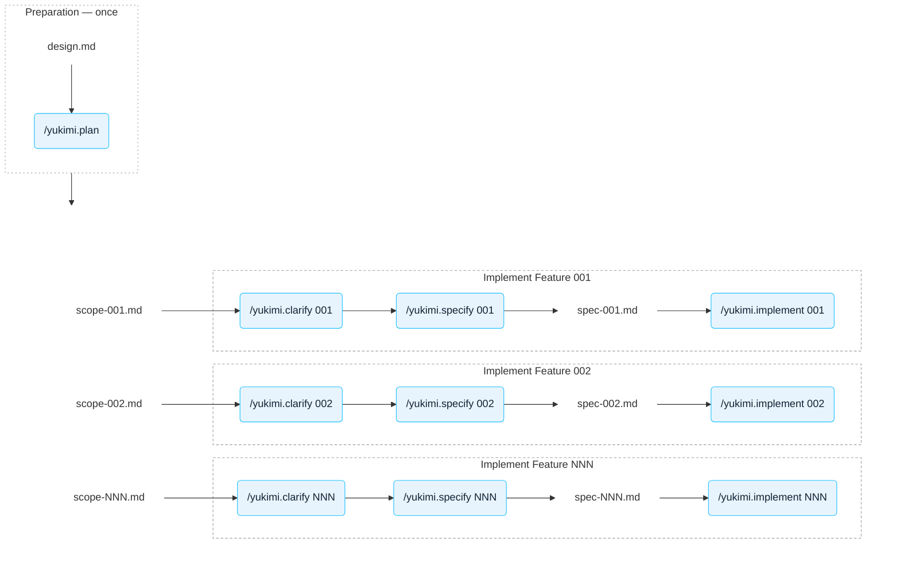

# Contributing

Yukimi is built spec-first. `specs/design.md` is the product blueprint (see its §1.2, *AI-First
Engineering*), and features are not coded straight from it. Instead each part of the design travels
through the pipeline below as one numbered spec, and the numbers are written and implemented one at
a time in ascending order. Most steps are driven by a project skill in `.claude/skills/`.

## The AI coding process

There are two processes. **Preparation** runs once over the whole product design and cuts it into
numbered scope notes. **Implementation** then runs once per number, in ascending order, and its
input is exactly what preparation produced.

What each step reads and writes:

| Step | Skill | Model | Output |
|---|---|---|---|
| Write and iterate the product design | none — direct prompting | Opus 5 or Gemini Pro | `specs/design.md` |
| Break the design into numbered scope notes | `/yukimi.plan` (not built yet) | Opus 5, *think hard* | `specs/scope-NNN-*.md` |
| Settle what the design intentionally leaves out | `/yukimi.clarify NNN` | Sonnet 5 | `specs/wip-NNN-*.md` |
| Write the spec | `/yukimi.specify NNN` | Sonnet 5 | `specs/NNN-*.md` |
| Implement it | `/yukimi.implement NNN` | Sonnet 5 | `apis/`, `internal/` |

A written spec is reviewed by a human and then corrected in place — by hand or by prompting —
before implementation starts.

## Notes

- **Run `/clear` before invoking any of the skills.** Each one spends its whole run reasoning about
  a single spec, and unrelated conversation history degrades it. The skills check for this and will
  ask you to clear rather than push on.
- **Ascending order is a hard rule.** A spec may depend only on specs numbered strictly below it —
  the code for higher numbers does not exist yet. A letter suffix (`003.a`) marks a pluggable
  backend and sorts between `003` and `004`.
  worked detail the spec deliberately omits. Where the two disagree, the spec wins.
- **The spec is authoritative for its package.** Read `specs/NNN-*.md` before changing anything
  under the package it owns; 

