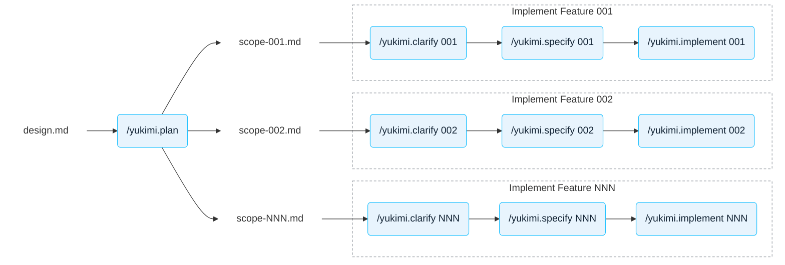

# Contributing

Yukimi is built spec-first. `specs/design.md` is the product blueprint (see its §1.2, *AI-First
Engineering*), and features are not coded straight from it. Instead each part of the design travels
through the pipeline below as one numbered spec, and the numbers are written and implemented one at
a time in ascending order. Most steps are driven by a project skill in `.claude/skills/`.

## The pipeline

Bare labels are files under `specs/`, rounded boxes are skills you invoke in Claude Code. One row
per numbered spec, run to completion before the next row starts. What each step reads and writes:

| Step | Skill | Model | Output |
|---|---|---|---|
| Write and iterate the product design | none — direct prompting | Opus 5 or Gemini Pro | `specs/design.md` |
| Break the design into numbered scope notes | `/yukimi.plan` (not built yet) | Opus 5, *think hard* | `specs/scope-NNN-*.md` |
| Settle what the design intentionally leaves out | `/yukimi.clarify NNN` | Sonnet 5 | `specs/wip-NNN-*.md` |
| Write the spec | `/yukimi.specify NNN` | Sonnet 5 | `specs/NNN-*.md` |
| Implement it | `/yukimi.implement NNN` | Sonnet 5 | `apis/`, `internal/` |

A written spec is reviewed by a human and then corrected in place — by hand or by prompting —
before implementation starts. The same is true of `design.md`, which is the product of many
iterations rather than a single pass.

## Notes

- **Run `/clear` before invoking any of the skills.** Each one spends its whole run reasoning about
  a single spec, and unrelated conversation history degrades it. The skills check for this and will
  ask you to clear rather than push on.
- **`/yukimi.plan` does not exist yet.** The diagram shows the intended shape; today's `scope-*`
  notes came out of a single one-off run over a temporary `roadmap.md`. Turning that into a
  repeatable skill is a known gap.
- **Ascending order is a hard rule.** A spec may depend only on specs numbered strictly below it —
  the code for higher numbers does not exist yet. A letter suffix (`003.a`) marks a pluggable
  backend and sorts between `003` and `004`.
- **The two transient documents are deleted at different points.** `scope-NNN-*.md` goes once the
  spec is written; `wip-NNN-*.md` stays until the code lands, because it holds the research and
  worked detail the spec deliberately omits. Where the two disagree, the spec wins.
- **The spec is authoritative for its package.** Read `specs/NNN-*.md` before changing anything
  under the package it owns; `CLAUDE.md` maps numbers to packages.

## Before you open a PR

Build, test and local-cluster setup are documented in
[`docs/development/development.md`](docs/development/development.md). Make sure `make reviewable`
passes.
