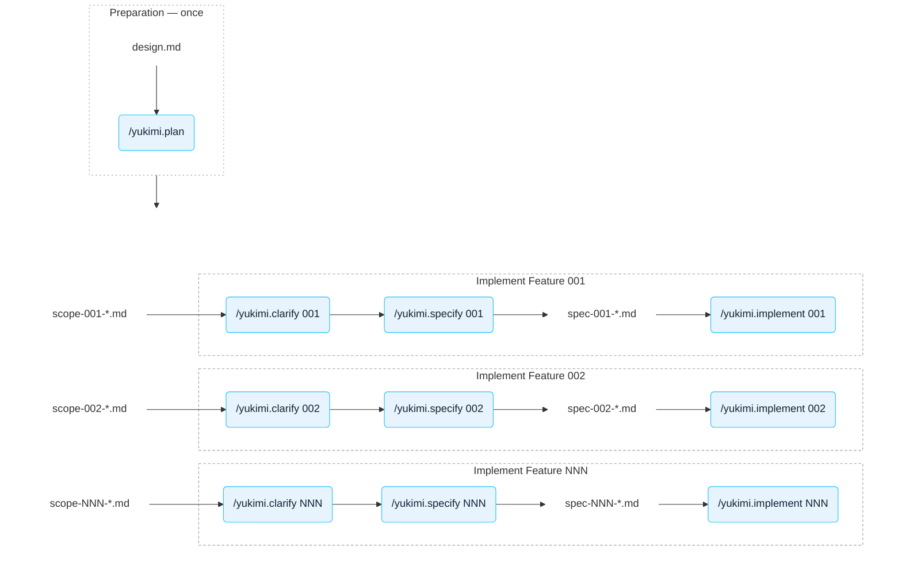

# Contributing

Contributions are welcome — bug reports, fixes, docs and design discussion alike.

Yukimi is built spec-first. `specs/design.md` is the product blueprint (see its §1.2, *AI-First
Engineering*), and features are not coded straight from it. Instead each part of the design travels
through the pipeline below as one numbered spec, and the numbers are written and implemented one at
a time in ascending order. Most steps are driven by a project skill in `.claude/skills/`.

That workflow is described in [The AI coding process](#the-ai-coding-process) below. If you just want
to fix a bug or improve the docs, you do not need any of it — read the next three sections and go.

- [Reporting bugs and requesting features](#reporting-bugs-and-requesting-features)
- [Building and testing](#building-and-testing)
- [Submitting a pull request](#submitting-a-pull-request)
- [Code conventions](#code-conventions)
- [The AI coding process](#the-ai-coding-process)

By participating you agree to abide by our [Code of Conduct](CODE_OF_CONDUCT.md).


## Reporting bugs and requesting features

Open an [issue](https://github.com/allianz/yukimi/issues); the templates ask for what we need.

For a bug, the two most useful things are the resource's `status` conditions and the provider log.
Run the provider with `--debug` before collecting logs — user errors (the kind you can fix by editing
your resource) are logged at debug level and are invisible without it. If a log line carries an
8-character incident ID, include it: it correlates every line of the failed operation.

**Never paste real credentials, account locators or organization names into an issue.** For a
security vulnerability, do not open an issue at all — follow [SECURITY.md](SECURITY.md).


## Building and testing

You need Go 1.26+, Docker, and **Linux or macOS**. The Crossplane build submodule that drives the
Makefile refuses to run on a Windows host (`build only supported on linux and darwin host
currently`); use WSL2 there, or let CI run the gate for you.

```bash
git clone --recurse-submodules https://github.com/allianz/yukimi.git
cd yukimi
make reviewable      # generate + lint + unit tests. This is what CI runs -- run it before pushing.
```

If you cloned without `--recurse-submodules`, run `make submodules` first.

| Command | What it does |
| --- | --- |
| `make reviewable` | Everything CI gates on: `generate`, `lint`, `test`. |
| `make test` | Unit tests only. Runs with `-short`, which skips integration tests. |
| `make test-integration` | Integration tests. **Needs real AWS and Snowflake access** via `.env`. |
| `make generate` | Regenerates CRDs and `deploy/install.yaml`. Run after any API change. |
| `make check-diff` | Fails if generated files are stale. Commit what `make generate` produces. |
| `make build` | Builds the provider binary into `_output/bin/`. |
| `make dev` / `make dev-clean` | kind cluster with the controller running locally. Needs `.env`. |

Integration tests load `.env` themselves, so they also run from an IDE's test runner. They are
guarded by `testing.Short()`, so they never run in CI. Resources they create are prefixed `test-` or
`integration-test-`.

Some changes cannot be verified without a real Snowflake organization. If yours is one of them, say
so in the pull request — CI cannot check it, and a reviewer will need to.

### What else CI runs

`make reviewable` is the gate, but three more workflows run alongside it. Each is reproducible
locally, which is the point — a red check should never be a mystery:

| Workflow | What it does | Run it yourself |
| --- | --- | --- |
| `codeql.yml` | CodeQL SAST, `security-extended` queries | Not practical locally; read the finding in the Security tab |
| `osv-scanner.yml` | Dependency advisories, with `osv-scanner.toml` suppressions | `go run github.com/google/osv-scanner/v2/cmd/osv-scanner@v2.6.0 scan source --config=osv-scanner.toml .` |
| `ci.yml` (fuzz job) | 30 s per fuzz target, smoke-testing for panics | `go test ./internal/snowflake/statement/ -run='^$' -fuzz=FuzzQuoteIdentifier -fuzztime=30s` |

Linting is configured in [`.golangci.yml`](.golangci.yml). Two of the enabled linters exist to enforce
conventions stated below rather than generic style: `nilerr` (never return `nil` after checking an
error) and `goheader` (the Apache-2.0 header). If a finding is genuinely wrong for your case, silence
it with a `//nolint:thelinter // reason` — `nolintlint` rejects one without a reason.

> **Windows note.** This repository is normalized to LF via `.gitattributes`. If you cloned before
> that landed, `core.autocrlf=true` left your working tree with CRLF endings and `gofmt` will report
> every file as unformatted. Fix it once, from a clean tree:
> `git rm --cached -r . && git reset --hard`.


## Submitting a pull request

1. **Branch off `main`.** Open the pull request against `main`.
2. **Sign off every commit.** Use `git commit -s`, which appends the `Signed-off-by` line that the
   [Developer Certificate of Origin](DCO) requires. This is how you certify you have the right to
   submit the code; there is no separate CLA to sign. A pull request with unsigned commits will be
   blocked by the DCO check — `git rebase --signoff main` fixes a branch after the fact.
3. **Run `make reviewable`** and commit any files `make generate` changed.
4. **Keep the spec and the code consistent.** If you changed designed behaviour in a package that a
   spec governs, update `specs/NNN-*.md` in the same pull request.
5. **Fill in the template**, especially what reviewers should know: trade-offs you weighed, and
   anything you deliberately left out.

Every pull request needs an approving review from a maintainer other than its author. Maintainers are
listed in [MAINTAINERS.md](MAINTAINERS.md) and are requested automatically via `CODEOWNERS`.

Small, focused pull requests get reviewed faster. If a change is large or reshapes a design, open an
issue first so the discussion happens before you write the code.


## Code conventions

These are the conventions a reviewer will hold you to. `CLAUDE.md` is the fuller reference.

- **Business logic lives in `internal/`, not in controllers.** Controllers are thin: validate, call
  business logic, update status. This is what makes the logic testable without a cluster.
- **Errors are classified.** A mistake the user can fix by editing their resource is
  `errors.NewUserError(...)` and is logged at debug level. An infrastructure failure is a wrapped
  error, is logged at info level, and gets an incident ID. Getting this wrong means either spamming
  operators or hiding a real failure.
- **Controllers do not retry.** Return the error and let Kubernetes reschedule.
- **In `Observe`, never return `nil` on error.** A nil error reports `Synced=True`, and with a
  zero-value `ExternalObservation` it can trigger a spurious `Create`.
- **No `types.go` and no `_impl.go` files.** Types live beside their implementation; interface and
  implementation live together.
- **New files carry the Apache-2.0 header** for `The Yukimi Authors` (see any existing file). Files
  inherited from the Crossplane template keep the original Crossplane copyright line above ours.
- **Never edit `zz_generated.*` files.** Change the source and run `make generate`.


## The AI coding process

There are two processes. **Preparation** runs once over the whole product design and cuts it into
numbered scope notes. **Implementation** then runs once per number, in ascending order, and its
input is exactly what preparation produced.




| Step | Skill | Model | Output |
|---|---|---|---|
| Write and iterate the product design | none — direct prompting | Opus 5 or Gemini Pro | `specs/design.md` |
| Break the design into numbered scope notes | `/yukimi.plan` (not built yet) | Opus 5, *think hard* | `specs/scope-NNN-*.md` |
| Settle what the design intentionally leaves out | `/yukimi.clarify NNN` | Sonnet 5 | `specs/wip-NNN-*.md` |
| Write the spec | `/yukimi.specify NNN` | Sonnet 5 | `specs/NNN-*.md` |
| Implement it | `/yukimi.implement NNN` | Sonnet 5 | `apis/`, `internal/` |


## Notes

- **Run `/clear` before invoking any of the skills.** Each one spends its whole run reasoning about
  a single spec, and unrelated conversation history degrades it. The skills check for this and will
  ask you to clear rather than push on.
- **Ascending order is a hard rule.** A spec may depend only on specs numbered strictly below it —
  the code for higher numbers does not exist yet. A letter suffix (`003.a`) marks a pluggable
  backend and sorts between `003` and `004`, and only `cmd/provider/main.go` may depend on one.
- **The two transient documents are deleted at different points.** `scope-NNN-*.md` goes once
  `NNN-*.md` is written. `wip-NNN-*.md` is kept until the code for `NNN` is implemented, because it
  holds the worked detail the spec deliberately omits. Where the two disagree, the spec wins.
- **The spec is authoritative for its package.** Read `specs/NNN-*.md` before changing anything
  under the package it owns. If your change alters designed behaviour, the spec changes in the same
  pull request — code and spec never diverge on purpose.

