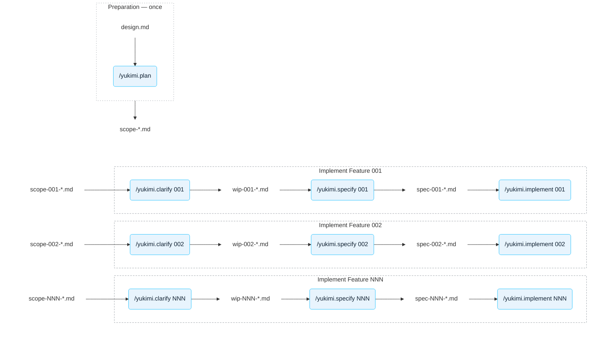

# Architecture

Yukimi has no classical architecture document. Instead, its architecture is described by one product design for the whole platform, and one numbered spec for each
package in the code. This page explains why the project is documented this way, how to read the
specs, and how a spec comes into being.

- [Why there is no classic architecture document](#why-there-is-no-classic-architecture-document)
- [How the documentation is layered](#how-the-documentation-is-layered)
- [Reading a spec](#reading-a-spec)
- [How a spec comes into being](#how-a-spec-comes-into-being)
- [Not every change takes the full process](#not-every-change-takes-the-full-process)

## Why there is no classic architecture document

Yukimi was designed from the start to be built with AI coding agents, and its documentation is
shaped around what an agent needs.

**An agent starts every task from zero.** It remembers nothing from the last session and has no
picture of what the project is for or what it should do. A person new to a codebase is in the same
position: code without context is hard to understand, however well it is written.

**What an agent lacks is context, not explanation.** Agents are very good at writing code and good
at understanding architecture. A classic architecture document spends most of its pages explaining
structure that an agent can read off the code by itself. What the code cannot tell it is the intent:
what the platform is for, which behaviour is deliberate, and what a package promises to its callers.

So the documentation provides that context, at two levels:

- **The product design, for the whole project.** [`specs/design.md`](../specs/design.md) describes
  Yukimi from the point of view of its users: tenants requesting accounts and operators running the
  platform. Load it into the context whenever you brainstorm a new feature or change an existing
  one, so the agent works from the full understanding of the project's goals.
- **One spec per package, for the code.** A spec describes a package's concepts and its public API.
  It lets an agent, or a person, understand what a package does and how to use it without reading
  its code.

**Specs are scoped to a package because context is limited.** An agent's context window holds
around 200K tokens, which is far less than the whole codebase and its history. Keeping each spec
to one package means a task loads only what it needs: the spec of the package it changes, and the
specs of the packages that package depends on.

## How the documentation is layered

There are two permanent documents:

| Document | Describes |
| --- | --- |
| [`specs/design.md`](../specs/design.md) | The whole product: what it does for tenants and operators, and why. Resource schemas, behaviour, security constraints. |
| `specs/NNN-<slug>.md` | One package (sometimes two closely related ones): its concepts, its public API and its behaviour, in enough detail to implement it. Authoritative for its package. |

`design.md` answers *what should the platform do*. A numbered spec answers *what does this package
promise, and how does it behave*. The code answers *how exactly*.

Any other file in `specs/` is a temporary artifact of the process that produces a spec and its code,
and is deleted once it has served its purpose. See [Temporary documents](#temporary-documents).

**The numbers are the dependency order.** Specs are written and implemented one at a time, in
ascending order, and a spec may depend only on specs numbered strictly below it. The numbering is
therefore also the layering of the code: error handling and configuration come first, Snowflake
connectivity and statement execution next, then the resources, the account pipeline and its
modules, and the controllers last. A letter suffix (`003.a`) marks a pluggable backend for an
interface its parent defines. It sorts between `003` and `004`, and only `cmd/provider/main.go`
may depend on it.

The table mapping each spec to its package is in [`CLAUDE.md`](../CLAUDE.md#specification-documents),
because the AI agents read it from there.

## Reading a spec

Every spec follows [`specs/000-template.md`](../specs/000-template.md), and is written for two
audiences:

- **`## Overview` and `## Key Concept: …` are for people.** They explain what the subsystem does and
  why it is shaped the way it is, in domain terms, without type names or algorithms. Read them to
  understand a package before opening its code. After reading them you should be able to roughly
  predict how the package behaves.
- **Everything below is for AI Agents.** Public API, behaviour, error handling, test cases and
  dependencies, in the detail needed to write or regenerate the code.

To understand the platform as a whole, read `design.md` first, then the Overview and Key Concept
sections of the specs in ascending order.

## How a spec comes into being

A product design describes where the project should end up, but not where to start or in which
order to get there. It is far too big to hand to an AI agent in one piece: the agent would run out
of context long before the end, and would fill every gap in the design with a guess. The problem
has to be broken down into pieces small enough to finish.

Writing a book works the same way. Ask an agent to write a whole book in one go and it stops after
a few pages. An author starts with a plan, turns it into an outline of chapters, works out the plot
of each chapter, and only then writes it, one chapter at a time. Here the plan is `design.md`, the
outline is the set of scoped work packages, working out the plot is the clarification record of one
package, and writing the chapter is its spec and then its code.

The design is split into scoped work packages once. Each package is then clarified, specified and
implemented, one at a time, in ascending order.

The project provides a skill for each step in [`.claude/skills/`](../.claude/skills). The skills
automate most of the work. Each one loads the right documents into the context, follows the same
steps every time, checks the rules (dependency order, the spec template, a cleared context), and
asks you only for the decisions it cannot make on its own. That gives better and more consistent
results than vibe coding, where every prompt starts from whatever the agent happens to guess about
the project.

| Step | Skill | Model | Output |
|---|---|---|---|
| Write and iterate the product design | none — direct prompting | Opus 5 | `specs/design.md` |
| Break the design into numbered scope notes | `/yukimi.plan` (not built yet) | Opus 5, *think hard* | `specs/scope-NNN-*.md` |
| Settle what the design intentionally leaves out | `/yukimi.clarify NNN` | Sonnet 5 | `specs/wip-NNN-*.md` |
| Write the spec | `/yukimi.specify NNN` | Sonnet 5 | `specs/NNN-*.md` |
| Implement it | `/yukimi.implement NNN` | Sonnet 5 | `apis/`, `internal/` |

- **Run `/clear` before invoking any of the skills.** Each one spends its whole run reasoning about
  a single spec, and unrelated conversation history degrades it. The skills check for this and will
  ask you to clear rather than push on.

### Temporary documents

Two kinds of documents exist only while a package is being produced. The skills create, read and
delete them; you do not maintain them by hand.

- **Scope notes, `specs/scope-NNN-<slug>.md`.** Preparation splits the design into packages of work
  and writes one scope note for each, roughly describing what that package should cover. A scope
  note is underspecified on purpose: the design leaves out detail that only matters inside one
  package, and the scope note cannot contain more than the design does. `/yukimi.specify` deletes
  it once the spec is written.
- **Clarification records, `specs/wip-NNN-<slug>.md`.** When work on a package starts,
  `/yukimi.clarify` finds the gaps the scope note leaves, researches them and settles them with
  you. The record holds those decisions, the open questions and the research results behind them.
  `/yukimi.specify` writes the spec from the scope note and the record. `/yukimi.implement` reads
  the record again for the detail the spec leaves out on purpose, then deletes it once the code is
  written. Where the record and the spec disagree, the spec wins.

Once a package is implemented, only its spec and its code remain.

## Not every change takes the full process

The pipeline above is for new features and new packages. Bug fixes, refactorings and documentation
changes are made directly. When a change alters designed behaviour in an existing package, the spec
and the code must be updated together in one pull request. Don't worry that this adds a maintenance
burden: in practice the AI agent updates the spec along with the code without being asked.
