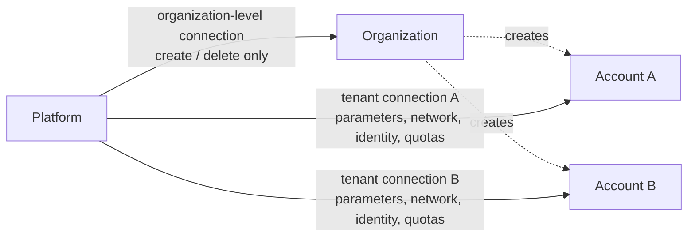
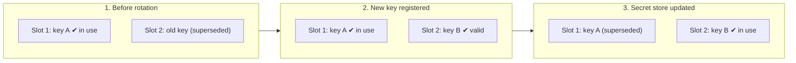

# Specification: Connection Pooling (004)

This specification covers two packages: `internal/snowflake/pool` (pooled Snowflake connections) and `internal/snowflake/host` (host and URL construction). 

## Overview

Authenticating to Snowflake is costly, and the platform reconciles many accounts repeatedly. Connections are therefore established once per account, on first use, and reused for subsequent operations. Each tenant account has a dedicated connection, isolated from the privileged organization-level connection, which is reserved for creating and deleting accounts. Since these connections are already authenticated, they also serve as the channel for rotating expiring credentials.

## Key Concept: Two Connection Scopes and the Privilege Step-Down

The platform uses two kinds of connection, following the privilege split in design.md 3.11. The **organization-level connection** is a single, privileged connection reserved for creating and deleting accounts (design.md 3.6, 6.3). The **tenant connection** exists once per account and authenticates as that account's platform service user. 

Immediately after an account is created, the platform steps down to the tenant connection, and every further operation, such as parameters, network rules, identity import and quotas, runs through it. Because a tenant connection can only act within its own account, an attacker who exploits a bug or weakness can at most affect their own account, never another one. The two kinds are requested through separate entry points, so a tenant operation cannot obtain the privileged connection by mistake.



## Key Concept: Open on First Use, Close Only on Shutdown or Deletion

A connection to an account is opened the first time it is needed and then kept for the lifetime of the controller, so authentication is performed once per account rather than on every reconcile. Each such connection is itself a small pool: the standard library manages the underlying network connections, recycling idle or aged ones within configured limits, without the platform having to intervene. A connection is acrtively closed only when the process shuts down or when its account is deleted (design.md 6.3), so connections to accounts that no longer exist do not remain open. 

## Key Concept: Self-Healing on a Locator Change

An account that is deleted and later recreated under the same name and namespace is, to Snowflake, a different account with a different locator (design.md 3.6, 6.3). Each cached connection therefore remembers the locator and region it was opened for. When a request names a different locator or region, the outdated connection is closed and a new one opened, so callers never need to clear the cache themselves.

## Key Concept: Inline Rotation Using Snowflake's Two Key Slots

Credentials are rotated once they exceed a configured age (002, six months by default). Snowflake accepts two public keys per user at the same time, so the new key is registered in the slot not currently in use while the existing key remains valid. The secret store is updated only after Snowflake has accepted the new key. A failure at any step therefore leaves the working credential intact: the operation that triggered the rotation proceeds normally, and the rotation is retried on the next use. Because the rotation runs over the connection that is already open, it requires neither a separate process nor an additional login.



## Key Concept: One Region Format, Translated to Snowflake's Hostnames

For historical reasons, Snowflake's regional hostnames do not follow a uniform convention: most include the cloud provider after the region, whereas certain legacy regions omit it. The platform therefore exposes a consistent `<provider>-<region>` identifier to users (design.md 3.1) and derives both the connection host and the tenant's account URL (design.md 7.2) from it. Regions that deviate from the general convention are handled as explicitly defined exceptions in the code.

| Region ID (provided by the user) | Host (used for the connection) | Comment |
|----------------------------------|--------------------------------|---------|
| `aws-eu-central-1` | `eu-central-1.snowflakecomputing.com` | Special case: host omits the cloud provider |
| `aws-eu-west-3` | `eu-west-3.aws.snowflakecomputing.com` | General rule: cloud provider follows the region |

## Public API

The two packages have a one-way dependency: `internal/snowflake/pool` imports `internal/snowflake/host`; `host` imports nothing internal but `internal/errors`.

### Package `internal/snowflake/host`

Host and URL construction from an account locator and a cloud-region string. No configuration, no credentials, no network — a pure string builder, imported by `pool` here and by `internal/account/tenant` (006) for `status.accountUrl`.

```go
package host

// Hostname returns the Snowflake connection host for an account, e.g.
// "xy12345.eu-central-1.privatelink.snowflakecomputing.com".
//
// Parameters:
//   - locator: the Snowflake account locator (design.md 3.6), e.g. "xy12345";
//     opaque, and never validated here
//   - region: the account's cloud-region string (e.g. "aws-eu-central-1",
//     design.md 3.1)
//   - usePrivateLink: selects the .privatelink.snowflakecomputing.com suffix
//     over .snowflakecomputing.com; the caller decides (today from
//     Config.Snowflake.UsePrivateLink, 002), never this package
//
// Returns:
//   - the host, or an empty string and a user error if region does not match
//     the expected cloud-region format
func Hostname(locator, region string, usePrivateLink bool) (string, error)

// URL returns the account's browser URL — Hostname with "https://" prefixed,
// carrying no path (design.md 7.2). Consumed by 006 for status.accountUrl.
//
// Parameters: as Hostname.
//
// Returns:
//   - the URL, or an empty string and the same user error Hostname returns for
//     a malformed region
func URL(locator, region string, usePrivateLink bool) (string, error)
```

### Package `internal/snowflake/pool`

The pooled connections themselves.

```go
package pool

import (
    "context"
    "database/sql"
    "time"

    "github.com/allianz/yukimi/internal/config/base"
    "github.com/allianz/yukimi/internal/secrets"
)

// Pool caches one *sql.DB per connection target and hands back the same one
// on every subsequent call. Every cached *sql.DB stays open until Close or an
// explicit eviction — never after ordinary use.
type Pool struct { /* unexported */ }

// New constructs a Pool. It makes no connection attempt itself: every
// *sql.DB is opened lazily, on its first OrgAdminDB or TenantDB call.
//
// Parameters:
//   - keyManager: the *secrets.KeyManager (003) credentials are read through
//   - cfg: Config (002) — Snowflake.Org, OrgAdminAccount,
//     OrgAdminAccountLocator, OrgAdminAccountRegion, UsePrivateLink,
//     DisableOCSPChecks, MaxConnectionPoolSize, MaxIdleConnections,
//     ConnectionMaxLifetime, ConnectionMaxIdleTime, ConnectionProbeTimeout
//
// Returns:
//   - *Pool: never nil
func New(keyManager *secrets.KeyManager, cfg *base.Config) *Pool

// OrgAdminDB returns the single org-admin *sql.DB, used only for CREATE ACCOUNT
// and DROP ACCOUNT (design.md 3.6, 6.3, 3.11 intro). The credential is read
// from the org-admin secret identifier (003) and the connection is authenticated
// with the GLOBALORGADMIN role. Opened on first call; every later call returns the
// same *sql.DB. Also rotates the credential inline once it is more than six
// months old (see Key Concept: Inline Rotation); a rotation failure never
// fails this call.
//
// Returns:
//   - System error if the org-admin credential cannot be read, does not
//     parse as a valid private key, or the connection cannot be established
func (p *Pool) OrgAdminDB(ctx context.Context) (*sql.DB, error)

// TenantDB returns the per-tenant *sql.DB, authenticated as that
// account's platform service user with the ACCOUNTADMIN role (design.md
// 3.6, 3.11, Appendix B X1). Keyed by (org, namespace, accountName) — the
// same tuple as the tenant secret identifier (003) — plus the account's current
// locator and region: a mismatch against a cached entry's locator or region
// closes it and dials again (see Key Concept: Self-Healing). Also rotates
// the credential inline once it is more than six months old (see Key
// Concept: Inline Rotation); a rotation failure never fails this call.
//
// Parameters:
//   - namespace: metadata.namespace at the call site, never a spec field
//     (design.md 3.11.1)
//   - accountName: the CRD's metadata.name, never the resolved, hash-suffixed
//     Snowflake account name (design.md 3.12) — matches the tenant secret identifier
//   - locator: the Snowflake account locator captured from CREATE ACCOUNT
//     (design.md 3.6); this package never runs CREATE ACCOUNT itself, so the
//     caller supplies it
//   - region: the account's cloud-region string (e.g. "aws-eu-central-1",
//     design.md 3.1)
//
// Returns:
//   - User error from host.Hostname if region does not match the expected
//     cloud-region format
//   - System error if the tenant credential cannot be read, does not parse
//     as a valid private key, or the connection cannot be established
func (p *Pool) TenantDB(ctx context.Context, namespace, accountName, locator, region string) (*sql.DB, error)

// EvictTenant closes and removes the cached *sql.DB for (namespace,
// accountName), if one exists. Called once an account is dropped (012) so a
// deleted tenant's connection does not linger for the rest of the process's
// life. A key never dialed is a no-op, not an error.
func (p *Pool) EvictTenant(namespace, accountName string)

// Close closes every cached *sql.DB — the org-admin connection, if opened,
// and every tenant connection. Called exactly once, from
// cmd/provider/main.go on shutdown.
//
// Returns:
//   - System error joining any individual Close failure; every entry is
//     still attempted even if an earlier one fails
func (p *Pool) Close() error
```

## Project Structure

```text
internal/snowflake/host/
├── host.go          # regionSegment (the region/cloud switch), Hostname, URL
├── host_test.go
└── doc.go

internal/snowflake/pool/
├── pool.go          # Pool, New, OrgAdminDB, TenantDB, EvictTenant, Close, cache keys
├── pool_test.go
├── connect.go       # dialFunc seam, defaultDial, gosnowflake.Config construction, health probe
├── connect_test.go
├── rotate.go        # age check, slot detection via DESC USER, ALTER USER push, secrets update
├── rotate_test.go
└── doc.go
```

Allowed imports beyond the standard library:

- `internal/snowflake/host`: only `internal/errors` (001), so 006 can build `status.accountUrl` without pulling in the driver, secrets or configuration.
- `internal/snowflake/pool`: only `internal/snowflake/host`, `internal/config/base` (002), `internal/secrets` (003), `internal/errors` (001) and `github.com/snowflakedb/gosnowflake/v2`. In particular, never 005 (would create a cycle) or 003.a.

## Error Classification

**User Errors** (use `errors.NewUserError()`):
- Malformed cloud-region string: `region 'Frankfurt!' does not match the expected cloud-region format (expected: aws-eu-central-1)`

**System Errors** (use `fmt.Errorf("context: %w", err)`):
- Credential read failure: `failed to read org-admin credentials: %w` / `failed to read tenant credentials for finance/analytics-team-eu: %w`
- Stored private key does not parse: `failed to parse private key for finance/analytics-team-eu: %w`
- Connection cannot be established or the health probe fails: `failed to connect to xy12345.eu-central-1.privatelink.snowflakecomputing.com: %w`

<br/><br/><br/><br/><br/>

================

## Appendix: Code Generation Details

## Scope

This specification defines the `internal/snowflake/pool/` and `internal/snowflake/host/` packages that:
- Maintains pooled `*sql.DB` connections to Snowflake, authenticated with JWT keypair credentials read through the `*secrets.KeyManager` (003) — never through a concrete key store package.
- Checks a stored credential's age on every `OrgAdminDB`/`TenantDB` call and, once it exceeds a fixed threshold, rotates it inline via Snowflake's unused key slot over the connection already in hand, rather than in a background process that could race an active session.
- Offers two connection scopes reflecting the privilege step-down of design.md 3.11: a single organization-admin connection used only for `CREATE ACCOUNT`/`DROP ACCOUNT`, and a per-tenant-account connection, keyed the same way as a tenant's secret identifier, used for everything else.
- Builds the Snowflake connection host and account URL from a locator and a cloud-region string in `internal/snowflake/host`, serving `gosnowflake.Config.Host` here and `status.accountUrl` in 006, with the PrivateLink decision passed in by the caller.
- Opens each connection lazily on first use, keeps it open for later reuse rather than closing it after each call, and only ever closes it on explicit eviction or process shutdown.
- Runs a lightweight health probe using the raw driver when a connection is first established, so a bad credential or host fails immediately rather than on some later caller's first real query.
- Introduces this repository's only dependency on the Snowflake Go driver (`gosnowflake`) and registers it.

**Out of Scope**:
- SQL statement semantics, safe rendering, and error decoration — that is 005's job. This package hands 005 a plain `*sql.DB`; it never imports `internal/snowflake/statement`, and 005 never imports this package (see Key Concept below).
- Any concrete key store — this package takes a `*secrets.KeyManager` as a constructor parameter and never imports `internal/secrets/aws` or any other key store package.
- Generating the keypair or defining the credential's JSON shape — still 003's job (`secrets.GenerateKeyPair`, `Credentials`); provisioning a tenant's *first* credential remains 012's job. This package only owns *when* a stored credential is due for rotation and pushing its replacement into Snowflake (see Key Concept below).
- Anything about which SQL statements run once a connection is obtained — that is every downstream module's business (012–015, 017, 018, 021), never this package's.
- Deciding *whether* PrivateLink is in use: callers pass that flag (today `Config.Snowflake.UsePrivateLink`, 002), and `internal/snowflake/host` never reads configuration itself.
- The `SnowflakeAccount` status field `accountUrl` (006) — this spec builds the string; 006 owns the field, the CRD schema, and when it is written.

## Edge Cases

- **What happens on the very first call for a key that fails to connect?** - Nothing is cached. `OrgAdminDB`/`TenantDB` returns the error, and the next call retries the credential read and dial from scratch — mirroring 003's rule that a failed `Get` is never cached.
- **What happens if two goroutines call `TenantDB` for the same key at the same time on a cold cache?** - Both block behind that key's own lock, acquired per-key rather than pool-wide; the first to acquire it dials and caches, the second observes the now-populated cache and returns the same `*sql.DB` without dialing a second time. A cold dial for a *different* key never waits on this — see Edge Cases below on running at a few thousand accounts.
- **Does a pool-wide lock serialize connecting a few thousand accounts, e.g. right after the process starts?** - No — the lock is per key, so cold dials for different accounts proceed concurrently; only two callers racing for the *same* account's first connection serialize. A shared pool-wide lock would have made a cold start across thousands of accounts take minutes of pure lock contention instead of running them in parallel, so this is a hard design requirement, not an implementation detail. The map holding thousands of cached entries costs a small, fixed amount of memory per entry (map slot plus an idle `*sql.DB`) — negligible at this scale. What ops must size for instead is the pod's open-file-descriptor limit: with per-account idle-connection limits set (see below), a few thousand actively-reconciled accounts can hold a correspondingly large number of idle TCP connections at once, all to different Snowflake accounts rather than concentrated on one, so no single account's own connection limit is at risk.
- **What happens when an account is dropped and later recreated under the same CRD name and namespace?** - See Key Concept: Self-Healing. The new locator no longer matches the cached entry, so the stale connection is closed and a fresh one dialed automatically, without requiring 012 to call `EvictTenant` first — though 012 calls it anyway, immediately after `DROP ACCOUNT`, so the cache never briefly serves a connection to an account already gone.
- **What tunes the underlying `*sql.DB`'s own connection limits, idle timeout, and maximum lifetime?** - `Config.Snowflake` (002): `MaxConnectionPoolSize`, `MaxIdleConnections`, `ConnectionMaxLifetime`, `ConnectionMaxIdleTime`, each with a documented default when omitted from `base.yaml`. `New` reads them once and applies them via `SetMaxOpenConns`/`SetMaxIdleConns`/`SetConnMaxLifetime`/`SetConnMaxIdleTime` to every `*sql.DB` this package dials.
- **Does the health probe run on every `OrgAdminDB`/`TenantDB` call, or only when a new connection is dialed?** - Only when a new connection is dialed (a cold cache, or after eviction/self-healing). A cache hit returns the already-cached `*sql.DB` with no probe and no other network call — probing on every call would defeat the point of caching.
- **Why does session role scoping use a `Config` field instead of a runtime `USE ROLE` statement?** - The Snowflake Go driver accepts a `Role` at connection construction time, applied automatically to every physical connection the driver opens underneath the cached `*sql.DB` — this needs no SQL statement and therefore no dependency on 005's statement execution. If a future need arises for session setup `Config` cannot express, it is done with the raw driver (`db.ExecContext`) directly in this package — never via `internal/snowflake/statement` (005), which is exactly the dependency direction this package must not create (005 already depends on the connection this package hands it; the reverse would be a cycle).
- **What if the region passed to `TenantDB` names a cloud this package has never seen (say a future fourth cloud)?** - Rejected. `host.regionSegment` checks the segment before the first `-` against `validClouds` — the same `aws`/`azure`/`gcp` allowlist `internal/config/base.cloudSectionKeys` (002) already uses — and returns a user error for anything else. Onboarding a new cloud is a deliberate, coordinated change to that map, `base.go`'s `cloudSectionKeys`, and the CRD's `region` `Pattern` (006), not something that already works structurally.
- **How is another region with a non-standard hostname supported?** - By adding a case to `host.regionSegment`'s switch. Snowflake has further legacy regions that omit the cloud provider; only `eu-central-1` is implemented today because no other is currently needed.
- **Why does `host` take a PrivateLink bool instead of reading `Config.Snowflake.UsePrivateLink` (002) itself?** - To stay reusable: 006 builds a tenant's `status.accountUrl` from the same host, and a configuration-free leaf can be imported by `internal/account/tenant` without dragging `internal/config/base` in with it. Callers pass the flag, so its origin can change without touching this package.
- **Does `host.URL` include a path such as `/console/login`?** - No. design.md 7.2 specifies `status.accountUrl` as scheme plus host, and Snowflake redirects a bare host to the login console on its own. If an explicit console link is ever wanted, it is a new exported function in `host` rather than a change to `URL`, so a tenant's status URL keeps the form 7.2 documents.
- **What happens if a rotation attempt fails?** - The call still returns the already-valid `*sql.DB`; the credential's stored age is unchanged, so the same check retries on the next call. This package does not log or otherwise surface the failure in this version — an accepted gap, not a design goal.
- **What if the second key slot was never used (an account only ever bootstrapped by 012)?** - Treated the same as a slot holding an old, superseded key: it doesn't match the current key's fingerprint either way, so it's still the correct rotation target.
- **How is the unused key slot identified?** - `DESC USER` reports the fingerprints of `RSA_PUBLIC_KEY` and `RSA_PUBLIC_KEY_2`; the existing `publicKeyFingerprint` helper computes the current key's fingerprint, and the slot that does not match it receives the new key via `ALTER USER`. The age threshold is `cfg.Secrets.RotationInterval` (002, default `4320h`).
- **Can two concurrent calls rotate the same credential at once?** - No. The per-key and org-admin locks that serialize a cold dial serialize a rotation too.

## Dependencies

- **`internal/errors` (001)** - Used APIs: `errors.NewUserError()` - Contract: used by both packages; in `host` for the one region-format validation above, in `pool` nowhere else.
- **`internal/config/base` (002)** - Read by `pool` only; `host` never imports it - Used APIs: `base.Config`, `Snowflake.Org`, `Snowflake.OrgAdminAccount`, `Snowflake.OrgAdminAccountLocator`, `Snowflake.OrgAdminAccountRegion`, `Snowflake.UsePrivateLink`, `Snowflake.DisableOCSPChecks`, `Snowflake.MaxConnectionPoolSize`, `Snowflake.MaxIdleConnections`, `Snowflake.ConnectionMaxLifetime`, `Snowflake.ConnectionMaxIdleTime`, `Snowflake.ConnectionProbeTimeout` - Contract: `Pool` reads these once at construction and treats them as fixed for the process's life, matching `Config`'s own immutability.
- **`internal/secrets` (003)** - Used APIs: `secrets.KeyManager`, `NewOrgAdminIdentifier()`, `NewTenantIdentifier()`, `KeyManager.GetCredentials()`, `NewCredentials()`, `KeyManager.UpdateCredentials()` - Contract: takes a `*secrets.KeyManager` as a constructor parameter, constructed and wrapped by `cmd/provider/main.go` via `secrets.NewKeyManager`; never imports a concrete key store itself.
- **`github.com/snowflakedb/gosnowflake/v2`** - the only Snowflake driver dependency in the tree; this is the spec that adds it to `go.mod` (see Project Structure).

## Integration Points

- **`cmd/provider/main.go`** - Constructs the `Pool` once via `pool.New(keyManager, cfg)` after building the AWS key store (003.a), wrapping it in a `*secrets.KeyManager` (003), and loading `Config` (002), and calls `Pool.Close()` on shutdown - Key functions: `pool.New()`, `Pool.Close()`.
- **`internal/snowflake/statement` (005, not yet written)** - Takes the `*sql.DB` this package returns as its injected executor and never imports this package directly; this package never imports it either, so the two-way avoidance is enforced from both sides.
- **`internal/account/modules/account` (012, not yet written)** - Calls `Pool.OrgAdminDB()` to run `CREATE ACCOUNT` and reads back its response's locator for status (design.md 3.6, 7.2); on teardown, calls it again to run `DROP ACCOUNT` and then `Pool.EvictTenant()` immediately afterward, so the cache does not keep serving a connection to a dropped account - Key functions: `Pool.OrgAdminDB()`, `Pool.EvictTenant()`.
- **Every other account module (013–015, 017) and the account pipeline/controller (009, 020, not yet written)** - Call `Pool.TenantDB()` to reach an account's own connection for parameters, network rules, identity import, and auth rules - Key functions: `Pool.TenantDB()`.
- **`internal/account/tenant` (006, not yet written)** - Calls `host.URL()` to build `status.accountUrl` (design.md 7.2), passing the locator 012 captures from `CREATE ACCOUNT`, the account's region, and the PrivateLink flag its caller (020) reads from `Config` (002). It never calls `Pool`, and `host` never imports `internal/account/tenant`, so the boundary holds from both sides - Key functions: `host.URL()`.

## Success Criteria

- **SC-001**: `New` returns a non-nil `*Pool` and makes no network call.
- **SC-002**: `OrgAdminDB`'s first call reads the org-admin credential via `KeyManager.GetCredentials`/`NewOrgAdminIdentifier`, builds the host from `OrgAdminAccountLocator`/`OrgAdminAccountRegion`/`UsePrivateLink`, and returns a `*sql.DB`.
- **SC-003**: Every later `OrgAdminDB` call returns the identical `*sql.DB` pointer from the first call, without re-reading the credential or dialing again.
- **SC-004**: `TenantDB` builds its secret identifier via `NewTenantIdentifier(org, namespace, accountName)`, using `Config.Snowflake.Org` and the caller-supplied `namespace`/`accountName`.
- **SC-005**: Two `TenantDB` calls with identical `namespace`/`accountName`/`locator`/`region` return the identical `*sql.DB` pointer; a call with a different `namespace` or `accountName` returns a distinct one.
- **SC-006**: `host.regionSegment("aws-eu-central-1")` returns `"eu-central-1"`; `host.regionSegment("aws-eu-west-3")` returns `"eu-west-3.aws"`.
- **SC-007**: `host.Hostname` appends `.privatelink.snowflakecomputing.com` when `usePrivateLink` is true and `.snowflakecomputing.com` when false, and the locator forms the leading label in both.
- **SC-007a**: `host.URL("xy12345", "aws-eu-central-1", true)` returns `https://xy12345.eu-central-1.privatelink.snowflakecomputing.com` — design.md 7.2's example verbatim, with no trailing path.
- **SC-008**: `TenantDB` returns a user error for a `region` missing its cloud prefix (e.g. `"eu-central-1"`) or otherwise malformed, and never attempts a connection in that case — satisfied by its call to `host.Hostname` preceding any credential read or dial.
- **SC-008a**: `host.Hostname` and `host.URL` both return an empty string and a user error for a region missing its cloud prefix or otherwise malformed.
- **SC-009**: A failed credential read, key parse, dial, or health probe on the first call for a key leaves nothing cached — the next call for the same key retries in full.
- **SC-010**: Concurrent goroutines calling `TenantDB` with the same key against a cold cache result in exactly one dial and one cached `*sql.DB`, observed by all callers.
- **SC-010a**: Concurrent cold dials for *different* keys do not serialize behind a single pool-wide lock — locking is scoped per key, provable by a test that blocks one key's dial and asserts a second key's dial still completes.
- **SC-011**: A `TenantDB` call whose `locator` or `region` differs from what is cached for that `(namespace, accountName)` closes the stale `*sql.DB` and returns a freshly dialed one.
- **SC-012**: `EvictTenant` closes and removes the cached entry for `(namespace, accountName)`; a following `TenantDB` call with the same key dials again.
- **SC-013**: `EvictTenant` on a key never dialed does not error and does not panic.
- **SC-014**: `Close` closes every cached `*sql.DB` — org-admin, if opened, and every tenant entry — and returns a joined error if any individual close fails, without skipping the rest.
- **SC-015**: The `gosnowflake.Config` built for `OrgAdminDB` sets `Authenticator` to `AuthTypeJwt`, `User` and `PrivateKey` from the stored org-admin credential, `Role` to `GLOBALORGADMIN`, and `Account`/`Host` from `OrgAdminAccountLocator`/`OrgAdminAccountRegion`.
- **SC-016**: The `gosnowflake.Config` built for `TenantDB` sets `Role` to `ACCOUNTADMIN` and `Account`/`Host` from the caller-supplied `locator`/`region`.
- **SC-017**: `internal/snowflake/pool` imports `internal/snowflake/host`, `internal/config/base`, `internal/secrets`, `internal/errors`, and `github.com/snowflakedb/gosnowflake/v2` among dependencies with an `internal/` boundary or a new `go.mod` entry — never `internal/secrets/aws` and never `internal/snowflake/statement`, grep-provable.
- **SC-017a**: `internal/snowflake/host` imports only the standard library and `internal/errors` — never `internal/config/base`, `internal/secrets`, `internal/snowflake/pool`, or `github.com/snowflakedb/gosnowflake/v2`, grep-provable.
- **SC-018**: `go.mod` requires the Snowflake driver at its `github.com/snowflakedb/gosnowflake/v2` module path.
- **SC-019**: The dial step is reachable through an unexported, swappable seam so unit tests exercise `Pool`'s caching, eviction, self-healing, and concurrency behavior without a real Snowflake account, a real network call, or the real driver.
- **SC-020**: Unit test coverage exceeds 95% for both packages.
- **SC-021**: Every `*sql.DB` this package dials has `SetMaxOpenConns`, `SetMaxIdleConns`, `SetConnMaxLifetime`, and `SetConnMaxIdleTime` applied from `cfg.Snowflake.MaxConnectionPoolSize`/`MaxIdleConnections`/`ConnectionMaxLifetime`/`ConnectionMaxIdleTime`, and the health probe's context deadline is `cfg.Snowflake.ConnectionProbeTimeout`.
- **SC-022**: The `gosnowflake.Config` built for both `OrgAdminDB` and `TenantDB` sets `DisableOCSPChecks` from `cfg.Snowflake.DisableOCSPChecks`.
- **SC-023**: A stored credential more than six calendar months old triggers a rotation attempt on the next `OrgAdminDB`/`TenantDB` call; a younger one never does.
- **SC-024**: A rotation failure never fails that call, and `KeyManager.UpdateCredentials` is only called once the `ALTER USER` pushing the new key has succeeded.

## Security Considerations

- **Privilege step-down is structural, not conventional** (design.md 3.11): `OrgAdminDB` and `TenantDB` are two different methods with two different signatures; there is no shared method with a scope parameter a caller could pass incorrectly, and no code path anywhere in this package derives one scope's connection from the other's credential or cache entry.
- **Credentials never touch a concrete key store from this package's own code**: this package depends only on `*secrets.KeyManager` (003), constructed and wrapped elsewhere; it cannot be the place a future key-store-specific bug leaks a credential, because it never imports one.
- **Role is set explicitly, not inherited**: both scopes set `Role` on every connection they dial (`ORGADMIN`, `ACCOUNTADMIN`) rather than relying on whatever a user's default role happens to be — matching design.md 3.11's framing of the platform "impersonating the accountadmin role exclusively for that specific tenant" as a deliberate choice, not an accident of account defaults.
- **No credential material in an error message**: every error this package produces is built from an identifier's own constituent segments (namespace, account name, org-admin account), a host, and the underlying error — never a private key or any other credential content, matching 003's own rule for the identifiers it hands this package.
- **OCSP checking defaults to on**: `Snowflake.DisableOCSPChecks` (002) defaults to `false`; disabling it is a deliberate, narrow escape hatch for local/integration testing and emergencies where the OCSP responder's network path is broken — never a routine production setting.
- **The host a tenant is told to visit is the host the platform dials**: `host` handles no credentials and opens no connection, and both the `gosnowflake.Config.Host` here and `status.accountUrl` in 006 come out of the same function. A tenant's published URL therefore cannot name a host the platform does not itself connect to — a divergence that would otherwise send users to an endpoint outside the region's PrivateLink path while reconciliation reported success.
- **Health-probe failures surface immediately, not on a tenant's first real query**: probing a newly dialed connection turns a bad credential or an unreachable host into a system error at the moment this package first tries it, rather than letting it surface later inside whichever module (012–015, 017) happens to run the first real statement.

## Performance Considerations

- One dial and one health probe per distinct connection target for the life of the process — not per reconcile — regardless of whether the calling cadence for that target is minutes apart in steady state or sub-second during exponential backoff.
- The underlying `*sql.DB`'s own connection limits, idle timeout, and maximum lifetime are set explicitly (`Config.Snowflake`, see Edge Cases) rather than left at the standard library's unbounded defaults, so a process managing many tenant accounts at once has a bounded number of idle physical connections per account rather than an unbounded one.
- Cache lookups for an already-dialed key are lock-protected map reads with no network call. Locking is per key, never pool-wide: a network operation (a cold dial or a self-healing redial) blocks only other callers asking for that same key, so connecting a few thousand distinct accounts proceeds in parallel rather than serializing behind one lock.
- At a few thousand managed accounts, the cache itself (one map entry per account) costs a small, fixed amount of memory per entry — not a scaling concern on its own. The real capacity-planning input is the pod's open-file-descriptor limit, since each account's idle connection allowance (`Config.Snowflake.MaxIdleConnections`, see Edge Cases) multiplies by the number of actively-reconciled accounts.

## References

- **Product design**: `specs/design.md`, §3.6 (`CREATE ACCOUNT`, the locator, PrivateLink), §3.11 (organization vs. account-level privilege step-down), §3.11.1 (the tenant secret identifier this package's cache key mirrors), §3.12 (CRD name vs. resolved Snowflake name), §6.3 (`DROP ACCOUNT`), §7.2 (`status.accountUrl`, the form `host.URL` produces), Appendix B X1 (the `platform` service user).
- **SnowflakeAccount CRD (006, not yet written)**: `specs/scope-006-snowflake-account-crd.md` - `internal/account/tenant`, the second consumer of `internal/snowflake/host`, which builds `status.accountUrl` from `host.URL`.
- **Secrets Handling (003)**: `specs/003-secrets-handling.md` - `KeyStore`, `KeyManager`, `Identifier`, `NewOrgAdminIdentifier()`, `NewTenantIdentifier()`, `Credentials`, `KeyManager.GetCredentials()`.
- **Base Config (002)**: `specs/002-base-config.md` - `SnowflakeSettings`, in particular `OrgAdminAccountLocator`, `OrgAdminAccountRegion`, `UsePrivateLink`.
- **Driver documentation**: `github.com/snowflakedb/gosnowflake/v2` (`godoc`) - `Config`, `NewConnector`, `DSN`, `AuthTypeJwt`; consult the pinned version's source before implementation, per this repo's own convention of verifying vendor behavior rather than assuming it.

<br/><br/><br/><br/><br/>

================

## Appendix: Usage Examples

### Example 1: Wiring the Pool in `cmd/provider/main.go` and Using a Tenant Connection (Primary Use Case)

```go
import (
    "context"
    "log"
    "time"

    "github.com/allianz/yukimi/internal/config/base"
    "github.com/allianz/yukimi/internal/secrets"
    secretsaws "github.com/allianz/yukimi/internal/secrets/aws"
    "github.com/allianz/yukimi/internal/snowflake/pool"
)

func main() {
    cfg, err := base.Load(*configDirFlag)
    if err != nil {
        log.Fatalf("failed to load base config: %v", err)
    }

    store, err := secretsaws.New(cfg.AWS.Region, cfg.AWS.KmsKeyId, cfg.Deletion.GracePeriodDays)
    if err != nil {
        log.Fatalf("failed to construct AWS key store: %v", err)
    }
    keyManager := secrets.NewKeyManager(store, 5*time.Minute)

    p := pool.New(keyManager, cfg)
    defer p.Close() // only Close() called here; nothing else in the process closes a pooled *sql.DB

    // ... later, inside a controller's Observe/Create/Update, once the account's
    // locator is known (design.md 3.6, 7.2):
    db, err := p.TenantDB(context.Background(), "finance", "analytics-team-eu", "xy12345", "aws-eu-central-1")
    if err != nil {
        log.Fatalf("failed to get tenant connection: %v", err)
    }
    // db is a plain *sql.DB — usable directly today, and 005's injected
    // executor once that spec is written.
    row := db.QueryRowContext(context.Background(), "SELECT CURRENT_ROLE()")
    var role string
    _ = row.Scan(&role)
}
```

### Example 2: Evicting a Dropped Account's Connection (012's Integration)

```go
// The pool-side sequence the account module's teardown (012, not yet written) performs immediately
// after DROP ACCOUNT succeeds. 012 reaches both calls through pipeline.ModuleContext (009), which
// wraps OrgAdminDB and EvictTenant; the order and effect are the same either way.
import "github.com/allianz/yukimi/internal/snowflake/pool"

func (m *Module) dropAccount(ctx context.Context, p *pool.Pool, orgAdminDB *sql.DB, namespace, accountName, resolvedName string) error {
    if _, err := orgAdminDB.ExecContext(ctx, "DROP ACCOUNT "+resolvedName+" GRACE_PERIOD_IN_DAYS = 3"); err != nil {
        return fmt.Errorf("failed to drop account: %w", err)
    }
    p.EvictTenant(namespace, accountName) // no-op if never dialed; closes it if it was
    return nil
}
```

### Example 3: Testing `Pool` Against an Injected Dialer

```go
package pool

import (
    "context"
    "database/sql"
    "testing"
    "time"

    "github.com/allianz/yukimi/internal/secrets"
)

// In pool_test.go: the package's own tests substitute the unexported dial
// seam so caching, eviction, and self-healing are testable without a real
// Snowflake account, network call, or driver.
func TestTenantDB_CachesByKey(t *testing.T) {
    p := New(secrets.NewKeyManager(secrets.NewFakeKeyStore(), time.Hour), testConfig())
    dialCount := 0
    p.dial = func(cfg dialConfig) (*sql.DB, error) {
        dialCount++
        return sql.OpenDB(fakeConnector{}), nil // never actually connects
    }

    seedTenantCredential(t, p, "finance", "analytics-team-eu")

    ctx := context.Background()
    first, err := p.TenantDB(ctx, "finance", "analytics-team-eu", "xy12345", "aws-eu-central-1")
    if err != nil {
        t.Fatalf("first call: %v", err)
    }
    second, err := p.TenantDB(ctx, "finance", "analytics-team-eu", "xy12345", "aws-eu-central-1")
    if err != nil {
        t.Fatalf("second call: %v", err)
    }
    if first != second {
        t.Fatal("expected the same *sql.DB on a cache hit")
    }
    if dialCount != 1 {
        t.Fatalf("dialCount = %d, want 1", dialCount)
    }
}
```

### Example 4: Building `status.accountUrl` from the Same Host (006's Integration)

```go
// In internal/account/tenant (006, not yet written). The locator comes from CREATE ACCOUNT
// (012, design.md 3.6); the PrivateLink flag from Config (002), passed down by
// the controller (020). No pool, no driver, no configuration import.
import "github.com/allianz/yukimi/internal/snowflake/host"

func accountURL(locator, region string, usePrivateLink bool) (string, error) {
    url, err := host.URL(locator, region, usePrivateLink)
    if err != nil {
        return "", err // user error for a malformed region, reported on the CRD
    }
    return url, nil // https://xy12345.eu-central-1.privatelink.snowflakecomputing.com
}
```
