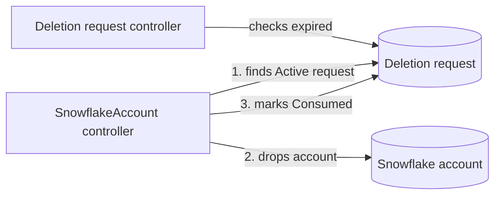

# Specification: SnowflakeDeletionRequest & Deletion Lifecycle (019)

This specification covers three packages: `apis/base/v1alpha1` (the `SnowflakeDeletionRequest` type), `internal/deletion` (business logic) and `internal/controller/snowflakedeletionrequest` (the lifecycle controller).

## Overview

The platform protects Snowflake accounts from accidental deletion: removing an account's
definition (CRD) does not by itself destroy the account or its data. This matters because a rename or
mistaken change to a Git repository can remove a definition without anyone intending to delete
the account. Destruction requires a separate deletion request that names the account, records the
reason, and permits deletion for no more than eight hours. If the window closes unused, the
account remains protected; if deletion succeeds, the request cannot be used again and remains as
a record of the decision.

## Key Concept: The Deletion Request's Lifecycle

A deletion request moves through three states — `Active`, `Expired`, `Consumed` — only ever
forward, never back. It starts `Active` the moment it's created, carrying an expiry computed once
from its creation time plus its requested window, capped at eight hours. If nothing consumes it
before that window closes, it becomes `Expired` on its own, with no further action from anyone;
from that point it authorizes nothing, and a fresh request is the only way back in. If it's used to
authorize an actual destruction, it becomes `Consumed` instead, permanently. Once a request is
`Expired` or `Consumed`, editing its time window cannot reactivate it. From then on it serves as
an audit record of when deletion was allowed and why.

## Key Concept: Two Controllers Implement Deletion Protection

Two controllers share this feature. The deletion request controller only tracks state: it marks a
request `Expired` when its window closes, and it never deletes anything. The `SnowflakeAccount`
controller (020) does the deletion: it looks for a request for the account that is still `Active`,
and only then drops the account and marks the request `Consumed`.



## Public API

```go
// Package v1alpha1 — apis/base/v1alpha1

// SnowflakeDeletionRequestSpec is the deletion request a tenant creates to
// authorize destroying one specific target (design.md §6.1). Nothing here
// is immutable after creation (see Security Considerations).
type SnowflakeDeletionRequestSpec struct {
	TargetRef TargetRef `json:"targetRef"`

	// Maintenance window length, capped at 8h on every write.
	// +kubebuilder:validation:XValidation:rule="self > duration('0s') && self <= duration('8h')",message="duration must be greater than 0 and at most 8h"
	Duration metav1.Duration `json:"duration"`

	// Audit trail: why this destruction is authorized (design.md §6.2).
	Reason string `json:"reason"`

	// The only crossplane-runtime managed-resource field this type
	// carries. No ProviderConfigReference, no
	// WriteConnectionSecretToReference.
	// +optional
	// +kubebuilder:default={"*"}
	ManagementPolicies common.ManagementPolicies `json:"managementPolicies,omitempty"`
}

// TargetRef names the one resource this request authorizes destroying.
// Name is the CRD name, not the resolved Snowflake account name.
type TargetRef struct {
	// +kubebuilder:validation:Enum=SnowflakeAccount
	Kind string `json:"kind"`
	Name string `json:"name"`
}

// SnowflakeDeletionRequestStatus reports this request's time-boxed
// lifecycle. Written only by internal/controller/snowflakedeletionrequest
// and internal/deletion.MarkConsumed.
type SnowflakeDeletionRequestStatus struct {
	xpv1.ResourceStatus `json:",inline"`

	// +optional
	ValidUntil *metav1.Time `json:"validUntil,omitempty"`

	// +kubebuilder:validation:Enum=Active;Expired;Consumed
	// +optional
	State string `json:"state,omitempty"`
}

// SnowflakeDeletionRequest hand-implements GetManagementPolicies,
// SetManagementPolicies, GetCondition, and SetConditions to satisfy
// resource.Managed, identically to SnowflakeAccount (spec 006) and for
// the same reason: angryjet's generator won't recognize a type that
// omits the embedded xpv2.ManagedResourceSpec it requires.
```

```go
// Package deletion — internal/deletion

// FindActiveRequest returns the Active SnowflakeDeletionRequest in
// namespace whose spec.targetRef matches targetKind/targetName, or nil
// if none exists. Trusts status.state as authoritative — performs no
// independent validUntil check. When more than one Active candidate
// matches, returns the one with the earliest creationTimestamp.
//
// Returns: system error if the list call against the Kubernetes API
// fails. Never a user error — there is nothing about the caller's input
// a tenant could fix here.
func FindActiveRequest(ctx context.Context, c client.Client, namespace, targetKind, targetName string) (*v1alpha1.SnowflakeDeletionRequest, error)

// MarkConsumed transitions req's status.state to Consumed. Its
// status.validUntil is left untouched: once state is terminal, the
// SnowflakeDeletionRequest controller stops recomputing it from
// spec.duration, so it freezes at whatever value was already there. Called
// by 020 after a successful DROP ACCOUNT.
//
// Returns: system error if the status update against the Kubernetes API
// fails.
func MarkConsumed(ctx context.Context, c client.Client, req *v1alpha1.SnowflakeDeletionRequest) error
```

```go
// Package snowflakedeletionrequest — internal/controller/snowflakedeletionrequest

// SetupGated adds a controller that reconciles SnowflakeDeletionRequest
// objects with safe-start support, wired into internal/controller/yukimi.go
// alongside every other resource's controller.
func SetupGated(mgr ctrl.Manager, o controller.Options) error
```

## Schema Specification

### Fields (`spec`)

| Field Path | Type | Required | Mutability | Validation / Constraints |
| ---------- | ---- | -------- | ---------- | ------------------------ |
| `targetRef` | object | **Yes** | Mutable | — |
| `targetRef.kind` | string | **Yes** | Mutable | Enum: `SnowflakeAccount` only in v1alpha1 |
| `targetRef.name` | string | **Yes** | Mutable | The target's `metadata.name` (CRD name), not its resolved Snowflake name |
| `duration` | duration | **Yes** | Mutable | `> 0s` and `<= 8h`, enforced by CEL on every write (create and update alike) |
| `reason` | string | **Yes** | Mutable | Non-empty; audit trail only, no length cap |
| `managementPolicies[]` | string | No | Mutable | crossplane-runtime field; default `["*"]`. No `providerConfigRef` or `writeConnectionSecretToRef` field exists on this type |

None of the above carries a `self == oldSelf` immutability rule — see Security Considerations for
why, and for the bound that keeps this acceptable.

### Fields (`status`)

| Field Path | Type | Description |
| ---------- | ---- | ----------- |
| `validUntil` | string (timestamp) | `metadata.creationTimestamp` + `spec.duration` while `Active`; frozen at its terminal value once `Expired` or `Consumed`. Set by `internal/controller/snowflakedeletionrequest`. |
| `state` | string (enum) | `Active`, `Expired`, or `Consumed`; monotonic, never reverts. Set by `internal/controller/snowflakedeletionrequest` (Active/Expired) and `internal/deletion.MarkConsumed` (Consumed). |
| `conditions[]` | Condition | Standard `Ready`/`Synced` per design.md §7.1. `Ready` becomes `True` once `Observe` succeeds — there is no failure mode here beyond a Kubernetes API error. |

## Project Structure

### Source Code

```text
apis/base/v1alpha1/
└── snowflakedeletionrequest_types.go   # Spec/Status types, CEL markers, hand-implemented resource.Managed methods

internal/deletion/
├── doc.go
├── lookup.go           # FindActiveRequest: List + Active filter + earliest-creationTimestamp tie-break
├── lookup_test.go      # Unit tests using controller-runtime's fake client (no real cluster needed)
├── consume.go          # MarkConsumed: freeze validUntil, set state=Consumed
└── consume_test.go

internal/controller/snowflakedeletionrequest/
├── doc.go
├── reconciler.go        # SetupGated/Setup, connector, external — Observe recomputes state every call
└── reconciler_test.go
```

No integration tests: a `SnowflakeDeletionRequest` is only a Kubernetes token with no AWS or
Snowflake access, so the fake client covers everything.

## Error Classification

**User Errors**: none originate in this spec's Go code. `duration`'s bound and `reason`'s
non-empty requirement are both CEL rules enforced at admission — by the time any object reaches
`internal/deletion` or the controller, both are already guaranteed to hold.

**System Errors** (use `fmt.Errorf("context: %w", err)`):
- `internal/deletion.FindActiveRequest` wraps a failure listing `SnowflakeDeletionRequest` objects
  against the Kubernetes API.
- `internal/deletion.MarkConsumed` wraps a failure updating a request's status against the
  Kubernetes API.
- No system error originates in `internal/controller/snowflakedeletionrequest` — its
  `Observe`/`Create`/`Update`/`Delete` compute only from fields already present on the object handed
  to them; nothing they do can fail.

<br/><br/><br/><br/><br/>

================

## Appendix: Code Generation Details

## Scope

This specification defines the deletion-request subsystem that:
- Defines the `SnowflakeDeletionRequest` CRD type in `apis/base/v1alpha1/` (design.md §6.1): the
  target to destroy, the time-boxed window, and the audit reason.
- Runs a dedicated controller, `internal/controller/snowflakedeletionrequest/`, that computes and
  advances the request's own time-boxed lifecycle (`Active` → `Expired`/`Consumed`), independent of
  any other reconcile loop in this platform.
- Provides `internal/deletion/`'s lookup and consumption API (`FindActiveRequest`, `MarkConsumed`)
  — the only point of contact between this spec and account provisioning, called by 020's deletion
  gate.

**Out of Scope**:
- Intercepting a `SnowflakeAccount`'s own deletion, blocking it without an active request, emitting the
  `DeletionBlocked` event, or tearing the account down — all owned by 020, which reaches the teardown
  through the account pipeline (009) (design.md §6.3 Phases 2-3).
- Any `targetRef.kind` beyond `SnowflakeAccount` — v1alpha1 accepts only that one kind (see Schema
  Specification); widening later, once a second destructible resource kind exists, is additive.
- Preventing an approved request from being edited after the fact. Nothing enforces this at the
  schema level (see Security Considerations); that control is left to RBAC or a git-review process
  outside this provider's code, and none is defined anywhere in this repository today.
- Any replication-related deletion request (021, not yet written).

## Edge Cases

- **Can `spec.duration`/`targetRef`/`reason` be edited after the request already exists?** Yes —
  nothing on the spec is immutable. The standing CEL bound (`> 0s`, `<= 8h`) still re-evaluates on
  every edit, and `validUntil` derives from the Kubernetes-immutable `creationTimestamp`, so no
  sequence of edits can push the authorized window past `creationTimestamp + 8h`.
- **Does editing `spec.duration` after a request has already `Expired` or been `Consumed` revive
  it?** No. State transitions are monotonic and terminal: once `Expired` or `Consumed`, the
  controller stops recomputing `validUntil` from `spec.duration` and freezes it at the terminal
  value.
- **What if two `Active` requests target the same resource?** Both are legitimate — nothing in this
  platform enforces cross-object uniqueness. `FindActiveRequest` deterministically returns the one
  with the earliest `creationTimestamp`; the other simply remains unconsumed and eventually expires
  on its own, with no effect on the outcome.
- **How stale can `status.state` be relative to `validUntil`?** Bounded by the manager's poll
  interval (`--poll`, default `1m`), because `Observe` recomputes `state` on every call regardless of
  `Generation`. `FindActiveRequest` trusts `state` directly and performs no live `validUntil` check, so whether a
  request is still valid is decided only by this spec's controller.
- **What actually stops someone from editing an approved request to quietly retarget it or widen its
  window?** Nothing at the schema level. That's left to an RBAC or git-review process outside this
  provider's code, and none is defined anywhere in this repository today — this spec's guarantees
  hold only as far as that external control actually exists.
- **What happens to a `SnowflakeDeletionRequest` when its target is destroyed?** Nothing — it carries
  no owner reference to its target and no finalizer of its own, so it outlives the target by design,
  forming the durable audit trail (design.md §6.2).
- **The request is `Consumed` but the account was later restored — does anything reset?** No. The
  `Consumed` state freezes permanently; nothing in this platform observes a manual restore performed
  outside it. The record says a destruction was authorized and carried out at that time, which stays
  true. A restored account that is to be managed again needs a `SnowflakeAccount` object reconciling
  against it, and destroying it again needs a fresh request — this one authorizes nothing further.

## Dependencies

- **internal/errors (001)** - Used APIs: none directly - Contract: `internal/deletion` classifies
  nothing as a user error; every failure it returns is a plain wrapped error, left for whichever
  caller's own `internal/logger.Handle` (020's controller) to classify as a system error.
  `internal/controller/snowflakedeletionrequest` has no error path at all and therefore never
  imports `internal/logger` either — a deliberate divergence from every other controller in this
  codebase, which do have failure modes to report.
- **apis/base/v1alpha1 SnowflakeAccount (006)** - Used APIs: none at the Go-import level - Contract:
  `targetRef.kind`'s enum names `"SnowflakeAccount"` as a literal string matching 006's
  `SnowflakeAccountKind`; the two specs share a naming convention, not a package import.

## Integration Points

- **SnowflakeAccount controller (020)** - calls `internal/deletion.FindActiveRequest` when
  intercepting a `SnowflakeAccount`'s deletion, and `internal/deletion.MarkConsumed` once the
  account's teardown (009) has succeeded - Key functions: `FindActiveRequest`, `MarkConsumed` -
  Notes: the dependency is one-way; 019 never imports anything from 020, and this spec neither reads
  provider configuration nor derives anything from it.
- **internal/controller/yukimi.go** - registers `snowflakedeletionrequest.SetupGated` in its list of
  controllers alongside every other resource's - Key functions: `SetupGated`.
- **crossplane-runtime's `managed.NewReconciler`** - drives `Observe`/`Create`/`Update`/`Delete` on
  the manager's global poll interval - Notes: no per-resource requeue override exists in
  crossplane-runtime v2.0.0, so this controller shares the same ~1m default poll cadence as every
  other controller in this codebase.

## Success Criteria

- **SC-001**: `apis/base/v1alpha1` registers `SnowflakeDeletionRequest` in group
  `base.snowflake.yukimi.io`, version `v1alpha1`.
- **SC-002**: `SnowflakeDeletionRequestSpec`/`Status` cover every field in the Schema Specification
  tables, with matching JSON names.
- **SC-003**: `targetRef.kind` accepts only `"SnowflakeAccount"`; any other value is rejected at
  admission.
- **SC-004**: `spec.duration` is rejected at admission for any value `<= 0s` or `> 8h`, both on
  create and on every subsequent update.
- **SC-005**: `spec.reason` is required and rejected at admission when empty.
- **SC-006**: no field on `SnowflakeDeletionRequestSpec` carries a `self == oldSelf` CEL rule
  (grep-provable).
- **SC-007**: `SnowflakeDeletionRequestSpec` carries exactly one crossplane-runtime-owned field
  (`managementPolicies`); no `providerConfigRef` or `writeConnectionSecretToRef` field exists
  anywhere in the generated CRD schema.
- **SC-008**: `SnowflakeDeletionRequest` satisfies `resource.Managed` via hand-written methods, the
  same way `SnowflakeAccount` does.
- **SC-009**: `internal/controller/snowflakedeletionrequest` is registered separately in
  `internal/controller/yukimi.go`'s `SetupGated` list, distinct from 020's controller.
- **SC-010**: `Observe` recomputes `status.state` on every reconcile regardless of whether
  `Generation` changed — a request whose `validUntil` has passed flips to `Expired` on the next poll
  with no CRD edit required.
- **SC-011**: a newly created request with a valid `duration` reaches `status.state = Active` with
  `status.validUntil = creationTimestamp + duration` within one reconcile.
- **SC-012**: once `status.state` reaches `Expired` or `Consumed`, no later edit to `spec.duration`
  changes `status.validUntil` or reverts `state` to `Active`.
- **SC-013**: `internal/deletion.FindActiveRequest` returns only requests with
  `status.state == "Active"` matching the given namespace/kind/name, performing no independent
  `validUntil` comparison.
- **SC-014**: when multiple `Active` requests match the same target, `FindActiveRequest`
  deterministically returns the one with the earliest `creationTimestamp`.
- **SC-015**: `internal/deletion.MarkConsumed` sets `status.state = Consumed` and freezes
  `status.validUntil` at its value at call time.
- **SC-016**: `FindActiveRequest`/`MarkConsumed` return a wrapped system error on any Kubernetes API
  failure, never a user error.
- **SC-017**: a `SnowflakeDeletionRequest` with `GetDeletionTimestamp()` set causes `Observe` to
  return `ResourceExists: false`, releasing the finalizer.
- **SC-018**: unit test coverage exceeds 95% for `internal/deletion` and
  `internal/controller/snowflakedeletionrequest`.
- **SC-019**: `make generate` produces a valid CRD manifest and `make reviewable` passes.

## Security Considerations

- Nothing on `SnowflakeDeletionRequestSpec` is immutable, so the schema alone cannot stop someone
  from editing an approved request's target, window, or reason after review. This is deliberate:
  enforcement is left to an RBAC or git-review process outside this provider's code, and no such
  control is defined anywhere in this repository yet — deploying this spec's code is not sufficient
  by itself; that external control must exist too.
- The residual risk from the point above is bounded, not open-ended: `duration`'s CEL ceiling
  (`<= 8h`) applies on every write, and `validUntil` derives from the Kubernetes-immutable
  `creationTimestamp`, so no sequence of edits can push a request's authorized window past
  `creationTimestamp + 8h`.
- `targetRef.kind` accepts only `SnowflakeAccount`, so a request can never be pointed at a resource
  kind this platform hasn't reasoned about the destructiveness of yet.
- `FindActiveRequest`'s trust in the persisted `status.state` field, rather than a live re-check,
  bounds worst-case staleness to about one poll interval (~1 minute) — small against the 8h maximum
  window it's protecting.

## Performance Considerations

- `Observe` is a pure, in-memory computation from fields already on the object it's handed; it does
  no I/O and stays cheap even though it can't skip work on an unchanged `Generation`.
- `FindActiveRequest` is a single namespaced `List` call, bounded by however many
  `SnowflakeDeletionRequest` objects exist in that namespace — expected to stay small.

## References

- **Product design**: `specs/design.md` §6.1-6.3, §7.1 - the authoritative source for every field,
  state, and behavior in this spec.
- **Shape reference**: `specs/001-error-and-logging.md` - section skeleton followed here.
- **CEL duration bound and minimal-managed-resource-surface precedent**:
  `specs/006-snowflake-account-crd.md` - followed directly for the `duration` CEL mechanism and the
  hand-implemented `resource.Managed` pattern.
- **Pipeline package boundary**: `specs/009-account-pipeline.md` - confirms this spec's controller is
  not a pipeline module: the teardown these two calls authorize is sequenced by `Pipeline.Destroy`,
  which nothing here invokes or knows about.
- **Poll interval**: `cmd/provider/main.go` `--poll` flag, default `1m`.
- **crossplane-runtime v2.0.0**: `pkg/reconciler/managed/reconciler.go` - confirms no per-resource
  requeue override exists.

<br/><br/><br/><br/><br/>

================

## Appendix: Usage Examples

### Example 1: 020's deletion gate looking up an active request

```go
req, err := deletion.FindActiveRequest(ctx, kube, cr.Namespace, "SnowflakeAccount", cr.Name)
if err != nil {
    return log.Handle(err) // system error: Kubernetes API failure
}
if req == nil {
    // Block: no open request. Emit DeletionBlocked, set Ready=False, stay Terminating.
    return managed.ExternalDelete{}, errors.NewUserError("deletion blocked: no active SnowflakeDeletionRequest authorizes this account")
}
```

### Example 2: 020 marking a request used after a successful teardown

```go
// Pipeline.Destroy (009) runs every module's Teardown in reverse, ending with 012's DROP ACCOUNT
// and platform-credential delete.
if err := pl.Destroy(ctx, mc); err != nil {
    return managed.ExternalDelete{}, log.Handle(err)
}
if err := deletion.MarkConsumed(ctx, kube, req); err != nil {
    return managed.ExternalDelete{}, err // system error: status update failed
}
```

### Example 3: `SnowflakeDeletionRequest` YAML

```yaml
apiVersion: base.snowflake.yukimi.io/v1alpha1
kind: SnowflakeDeletionRequest
metadata:
  name: decommission-analytics-prod
spec:
  targetRef:
    kind: SnowflakeAccount
    name: analytics-team-eu   # CRD name, not the resolved Snowflake name
  duration: 4h                # Maintenance window (max: 8h)
  reason: "Ticket OPS-1234: Project sunsetting, data archived."
status:
  validUntil: "2026-09-03T18:00:00Z"
  state: Active
  conditions:
    - type: Ready
      status: "True"
      reason: "Available"
    - type: Synced
      status: "True"
      reason: "ReconcileSuccess"
```
