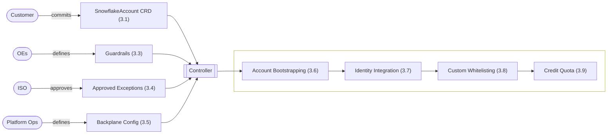
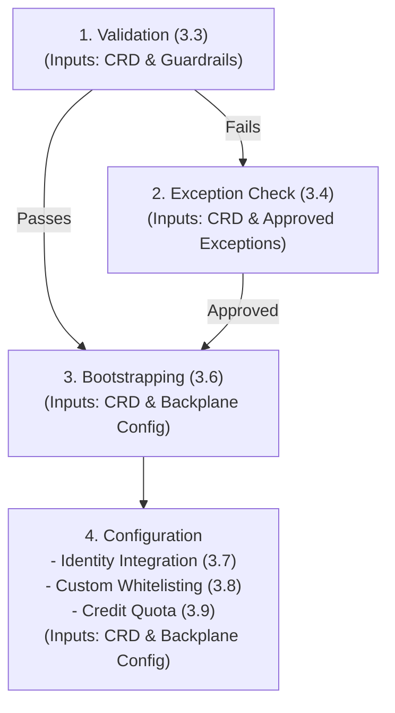

# Product Design

## Table of Contents

1. [Introduction](#1-introduction)
2. [Tenant Onboarding](#2-tenant-onboarding)
3. [SnowflakeAccount Resource](#3-snowflakeaccount-resource)
4. [SnowflakeReplication Resource](#4-snowflakereplication-resource)
5. [SnowflakeDeletionRequest Resource](#5-snowflakedeletionrequest-resource)
6. [Error Handling & Observability](#6-global-error-handling--observability)
7. [Appendix A: Open TODOs](#appendix-a-open-todos)
8. [Appendix B: Organization Policy Requirements](#appendix-b-organization-policy-requirements)


## 1. Introduction

### 1.1 Purpose & Scope
The Snowflake Multi-Account Platform aims to deliver a secure, scalable, and fully self-service solution for automated provisioning and centralized management of Snowflake accounts at enterprise scale.

**Scope:**
* **Self-Service:** Enable teams to create and manage their own Snowflake accounts (tenants) without dependency on central operations tickets.
* **Enterprise Security:** Ensure compliance through automated guardrails and server-side policy enforcement.
* **Multi-Cloud/Region:** Support uniform operations across AWS and Azure regions.
* **Integration:** Provide seamless connectivity with existing enterprise self-service and Identity Access Management (IAM) systems.


### 1.2 Design Philosophy: AI-First Engineering
This platform is not built using traditional, manual software development methods. Instead, it adopts a **Spec-Driven Development (SDD)** approach, designed explicitly for an era of AI coding and operations. This document outlines the desired end-state and serves as the strict blueprint for implementation of the AI coding agent. 

* **The Spec is the Source Code:** This document is the authoritative source of truth. The implementation code for the controller is generated by AI agents (e.g., Claude Code) directly from these schemas and behavioral descriptions.
* **Regeneration over Refactoring:** To avoid technical debt, the system is designed so that code is regenerated from the latest specification rather than manually patched. This ensures strict alignment between the design (this doc) and the runtime artifacts.
* **AI Ops Readiness:** By strictly defining state and error behaviors, the platform prepares for future AI Ops capabilities, allowing autonomous agents to understand system goals, detect anomalies, and resolve operational issues without human intervention.


## 2. Tenant Onboarding

The onboarding process begins when a team requests access to the self-service platform and provides three pieces of information: the tenant name (called profile at FCP), the GIAM group that should be granted access in Argo CD, and the team’s cost center. The platform product owner defines the credit quota based on expected consumption. Once this information is available, the operations team performs a standardized onboarding workflow:

* A Kubernetes namespace with the same name is created and labeled with the cost center and credit quota.
* A new GitHub repository is created under the shared organization using the tenant name.
* Argo CD is then configured to automatically sync the team’s repo into this namespace so that any SnowflakeAccount resources are reconciled immediately.

The following is a simple bash script to illustrate the required steps. (will be replaced by Terraform):

```bash
 #!/usr/bin/env bash  
 TENANT="$1" # profile name, also repo + namespace name  
 AD_GROUP="$2" # AD group for Argo CD access  
 COST_CENTER="$3" # provided by customer  
 CREDIT_QUOTA="$4" # set by platform PO  
 
 gh repo create "yukimi/$TENANT" --template yukimi/get-started
 kubectl create namespace "$TENANT"  
 kubectl label namespace "$TENANT" \  
    cost-center="$COST_CENTER" \  
    credit-quota="$CREDIT_QUOTA" \  --overwrite  

argocd app create "$TENANT" \  
    --repo "git@github.com:yukimi/$TENANT.git" \  
    --path "." \  --dest-namespace "$TENANT" \  
    --dest-server https://kubernetes.default.svc \  
    --project "snowflake-accounts" \  
    --sync-policy automated 
 ```


## 3. SnowflakeAccount Resource
The SnowflakeAccount resource enables teams to define, provision, and manage a fully isolated Snowflake account.

### 3.1 Example

```yaml
apiVersion: base.snowflake.yukimi.io/v1alpha1
kind: SnowflakeAccount
metadata:
  name: analytics-team-eu
  labels:
    environment: prod
spec:
  # --- General metadata ---
  description: "Analytics team Snowflake environment for EU operations"
  contacts:
    - alice.smith@company.com
    - team-analytics@company.com
  # --- Snowflake account configuration ---
  region: aws-eu-central-1
  # --- Share of the namespace's monthly credit allowance (3.9) ---
  creditQuota: 500
  # --- GIAM roles to import and assign ---
  groups:
    import:                          # every group to import; must exist in the backplane
      - XYZ_DATA_ENGINEERS
      - XYZ_DEVELOPERS
      - XYZ_ANALYSTS
    grants:                          # system role → imported group; ACCOUNTADMIN required
      ACCOUNTADMIN: XYZ_DATA_ENGINEERS
      SYSADMIN: XYZ_DEVELOPERS       # any Snowflake system role may be granted   
  # --- Allow custom whitelisting ---
  networkPolicy:
    users:                       # one entry per technical user, deny-by-default (3.8)
      tu_airflow:
        - connection: agn        # from the region's inventory in the Backplane Config
          allowedIPs: ["10.23.45.0/24"]
        - connection: dbt-cloud  # VPCE-only: nothing to narrow
    account:                     # opened for every user in the account
      - connection: dbt-cloud
  # --- Allow human users to bypass SSO ---
  authPolicy:
    exceptions:
      - user: alice.smith
        rsaKeyAllowed: true
        reason: "Automation without SSO support"
```


### 3.2 Domain Concepts

The SnowflakeAccount CRD serves as the atomic unit of tenancy within the platform. It represents a fully isolated Snowflake Account Object combined with necessary enterprise bindings, specifically identity mapping (GIAM/SCIM) and network posture (Network Policies).

The platform’s scalability relies on a fundamental architectural shift: integrating regions rather than individual accounts. Previously, account creation required provisioning heavy infrastructure from scratch for every account. To address this, the architecture pre-provisions infrastructure once per cloud region as a shared "backplane".

Integration is performed once per region (or globally where possible) rather than repeatedly for each tenant:

* PrivateLink is configured once per Snowflake region.
* DNS is registered using regional wildcards.
* SSO is integrated globally.
* Hardened network and authentication policies are defined centrally.

Because the network integration is pre-configured and active, new accounts simply attach to this existing infrastructure via automated SQL commands. This mechanism transforms provisioning from a manual infrastructure project into an instant, logical operation.

#### 3.2.1 Configuration Origins and Ownership

Account creation is driven by four inputs, each associated with a different party. The diagram below shows how these inputs relate, which party each is associated with, and how they feed the overall system. The numbers in parentheses map directly to the subsequent sections in this document for easy reference.



* **SnowflakeAccount CRD (3.1):** The customer commits a `SnowflakeAccount` CRD describing the account they want, kicking off the reconciliation flow.
* **Guardrails (3.3):** OEs (Operating Entities) define the rules that gate and preset the customer's CRD input before it is ever applied to Snowflake.
* **Approved Exceptions (3.4):** ISO approves one-off exceptions to what the guardrails would otherwise reject — e.g. whitelisting a public-internet IP.
* **Backplane Config (3.5):** Once Ops has provisioned a region's network via Terraform and closed out the follow-up setup tickets, they record the resulting IDs and IP ranges in the Backplane Config for the controller to use.

#### 3.2.2 Controller Execution Flow

During the reconciliation cycle, the controller processes these inputs through a strict, multi-phased sequence. The system evaluates constraints and applies configurations progressively, ensuring compliance is established before proceeding to infrastructure provisioning.



* **Validation (3.3):** The controller evaluates the submitted `SnowflakeAccount` CRD against the organizational Guardrails to ensure baseline compliance.
* **Exception Check (3.4):** If the CRD violates standard constraints, the system consults the Approved Exceptions to determine if a formal override exists for the requested configuration.
* **Bootstrapping (3.6):** Upon successful validation, the controller provisions the Snowflake account and binds it to the pre-existing regional infrastructure defined in the Backplane Config. The controller extracts values from both the validated CRD and the Backplane Config to construct and execute the requisite SQL commands.
* **Configuration (3.7 - 3.9):** Using the CRD and Backplane Config, the controller constructs the SQL commands to execute the final configuration sequence:
  * **Identity Integration (3.7):** Imports the required organizational groups via the identity backplane.
  * **Custom Whitelisting (3.8):** Enforces dedicated network ingress policies for technical users and the broader account.
  * **Credit Quota (3.9):** Applies the namespace's allocated credit limit as an active resource monitor.


### 3.3 Guardrails

Guardrails act as a gatekeeper that validates and modifies a tenant's input before it is ever applied to Snowflake. They enforce compliance, govern input logic (such as whitelisting), and ensure no unsafe configurations are provisioned.

**Scope:** Guardrails apply exclusively to `SnowflakeAccount` resources; other resource types handle their own separate validation.

Each guardrail defines three core components:

  * **`target`:** Defines which accounts the guardrail applies to. An omitted field or a `"*"` wildcard means the rule matches all accounts.
  * **`constraints`:** The strict rules the user's input must pass, such as correct naming conventions, maximum credit quotas, and network rules. If a submitted CRD violates these rules, the system immediately rejects it with a validation error.
  * **`preset`:** Automatically populates default values (like timezones or base credit quotas) if the user omits them in their request.

**Connection Constraints:** Guardrails strictly control how tenants can configure network access. These constraints are categorized by scope (either `users` or `account`, mirroring the CRD's whitelisting keys) and then by connection name, applying one of three rules:

  * **Max Width (`"/NN"`):** The user is required to provide an IP range (CIDR), but it is capped at the specified maximum width.
  * **Inherit Full Range (`"full"`):** The user may not specify an IP range; they simply inherit the connection's full predefined range from the Backplane Config.
  * **Forbidden (`"off"`):** The user is completely blocked from using this connection.
  * **Fallback:** Any connection a user attempts to reference that isn't explicitly listed in a scope will fall back to that scope's wildcard (`"*"`) rule.

**Matching Strategy (Top-Down):** Guardrails merge top-down, applying broad global baselines first, followed by narrower, environment-specific overrides.


```yaml
# Example guardrails (governs user-committed SnowflakeAccount YAML).
# Evaluated top-down: broad baseline first, narrower guardrails override.
guardrails:
  # 1️⃣ Global Baseline (Applies to everyone unless overridden)
  - target:
      environment: "*"
      region: "*"
      department: "*"
      account: "*"

    # constraints: Gates user input.
    constraints:
      accountName: "^[a-z][a-z0-9-]{2,62}$" # Lowercase, no special chars, RFC1123
      groupNames: "^[A-Z0-9_]+$"            # Name pattern for group names
      maxCreditQuota: 1000                  # ceiling per account (3.9); the namespace
                                            #   allowance still caps the sum

      allowedRegions:
        - "*"
      connections:              # per-connection: "/NN" = CIDR required (max width),
        users:                  #   "full" = no CIDR (inherit full range), "off" = forbidden
          agn: "/16"
          public: "/32"         # public: single IPs only
          dbt-cloud: "full"     # VPCE-only: no CIDR to narrow
          "*": "off"            # unlisted connection → rejected
        account:
          dbt-cloud: "full"     # VPCE-only: nothing to widen
          "*": "off"            # no account-wide whitelisting by default

    # preset: Applied if user omits these fields in their CRD.
    preset:
      timeZone: "UTC"
      creditQuota: 100                      # modest default rather than zero-credit

  # 2️⃣ Dev Overrides — agn needs no CIDR (convenience)
  - target:
      environment: "dev"

    constraints:
      connections:
        users:
          agn: "full"           # just `connection: agn`, no allowedIPs
        account:
          agn: "/16"            # dev may open agn account-wide

  # 3️⃣ Allianz DE Overrides
  - target:
      department: "Allianz_DE"

    constraints:
      allowedRegions:
        - "aws-eu-central-1"    # Frankfurt
        - "aws-eu-west-3"       # Paris
      connections:
        users:
          agn: "/24"            # DE tightens agn further
```


### 3.4 Approved Exceptions

When a `SnowflakeAccount` CRD fails its guardrails (3.3), the controller does not reject it outright. Before returning a validation error, it checks a separate exceptions file for a matching approved exception. If one exists, the otherwise-failing input is allowed through; if not, the resource is rejected as usual.

This exists for cases where a customer has a legitimate, one-off need that the standing guardrail baseline would otherwise block — for example, whitelisting the `public` connection with a wider CIDR than the guardrails normally permit. Getting one added is a manual, email-driven process, not a self-service one: the customer emails ISO (Information Security Office) to request approval for their specific use case; ISO reviews it and, if approved, forwards the request to platform ops; ops then adds the corresponding entry to the exceptions file. Only after that entry exists does the customer's CRD pass validation.

**Ownership:** The exceptions file is owned and maintained by platform ops, not ISO — ISO grants the security approval, but ops is the one who edits the file that the controller reads. The approval itself happens outside the platform, over email; the file is just the durable record of what was approved.

```yaml
# Example Exceptions file (ops-owned). Approves specific, otherwise-invalid inputs
# on a case-by-case basis, once ISO has approved them by email; matched against a
# CRD only after its guardrails (3.3) reject it.
exceptions:
  - account: "analytics-team-eu"        # exact account name — no wildcards
    networkPolicy:                        # the full entry being approved, verbatim
      users:
        tu_airflow:
          - connection: public
            allowedIPs: ["203.0.113.50/32"] # wider than the guardrails normally allow
    reason: "ISO-4821: temporary vendor integration, approved by ISO via email 2026-06-01"
```


### 3.5 Backplane Config

The Backplane Config is a platform-owned artifact that catalogs the pre-provisioned regional networking infrastructure (such as VPC endpoints) established via Terraform. The controller uses this active backplane to instantly network-bind new accounts without manual setup. Additionally, it enforces the organization-wide security posture through global parameters and strict network ingress ceilings.

Bringing a region online is a one-time manual job for platform ops: run the Terraform project that provisions the region's backplane, close out the follow-up tickets that finalize it (DNS, Snowflake accepting the VPC endpoint), test it end-to-end, then add the region's entry from the Terraform outputs with `active: true`. From then on the controller can provision accounts into it, looking the region up by the CRD's `region` field.

The configuration consists of three core components:

  * **`inventory`:** A catalog of all physical ingress paths (connections) in a region. It defines the maximum allowed IP range (`maxCidrs`) for each connection, but does not grant access itself.
  * **`parameters`:** Snowflake account parameters applied during bootstrapping, covering both global security baselines and region-specific settings.
  * **`allowlist`:** The mandatory baseline whitelisting applied to every account in the region. This guarantees basic reachability (e.g., for browser logins) before any custom, user-specific rules are added.

```yaml
backplane:

  # --- GLOBAL PARAMETERS: org-wide security baseline, applied to every account ---
  globalParameters:
    PREVENT_UNLOAD_TO_INLINE_URL: "true"        # block data exfiltration to arbitrary URLs
    REQUIRE_STORAGE_INTEGRATION_FOR_STAGE_CREATION: "true"

  # --- REGIONS: one entry per cloud region, filled in from the Terraform outputs ---
  regions:

    aws-eu-central-1:
      active: true

      # Every ingress path that exists in this region. Listing one here only makes its
      # handle referenceable and caps how wide it may ever be opened; it opens nothing
      # on its own. Access is granted by `regionalAllowlist` below (account-wide) or by a tenant's
      # per-user `whitelisting` (3.8).
      inventory:
        - connection: agn                       # Allianz Global Network (corp VPN)
          type: "AWSVPCEID"
          vpceId: "vpce-00006900000000001"
          maxCidrs: ["172.16.0.0/12"]           # widest block this path may carry
        - connection: dbt-cloud
          type: "AWSVPCEID"
          vpceId: "vpce-00006900000000004"      # VPCE-only: no maxCidrs, no IPs to manage
        - connection: public
          type: "IPV4"
          maxCidrs: ["0.0.0.0/0"]               # any public IP may be narrowed from this

      # Region-specific account parameters, from the Terraform outputs.
      regionalParameters:
        ENABLE_INTERNAL_STAGES_PRIVATELINK: "true"
        S3_STAGE_VPCE_DNS_NAME: "*.vpce-sd98fs0d9f8g.s3.eu-central-1.vpce.amazonaws.com"

      # The paths actually opened for every account in this region — this is what lets
      # people reach the account at all, e.g. logging in from the corporate network.
      # Each entry picks one connection from the inventory above. Add `allowedIPs` to
      # open only part of its range; leave it out to open the whole maxCidrs range.
      regionalAllowlist:
        - connection: agn                       # inherit full 172.16.0.0/12
        - connection: dbt-cloud                 # VPCE-only, nothing to narrow
        - connection: public
          allowedIPs: ["203.0.113.0/24"]        # narrowed: platform office egress only

    # A region can be staged ahead of time and switched on once its backplane is confirmed.
    aws-eu-west-3:
      active: false
      inventory:
        - connection: agn
          type: "AWSVPCEID"
          vpceId: "vpce-00006900000000008"
          maxCidrs: ["10.0.0.0/8"]
      regionalParameters:
        ENABLE_INTERNAL_STAGES_PRIVATELINK: "true"
        S3_STAGE_VPCE_DNS_NAME: "*.vpce-9f8g7h6j5k.s3.eu-west-3.vpce.amazonaws.com"
      regionalAllowlist:
        - connection: agn                       # inherit full 10.0.0.0/8
```


### 3.6 Account Bootstrapping

When the controller observes a `SnowflakeAccount` that does not yet exist in Snowflake, it runs the following script, drawing on two inputs: the `SnowflakeAccount` CRD itself, and the Backplane Config entry for `spec.region` — the controller looks up that region's entry under `backplane.regions` by the CRD's `region` field before it can resolve any of the values below.

```sql
-- 1. Instantiation: create the account.
CREATE ACCOUNT '<name-from-crd>' ADMIN_NAME='platform' ADMIN_RSA_PUBLIC_KEY = '<generated-by-controller>' ADMIN_USER_TYPE='SERVICE' EDITION='ENTERPRISE' REGION='<region-from-crd>' COMMENT='<description-from-crd>';

-- 2. Backplane Integration: bind the new account to the regional infrastructure
-- held in the region's Backplane Config entry.

-- 2a. Apply the org-wide baseline, then the region's own parameters — one statement
-- per entry in globalParameters followed by one per entry in regionalParameters.
ALTER ACCOUNT SET <parameter-name> = '<parameter-value>';
-- ... repeated for every entry in globalParameters, then every entry in regionalParameters

-- 2b. Create one network rule per entry in the region's regionalAllowlist, resolving each
-- to its inventory entry: use the entry's `allowedIPs` if given (validated to
-- fall inside that connection's maxCidrs), otherwise inherit the connection's full maxCidrs.
CREATE NETWORK RULE <connection-name-from-regionalAllowlist> TYPE = <type-from-region-config> MODE = INGRESS
  VALUE_LIST = (<vpceId-and/or-resolved-allowedIPs>);
-- ... repeated for every entry in the region's regionalAllowlist

-- 2c. Attach those rules to the account via the platform's fixed network policy.
-- Further account-level rules are added to this policy in Custom Whitelisting (3.8).
CREATE NETWORK POLICY PLATFORM_ACCOUNT_POLICY
  ALLOWED_NETWORK_RULE_LIST = (<all-connection-names-from-regionalAllowlist>);
ALTER ACCOUNT SET NETWORK_POLICY = 'PLATFORM_ACCOUNT_POLICY';

```

**Note:** Snowflake is expected to release a new feature/syntax called Organization Policies, which will let this same network policy be enforced centrally on the account rather than via the `ALTER ACCOUNT` commands above. Once that syntax is available, this implementation will be swapped to use it — the enforced policy stays the same, but tenants will no longer be able to modify or unset it themselves. Not yet released as of this writing.


### 3.7 Identity Integration

Identity, like networking, is integrated globally rather than per account. An Azure AD SCIM sync continuously feeds enterprise users and GIAM groups into a single Organization User Group backplane in Snowflake, independent of any `SnowflakeAccount` CRD. This sync makes groups available org-wide, but a group must still be explicitly imported into an account before it can be used there.

That import is what the CRD's `groups` field drives, and it splits the two questions that were previously conflated: which groups exist in the account, and which of them carry a system role.

  * **`import`:** The complete list of organization groups to bring into the account. Each must already exist in the backplane. Importing a group creates a matching role in the account, and its members are granted that role automatically.
  * **`grants`:** Binds Snowflake system roles to imported groups — each key is a literal system role name, each value the group that receives it. The set of keys is open: `USERADMIN`, `SECURITYADMIN` or any other system role may be granted without a change to this spec. Three rules apply:
      * **`ACCOUNTADMIN` is required.** Without it nobody could log in to the freshly created account and administer it, since the `platform` service user is the only other principal that exists (3.6) and it is not a human login path. A CRD omitting it is rejected.
      * **Every value must also appear in `import`.** A `grants` entry naming a group that is not being imported is a validation error, since there would be no role in the account to grant to.
      * **One group per role.** A given system role is granted to exactly one group; listing the same role key twice is a validation error. Other groups needing the same privileges receive them through the role hierarchy inside the account, which is the tenant's own concern.

```sql
-- 1. Import every group in groups.import, in the order listed. This is the only
-- statement that creates roles in the account; grants below only bind to them.
ALTER ACCOUNT ADD ORGANIZATION USER GROUP '<group-name-from-groups.import>';
-- ... repeated for each entry in groups.import

-- 2. Grant the system roles named in groups.grants — one statement per entry, the
-- key used verbatim as the system role — so members of the referenced group inherit
-- it through the role hierarchy. ACCOUNTADMIN is always among these (see above).
GRANT ROLE <role-name-from-grants-key> TO ROLE "<group-name-from-grants-value>";
-- ... repeated for each entry in groups.grants
```

**TODO:** Either all users and groups are synced with SCIM or the controller must trigger to add all groups in the CRD to the Azure Entra ID Enterprise App.


### 3.8 Custom Whitelisting

Custom whitelisting is a critical step in the account provisioning process. Additional network access defined in the `SnowflakeAccount` CRD is provisioned here for both the overall account and specific technical users. Securing technical users (e.g., service accounts like `tu_airflow`) is the most important aspect of this process, as their long-lived credentials pose the highest security risk to the platform. This mechanism forces customers to define tight, explicit ingress paths rather than reusing the broad access ranges meant for human users.

**Core Principles & Behavior:**

  * **Deny-by-Default:** A technical user with no explicit whitelisting entry receives an empty network policy, completely blocking them from logging in. Access is only granted through narrow, explicitly defined entries.
  * **Strict Containment:** Every requested IP range (`allowedIPs`) must fall entirely within the security ceiling (`maxCidrs`) defined for that connection in the region's Backplane Config. Any entry broader than or outside this limit is rejected, and the account is not provisioned.
  * **User-Scoped Policies:** Snowflake network policies fully override the account-level default when applied to a specific user. Therefore, the system generates a dedicated, custom network policy for each technical user under `networkPolicy.users`, built exclusively from the connections they are explicitly granted. A user's list may name several connections; because a user can only have one active `NETWORK_POLICY` at a time, all of them collapse into that single policy.
  * **Account-Scoped Policies:** Entries under `networkPolicy.account` are applied account-wide. These rules are appended to the baseline platform account policy created during the initial bootstrapping phase.
  * **No Duplicate Connections:** A connection may appear at most once in a given user's list, and at most once under `account`. A repeated connection within the same scope is a validation error rather than a silent merge of its IP ranges.

```sql
-- For each user key in networkPolicy.users, create one network rule per
-- entry in that user's list. Resolve each entry's allowedIPs against the connection's
-- maxCidrs (from the region's inventory), having validated that each allowedIPs entry
-- falls inside that connection's maxCidrs.
CREATE NETWORK RULE <technical-user-and-connection-derived-name> TYPE = <type-from-region-config> MODE = INGRESS
  VALUE_LIST = (<vpceId-and/or-validated-allowedIPs>);
-- ... repeated for every entry in this user's list

-- Collect that user's rules into a single dedicated policy — one policy per user,
-- covering every connection they were granted, since a user can only have one active
-- NETWORK_POLICY at a time.
CREATE NETWORK POLICY <technical-user-derived-policy-name>
  ALLOWED_NETWORK_RULE_LIST = (<all-rule-names-for-this-user>);
ALTER USER '<technical-user-from-crd>' SET NETWORK_POLICY = '<technical-user-derived-policy-name>'; -- technical users only, never human users
-- ... repeated for every user key in networkPolicy.users

-- Entries under networkPolicy.account are account-scoped: they add their
-- rules to the account policy created during bootstrapping (3.6) instead of getting a
-- policy of their own. Same containment validation applies.
CREATE NETWORK RULE CUSTOM_<connection-name> TYPE = <type-from-region-config> MODE = INGRESS
  VALUE_LIST = (<vpceId-and/or-validated-allowedIPs>);
-- ... repeated for every entry under networkPolicy.account

-- Attach them to the account policy. The CUSTOM_ prefix keeps these separate from the
-- region's regionalAllowlist rules (3.6), which are named by the bare connection.
ALTER NETWORK POLICY PLATFORM_ACCOUNT_POLICY
  ADD ALLOWED_NETWORK_RULE_LIST = (<all-custom-rule-names>);
```

**Note:** Snowflake will introduce Organization Policies that will centrally enforce these per-user network rules and natively enforce the empty policy by default.


### 3.9 Credit Quota

A tenant's overall monthly credit allowance is defined during onboarding and securely bound to their Kubernetes namespace via the `credit-quota` label. Because this limit is managed outside the tenant's Git repository, it acts as a strict trust anchor that teams cannot bypass or increase on their own — the same trust-anchor argument that makes the namespace the tenancy boundary in 3.10.1. Individual accounts claim a portion of this overall allowance via the mutable `creditQuota` field in their `SnowflakeAccount` CRD.

**Quota Lifecycle:**

* **Admission (Validation):** During every account creation or update, the controller loads all `SnowflakeAccount` resources within the namespace to calculate the total claimed quota. If the request exceeds the namespace allowance, it is rejected with a validation error.
  * **Quota Reductions:** Capacity is evaluated on a first-come, first-served basis. If platform operations decreases the overall namespace allowance, existing accounts are never retroactively suspended. However, future creations or updates are blocked until the tenant lowers their CRD claims to fit within the newly reduced limit.
* **Enforcement:** The approved quota is pushed directly into Snowflake as an account-level Resource Monitor and budget limit. This Resource Monitor strictly suspends compute warehouses when the quota is exhausted, physically stopping the majority of spend in real time.
* **Exhaustion State:** If an account exceeds its allocated share, the system triggers a `QuotaExhausted` warning event in Kubernetes. This is not a provisioning failure — the account remains fully intact, and the condition automatically clears at the start of the next monthly billing cycle.

**TODO (The Serverless & AI Gap):** Resource monitors currently only cover warehouse compute. Serverless features and AI functions cannot be physically suspended this way; budgets for these are notify-only. The platform must decide how to cap these costs before implementation. Options include waiting for Snowflake to release native Organization-level spending limits, strictly gating access to serverless/AI features, or attempting custom privilege-revocation logic.


### 3.10 Security Constraints

The platform's security and protection mechanisms are designed to remain resilient even in the event of system bugs or breaches. This resilience is achieved not merely through validation logic, but by strictly avoiding the routine use of highly privileged credentials, such as organization admin accounts. Organization-level credentials are restricted almost entirely to the initial account creation phase. While account deletion also requires organization admin access, it is protected by additional structural safeguards to prevent unauthorized or accidental destruction.

Following the creation of an account, the controller transitions to impersonating the accountadmin role exclusively for that specific tenant. By stepping down from organization-level privileges to account-level access, the platform effectively minimizes the potential blast radius of any security incident to just that individual account. Every guarantee below is enforced outside the controller's own logic, and the implementation must adhere to the following definitions.

#### 3.10.1. Tenant Isolation via Secret Paths

Isolation is enforced physically by the storage path of the credentials in **AWS Secrets Manager (ASM)**.

* **The Trust Anchor:** The **Kubernetes Namespace** (`metadata.namespace`) is the sole source of truth for tenancy. It is derived directly from the runtime environment (not user input) and is used to cryptographically bind the account to the team's sandbox.
* **Path Construction:** The controller must construct the ASM Secret ID using the following strict pattern:
    `snowflake/tenant/<snowflake-org-name>/<kubernetes-ns>/<snowflake-account-name>/platform-credentials`
* **The Constraint:** When the controller attempts to access an existing account, it **must** derive the lookup path using the CRD's namespace. This ensures that any attempt to manage an account outside the team's namespace will fail at the AWS IAM level due to an incorrect secret path, thereby preventing cross-tenant access.

#### 3.10.2. OIDC Authentication (Optional) TODO

Every account is always created with the secret-based `platform` user described above and in 3.6 — that mechanism is not replaced. OIDC is an **additional**, optional authentication path layered on top of the same account, established immediately after creation, that lets the controller reach a tenant's account without reading its RSA private key from AWS Secrets Manager (ASM) on every connection.

**Principal:** Unlike the account-birth credential, which belongs to a single `platform` service user, the OIDC principal is scoped to the **tenant's Kubernetes namespace** — the same trust anchor used for secret-path isolation above. The controller creates a dedicated Kubernetes `ServiceAccount` in the tenant's namespace alongside the `SnowflakeAccount` resource (e.g. `sa-<account-name>-oidc`). This ServiceAccount never runs a pod — it exists purely as an identity primitive. When the controller needs to connect to that account, it uses the Kubernetes `TokenRequest` API to mint a short-lived, narrowly-audienced JWT for that ServiceAccount, uses it once, and discards it. The token's `sub` claim — `system:serviceaccount:<namespace>:sa-<account-name>-oidc` — encodes both the tenant namespace and the account name, mirroring the granularity of the ASM secret path.

**Global setup (one-time, like the network/identity backplane in 3.2):** The Kubernetes cluster's OIDC issuer and JWKS endpoint are registered once, platform-wide, as a trusted external identity provider in the Backplane Config. This is an ops/bootstrap concern, not a per-account step.

**Per-account setup (added to account bootstrapping, 3.6):**

```sql
-- 3. OIDC Integration: trust the cluster's OIDC issuer for this account, and map
-- this account's namespace-and-account-scoped ServiceAccount subject to one of
-- the CRD's already-imported groups (3.7) — no new identity or role is created.
CREATE SECURITY INTEGRATION PLATFORM_OIDC
  TYPE = EXTERNAL_OAUTH OAUTH_TYPE = CUSTOM
  OAUTH_ISSUER = '<k8s-oidc-issuer-url-from-platform-config>'
  OAUTH_JWS_KEYS_URL = '<k8s-oidc-jwks-url-from-platform-config>'
  OAUTH_AUDIENCE_LIST = ('snowflake')
  EXTERNAL_OAUTH_TOKEN_USER_MAPPING_CLAIM = 'sub';

-- The mapped Snowflake user's LOGIN_NAME is derived deterministically from the
-- expected `sub` claim value, and is granted the group role named by
-- grants.ACCOUNTADMIN (3.7) — always present, so this mapping is always available.
-- OIDC authenticates as an *existing* role, it does not introduce a new one.
ALTER USER '<group-name-from-grants.ACCOUNTADMIN>' SET LOGIN_NAME = '<sub-claim-derived-from-namespace-and-account>';
```

**Isolation:** Cross-tenant access is rejected by Snowflake itself, not merely by client-side path construction. Each tenant account's `PLATFORM_OIDC` integration only maps its own namespace-and-account-derived `sub` to a valid user; a token minted for namespace B's ServiceAccount, presented to namespace A's account, matches no mapped user there and is rejected during Snowflake's own signature-and-claims verification — before any SQL executes. This is a stronger guarantee than the ASM path check above, which relies on the calling code correctly constructing a path string: here the Kubernetes API server cryptographically signs the `sub` claim, and Snowflake independently verifies it.

**Fallback:** The secret-based `platform` credential in ASM remains fully functional and is not deprecated by enabling OIDC. `CREATE ACCOUNT` always requires the RSA key pair, so the secret path and its isolation guarantees stay exactly as documented. OIDC is consulted first for routine reconciliation once established; the controller falls back to the ASM-stored key if OIDC is unavailable.

**TODO:** Define the precise fallback trigger (automatic detection vs. explicit CRD flag), and the Kubernetes RBAC model that lets the controller mint `TokenRequest` tokens for ServiceAccounts across every tenant namespace (a cluster-scoped capability that itself deserves the same "why can this not be abused cross-tenant" scrutiny given to the ASM IAM role below).


#### 3.10.3. Immutable Identity Binding

The **`region`** and **`name`** of a `SnowflakeAccount` are **Immutable** after creation. This prevents identity spoofing where a user creates an account, lets the secret generate, and then attempts to switch the CRD to point to a different target resource while retaining the original credentials.


## 4. SnowflakeReplication Resource

The `SnowflakeReplication` resource links multiple existing `SnowflakeAccount` resources into a single replication group, with exactly one account acting as the primary.

### 4.1 Example

```yaml
apiVersion: base.snowflake.yukimi.io/v1alpha1
kind: SnowflakeReplication
metadata:
  name: analytics-team-dr
  namespace: analytics-team-eu
spec:
  description: "Cross-region standby for EU analytics"
  accounts:
    - analytics-team-eu # aws-eu-central-1
    - analytics-team-eu-dr # aws-eu-west-3
  primaryAccount: analytics-team-eu
  objectTypes:
    - DATABASES
    - ROLES
    - USERS
    - WAREHOUSES
  databases:
    - SALES
    - "PROD_*"
  schedule: "10 MINUTE"
  failoverEnabled: true
```

### 4.2 Data Residency

Data replication across regions is strictly governed by the platform's existing guardrails (3.3), ensuring data only moves between legally permitted region pairs.

### 4.3 Infrastructure vs. Data Replication

Replication is strictly limited to customer data and logical objects (such as databases and roles). Platform-level infrastructure, like network rules and endpoints, is never replicated to avoid breaking regional connectivity.

**Native Snowflake Execution:**

The Kubernetes controller does not actively manage the ongoing replication sync. Instead, it uses native Snowflake functionality:

* **Stored Procedure & Timer:** During setup, the controller provisions a stored procedure and a scheduled timer (task) directly inside the primary Snowflake account.
* **Autonomous Operation:** This native Snowflake setup runs on the defined schedule to evaluate configurations (such as resolving database wildcard patterns) and automatically updates the active replication group as the environment changes.

### 4.4 Controller Lifecycle and Failover

* **Bootstrapping:** The controller validates the accounts, establishes the initial replication setup, provisions the stored procedure and timer, and then hands over ongoing execution entirely to Snowflake.
* **Auto-Repair:** Because tenants have access to their Snowflake environment, they could inadvertently modify or break the replication code. If the controller detects replication errors or configuration drift during reconciliation, it automatically repairs the setup by completely removing and recreating the stored procedure and timer.
* **Manual Failover:** Failovers are strictly manual to prevent "split-brain" data corruption caused by temporary network blips. A failover is executed only when a tenant explicitly updates the `primaryAccount` in their Git repository, prompting the controller to promote the new primary.


## 5. SnowflakeDeletionRequest Resource

### 5.1 Example

```yaml
apiVersion: base.snowflake.yukimi.io/v1alpha1
kind: SnowflakeDeletionRequest
metadata:
  name: decommission-analytics-prod
  namespace: analytics-team-eu
spec:
  targetRef:
    kind: SnowflakeAccount
    name: analytics-team-eu
  duration: 4h  # Maintenance window duration (Max: 8h)
  reason: "Ticket OPS-1234: Project sunsetting, data archived."
```


### 5.2 Domain Concepts

#### Positive Control (The "Two-Key" System)

To prevent catastrophic data loss via accidental Git operations, the platform enforces a **Positive Control** model. A resource cannot be destroyed simply by removing its definition file. Instead, deletion is treated as a privileged operation that requires a dedicated "Deletion Warrant."

  * **The Lock:** Every critical resource is protected by a Kubernetes Finalizer (`snowflake.finalizer`) that blocks deletion by default.
  * **The Key:** The `SnowflakeDeletionRequest` acts as the temporary key that authorizes the controller to unlock and destroy the specific target resource.

#### Time-Boxed Maintenance Windows

Deletion permissions are ephemeral. By defining a `duration` (max 8 hours), the platform enforces strict **Time-Boxing**. This minimizes security risks by ensuring that an "open" deletion window automatically closes if not used promptly, preventing long-standing "dangling permissions" that could be exploited later.

#### Durable Audit Trail

While the target resource disappears after deletion, the `SnowflakeDeletionRequest` (or its logs) remains. This creates a permanent audit trail linking the destruction of infrastructure to a specific reason (e.g., a ticket number) and a specific timeframe, satisfying compliance requirements for data destruction.

### 5.3 Controller Behavior

The controller logic focuses on the interaction between the Target Resource (e.g., `SnowflakeAccount`) and the `SnowflakeDeletionRequest`.

**Phase 1: Request Validation**
Upon creation of a `SnowflakeDeletionRequest`:

1.  **Validation:** The controller verifies the `duration` does not exceed 8 hours.
2.  **Window Calculation:** It calculates `status.validUntil` based on the creation timestamp.
3.  **Activation:** It sets `status.state = Active`.

**Phase 2: Interception (The Block)**
When a user deletes a `SnowflakeAccount` (sets `deletionTimestamp`):

1.  The controller intercepts the delete request via the Finalizer.
2.  It queries for an **Active** `SnowflakeDeletionRequest` in the same namespace targeting this specific resource.

**Phase 3: Resolution**

  * **If Valid Request Found:**
    1.  **Execute:** The controller runs the SQL destruction logic (`DROP ACCOUNT` / `DROP DATABASE`).
    2.  **Unlock:** The controller removes the Finalizer, allowing the Kubernetes object to be garbage collected.
    3.  **Close:** The `SnowflakeDeletionRequest` status is updated to `Consumed`.
  * **If No Request / Expired:**
    1.  **Block:** The controller **refuses** to drop the resource.
    2.  **Stall:** The resource remains in a `Terminating` state.
    3.  **Alert:** A Kubernetes Event (`Warning: DeletionBlocked`) is emitted, and `Ready=False` is set, causing ArgoCD to report a failure. This forces the user to either restore the file or create a valid Deletion Request.


## 6. Global Error Handling & Observability

Reliable and transparent error handling is essential for a self-service platform. To ensure a consistent user experience, the platform enforces a **standardized status schema** across all CRDs (`SnowflakeAccount`).

Users must be able to instantly determine whether a resource is healthy, still reconciling, or requires manual intervention. The controller exposes this information via Kubernetes-compliant `status.conditions`.

### 6.1 Condition Model

Every Custom Resource (CR) in this platform surfaces three standard condition types. These conditions provide a high-level summary of the resource's lifecycle state.

| Condition Type | Scope | Description |
| :--- | :--- | :--- |
| **`Ready`** | **Availability** | Indicates whether the resource is provisioned and usable. <br>**During Creation:** Set to **False** until the resource is successfully created. Creation errors are reported here. <br>**After Creation:** Set to **True** once the resource is fully operational. <br>**During Updates:** Remains **True** (updates are non-disruptive). |
| **`Synced`** | **State Consistency** | Indicates whether the live state matches the desired state. <br>**During Creation:** Set to **True** once the CRD is accepted and processing begins. <br>**After Creation:** Remains **True** when no changes are pending. <br>**During Updates:** Set to **False** while changes are being applied. Update errors are reported here. Returns to **True** once synchronized. |
| **`Compliance`** | **Governance** | **True:** The account is bound by the platform's Organization Policies and adheres to the baseline. <br>**Reason `PolicyBound`:** The server-side Organization Policies are in effect for this account. |

### 6.2 Status Examples

**Example A: A Healthy Resource**

```yaml
status:
  accountName: "sf_analytics_prod"
  accountUrl: "https://xyz.snowflakecomputing.com"
  conditions:
    - type: Ready
      status: "True"
      reason: "Available"
      message: "Resource is available for use."
    - type: Synced
      status: "True"
      reason: "ReconcileSuccess"
```


## Appendix A: Open TODOs

Items flagged inline throughout this document, collected here for tracking. 


## Appendix B: Organization Policy Requirements

This appendix is addressed to Snowflake as input while Organization Policies are being designed.

### A.1 Network

| ID | Requirement | Today | Ref |
| :--- | :--- | :--- | :--- |
| **N1** | Account network-policy binding org-owned and not unsettable | `ALTER ACCOUNT SET NETWORK_POLICY` | 3.6 |
| **N2** | Per-user network policies for service users org-enforced | `ALTER USER … SET NETWORK_POLICY` | 3.8 |
| **N3** | Deny-by-default (empty policy) for service users with no explicit grant | `ALTER USER … SET NETWORK_POLICY` | 3.8 |

On N3: a newly created service user should be born with an empty, deny-all network policy already attached, rather than inheriting the account policy or having no policy at all. Service users hold long-lived credentials and are the platform's highest-risk login path (3.8), so the safe default is that a new one cannot log in from anywhere until an ingress path is explicitly granted. This closes the window between `CREATE USER` and the platform attaching a policy, and it makes forgetting to attach one fail closed instead of silently leaving the user reachable from the whole account range.

### A.2 Account Parameters

| ID | Requirement | Today | Ref |
| :--- | :--- | :--- | :--- |
| **C1** | Pin **arbitrary** account parameters from org level, non-overridable | `ALTER ACCOUNT SET` | 3.5, 3.6 |

Parameters in use today: `PREVENT_UNLOAD_TO_INLINE_URL`, `REQUIRE_STORAGE_INTEGRATION_FOR_STAGE_CREATION`, `ENABLE_INTERNAL_STAGES_PRIVATELINK`, `S3_STAGE_VPCE_DNS_NAME`. This set is open-ended and operator-owned (3.5), so C1 should not be limited to a fixed allowlist of parameter names.

### A.3 Spend

| ID | Requirement | Today | Ref |
| :--- | :--- | :--- | :--- |
| **S1** | Org-level credit limit the account admin cannot raise or detach | `ALTER ACCOUNT SET RESOURCE_MONITOR` | 3.9 |
| **S2** | Limits covering serverless and AI consumption, enforcing not just notifying | budgets — notify-only, cannot suspend | 3.9 |

### A.4 Authentication

| ID | Requirement | Today | Ref |
| :--- | :--- | :--- | :--- |
| **A1** | Mandatory SSO, org-enforced | `ALTER ACCOUNT SET AUTHENTICATION_POLICY` | 3.1, 3.7 |
| **A2** | Key-pair and PAT exceptions grantable only at org level | `ALTER USER … SET AUTHENTICATION_POLICY` | 3.4 |

Both bind an authentication policy created with `AUTHENTICATION_METHODS` restricted to `SAML`/`OAUTH`, with `KEYPAIR` or `PROGRAMMATIC_ACCESS_TOKEN` added only for approved exceptions. The account admin can unset either binding, or alter the policy to re-admit a method. No SQL for this is written in 3.1/3.4 yet — the `authPolicy` field is specified without an implementing statement.

### A.5 Platform Access

Both rows concern the platform's own access paths into a tenant account; each is an ordinary in-account object owned by a role the tenant holds.

| ID | Requirement | Today | Ref |
| :--- | :--- | :--- | :--- |
| **X1** | Org-owned break-glass service user, not droppable or alterable by the tenant | `CREATE ACCOUNT … ADMIN_NAME='platform'` | 3.6, 3.10.1 |
| **X2** | Security integration immutable — issuer and JWKS URL not repointable | `CREATE SECURITY INTEGRATION PLATFORM_OIDC` | 3.10.2 |

X1 concerns the `platform` user, created by the `CREATE ACCOUNT` statement itself via `ADMIN_NAME` (3.6). It is a service user with an RSA key pair the platform generates and stores externally (3.10.1), and it is how the platform reaches the account for every subsequent operation — applying parameters, network rules, group imports, and the quota. Once the tenant holds `ACCOUNTADMIN` it becomes an ordinary user they can drop or re-key, locking the platform out of an account it is responsible for managing.


