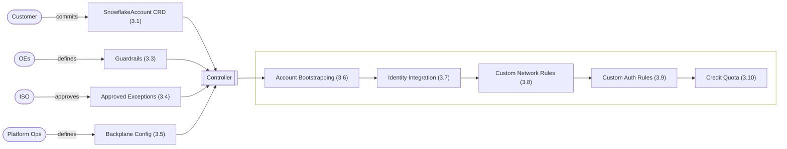

# Product Design

## Table of Contents

- [1. Introduction](#1-introduction)
- [2. Tenant Onboarding](#2-tenant-onboarding)
- [3. SnowflakeAccount Resource](#3-snowflakeaccount-resource)
- [4. IdentitySyncRequest Resource](#4-identitysyncrequest-resource)
- [5. SnowflakeReplication Resource](#5-snowflakereplication-resource)
- [6. SnowflakeDeletionRequest Resource](#6-snowflakedeletionrequest-resource)
- [7. Global Error Handling & Observability](#7-global-error-handling--observability)
- [Appendix A: Open TODOs](#appendix-a-open-todos)
- [Appendix B: Organization Policy Requirements](#appendix-b-organization-policy-requirements)


## 1. Introduction

### 1.1 Purpose & Scope
The Snowflake Multi-Account Platform aims to deliver a secure, scalable, and fully self-service solution for automated provisioning and centralized management of Snowflake accounts at enterprise scale.

**Scope:**
* **Self-Service:** Enable teams to create and manage their own Snowflake accounts (tenants) without dependency on central operations tickets.
* **Enterprise Security:** Ensure compliance through automated guardrails and server-side policy enforcement.
* **Multi-Cloud/Region:** Support uniform operations across AWS and Azure regions.
* **Integration:** Provide seamless connectivity with existing enterprise self-service and Identity Access Management (IAM) systems.


### 1.2 Design Philosophy: AI-First Engineering
This platform is not built using traditional, manual software development methods. Instead, it adopts a **Spec-Driven Development (SDD)** approach, designed explicitly for an era of AI coding and operations. This document outlines the desired end-state and serves as the strict blueprint for implementation of the AI coding agent. 

* **The Spec is the Source Code:** This document is the authoritative source of truth. The implementation code for the controller is generated by AI agents (e.g., Claude Code) directly from these schemas and behavioral descriptions.
* **Regeneration over Refactoring:** To avoid technical debt, the system is designed so that code is regenerated from the latest specification rather than manually patched. This ensures strict alignment between the design (this doc) and the runtime artifacts.
* **AI Ops Readiness:** By strictly defining state and error behaviors, the platform prepares for future AI Ops capabilities, allowing autonomous agents to understand system goals, detect anomalies, and resolve operational issues without human intervention.


## 2. Tenant Onboarding

The onboarding process begins when a team requests access to the self-service platform and provides four pieces of information: the tenant name (called profile at FCP), the GIAM group that should be granted access in Argo CD, the team’s cost center, and the team’s department (e.g. `Allianz_DE`) — used by Guardrails (3.3) to scope department-specific rules. The platform product owner defines the credit quota based on expected consumption. Once this information is available, the operations team performs a standardized onboarding workflow:

* A Kubernetes namespace with the same name is created and labeled with the cost center, department, and credit quota. Like the credit quota (3.10), the department label is set by ops during onboarding and is not exposed as a CRD field, so tenants cannot alter it themselves.
* A new GitHub repository is created under the shared organization using the tenant name.
* Argo CD is then configured to automatically sync the team’s repo into this namespace so that any SnowflakeAccount resources are reconciled immediately.

The following is a simple bash script to illustrate the required steps. (will be replaced by Terraform):

```bash
#!/usr/bin/env bash
TENANT="$1"        # profile name, also repo + namespace name
AD_GROUP="$2"      # GIAM group granted access in Argo CD
COST_CENTER="$3"   # provided by customer
DEPARTMENT="$4"    # provided by customer; used by Guardrails (3.3)
CREDIT_QUOTA="$5"  # set by platform PO

gh repo create "yukimi/$TENANT" --template yukimi/get-started

kubectl create namespace "$TENANT"
kubectl label namespace "$TENANT" \
    cost-center="$COST_CENTER" \
    department="$DEPARTMENT" \
    credit-quota="$CREDIT_QUOTA" \
    --overwrite

argocd app create "$TENANT" \
    --repo "git@github.com:yukimi/$TENANT.git" \
    --path "." \
    --dest-namespace "$TENANT" \
    --dest-server https://kubernetes.default.svc \
    --project "snowflake-accounts" \
    --sync-policy automated

# let the team's GIAM group see and sync their own app
argocd proj role add-group "snowflake-accounts" "$TENANT" "$AD_GROUP"
```


## 3. SnowflakeAccount Resource
The SnowflakeAccount resource enables teams to define, provision, and manage a fully isolated Snowflake account.

### 3.1 Example

```yaml
apiVersion: base.snowflake.yukimi.io/v1alpha1
kind: SnowflakeAccount
metadata:
  name: analytics-team-eu      # created in Snowflake as analytics_team_eu_5k3wf (3.12)
spec:
  # --- General metadata ---
  description: "Analytics team Snowflake environment for EU operations"
  contacts:
    - alice.smith@company.com
    - team-analytics@company.com
  # --- Snowflake account configuration ---
  region: aws-eu-central-1
  environment: prod            # dev | prod — required, immutable (3.11.3); a Guardrails target key (3.3)
  # --- Share of the namespace's monthly credit allowance (3.10) ---
  creditQuota: 500
  # --- GIAM groups to import and bind to system roles ---
  identityIntegration:
    groups:                          # one group list per identity integration (3.7)
      giam:                          # every group to import; key is free-form, not part of the schema
        - XYZ_DATA_ENGINEERS
        - XYZ_DEVELOPERS
        - XYZ_ANALYSTS
    roleBindings:                    # system role → group it is bound to; ACCOUNTADMIN required
      ACCOUNTADMIN: XYZ_DATA_ENGINEERS
      SYSADMIN: XYZ_DEVELOPERS       # any Snowflake system role may be bound
  # --- Allow custom network rules ---
  customNetworkRules:
    serviceUsers:                # one entry per service user, deny-by-default (3.8)
      tu_airflow:
        - connection: agn        # from the region's inventory in the Backplane Config
          allowedIPs: ["172.16.45.0/24"]
        - connection: dbt-cloud  # VPCE-only: nothing to narrow
    accountWide:                 # added to the account policy (3.6); service users
      - connection: public       # have their own policy and ignore this (3.8)
        allowedIPs: ["192.0.2.14/32", "192.0.2.15/32"]  # /32 only — see 3.3
  # --- Allow human users to bypass SSO (3.9) ---
  customAuthRules:
    exceptions:
      - user: alice.smith
        rsaKeyAllowed: true
        patAllowed: false
        reason: "Legacy desktop tool without SSO support"
```


### 3.2 Domain Concepts

The SnowflakeAccount CRD serves as the atomic unit of tenancy within the platform. It represents a fully isolated Snowflake Account Object combined with necessary enterprise bindings, specifically identity mapping (GIAM/SCIM) and network posture (Network Policies).

The platform’s scalability relies on a fundamental architectural shift: integrating regions rather than individual accounts. Previously, account creation required provisioning heavy infrastructure from scratch for every account. To address this, the architecture pre-provisions infrastructure once per cloud region as a shared "backplane".

Integration is performed once per region (or globally where possible) rather than repeatedly for each tenant:

* PrivateLink is configured once per Snowflake region.
* DNS is registered using regional wildcards.
* SSO is integrated globally.
* Hardened network and authentication policies are defined centrally.

Because the network integration is pre-configured and active, new accounts simply attach to this existing infrastructure via automated SQL commands. This mechanism transforms provisioning from a manual infrastructure project into an instant, logical operation.

Account creation is driven by four inputs, each owned by a different party, which the controller reconciles into a live account through a fixed sequence. The diagram below shows how these inputs relate, who owns each one, and how they feed the create flow; the bullets and sections that follow detail each in turn.



* **SnowflakeAccount CRD (3.1):** The customer commits a `SnowflakeAccount` CRD describing the account they want, kicking off the reconciliation flow.
* **Guardrails (3.3):** OEs (Operating Entities) define the rules that gate the customer's SnowflakeAccount CRD input before it is ever applied to Snowflake.
* **Approved Exceptions (3.4):** ISO approves one-off exceptions to what the guardrails would otherwise reject — e.g. opening a public-internet IP range.
* **Backplane Config (3.5):** Once Ops has provisioned a region's network via Terraform and closed out the follow-up setup tickets, they record the resulting IDs and IP ranges in the Backplane Config for the controller to use.
* **Account Bootstrapping (3.6):** The controller creates the Snowflake account and binds it to the regional backplane infrastructure from the Backplane Config.
* **Identity Integration (3.7):** The controller imports the SnowflakeAccount CRD's referenced company groups into the new account, so their members can log in via SSO with their existing company roles carried over. Those groups must first exist in the central organization account; where the enterprise does not sync them there by default, the controller requests them via an `IdentitySyncRequest` (4).
* **Custom Network Rules (3.8):** The controller turns the SnowflakeAccount CRD's `customNetworkRules` entries into Snowflake network rules and policies — a dedicated, deny-by-default policy per service user under `serviceUsers`, and account-wide additions for each entry under `accountWide`.
* **Custom Auth Rules (3.9):** The controller turns the SnowflakeAccount CRD's `customAuthRules.exceptions` entries into per-user authentication policies, letting the named human users bypass the account's SSO-only baseline.
* **Credit Quota (3.10):** The controller checks the share of credits the SnowflakeAccount CRD claims against the namespace allowance set at onboarding (2), then pushes that share into Snowflake as a resource monitor and a budget so consumption stops when it is used up.


### 3.3 Guardrails

Guardrails act as a gatekeeper that validates and modifies a tenant's input before it is ever applied to Snowflake. They enforce compliance, govern input logic (such as network policies), and ensure no unsafe configurations are provisioned.

**Scope:** Guardrails apply exclusively to `SnowflakeAccount` resources; other resource types handle their own separate validation.

Each guardrail defines two components: `target` and `constraints`:

  * **`target`:** Defines which accounts the guardrail applies to. An omitted field or a `"*"` wildcard means the rule matches all accounts. Each key is read from a fixed source: `environment` and `region` from the CRD's spec fields (3.1), `account` from `metadata.name` as the tenant wrote it (not the resolved Snowflake name — guardrails run before the account exists; see 3.12), and `department` from the namespace label set by ops during onboarding (2). Since `department` is ops-owned, tenants cannot move themselves out of their department's rules; `environment`, by contrast, the tenant declares themselves.
  * **`constraints`:** The strict rules the user's input must pass, such as correct naming conventions, maximum credit quotas, and network rules. If a submitted CRD violates these rules, the system immediately rejects it with a validation error.

**On self-declared `environment`:** Because the tenant sets `environment` in their own CRD, they can choose `dev` and receive its looser constraints. The platform does not verify that a `dev` account is actually used for development — a team running production workloads in an account they declared as `dev` carries that risk themselves.

**Connection Constraints:** Guardrails strictly control how tenants can configure network access. These constraints are categorized by scope (either `serviceUsers` or `accountWide`, mirroring the CRD's `customNetworkRules` keys) and then by connection name, applying one of three rules:

  * **Max Width (`"/NN"`):** The user is required to provide an IP range (CIDR), but it is capped at the specified maximum width.
  * **Inherit Full Range (`"full"`):** The user may not specify an IP range; they simply inherit the connection's full predefined range from the Backplane Config.
  * **Forbidden (`"off"`):** The user is completely blocked from using this connection.

Any connection a user references that isn't explicitly listed in a scope falls back to that scope's wildcard (`"*"`) entry, which carries one of the three rules above.

**Matching Strategy (Top-Down):** Guardrails merge top-down, applying broad global baselines first, followed by narrower, more specific guardrails. A later match replaces the value it overrides, whether that tightens or loosens the baseline.


```yaml
# Example guardrails (governs user-committed SnowflakeAccount YAML).
# Evaluated top-down: broad baseline first, narrower guardrails override.
guardrails:
  # 1️⃣ Org-Wide Baseline (Applies to everyone unless overridden)
  - target:
      environment: "*"
      region: "*"
      department: "*"
      account: "*"

    # constraints: Gates user input.
    constraints:
      accountName: "^[a-z][a-z0-9-]{2,56}$"
      groupNames: "^[A-Z0-9_]+$"            # every group name under identityIntegration.groups (3.7)
      maxCreditQuota: 1000                  # ceiling for a single account's creditQuota

      allowedRegions:
        - "*"
      connections:              # per-connection: "/NN" = CIDR required (max width),
        serviceUsers:           #   "full" = no CIDR (inherit full range), "off" = forbidden
          agn: "/16"
          public: "/32"         # public: single IPs only
          dbt-cloud: "full"     # VPCE-only: no CIDR to narrow
          "*": "off"            # unlisted connection → rejected
        accountWide:
          public: "/32"         # account-wide, but single IPs only
          dbt-cloud: "full"     # VPCE-only: no CIDR to narrow
          "*": "off"            # any other connection → no account-wide additions

  # 2️⃣ Dev Overrides — agn needs no CIDR (convenience)
  - target:
      environment: "dev"

    constraints:
      connections:
        serviceUsers:
          agn: "full"           # just `connection: agn`, no allowedIPs
        accountWide:
          agn: "/16"            # dev may open agn account-wide

  # 3️⃣ Allianz DE Overrides
  - target:
      department: "Allianz_DE"

    constraints:
      allowedRegions:
        - "aws-eu-central-1"    # Frankfurt
        - "aws-eu-west-3"       # Paris
      connections:
        serviceUsers:
          agn: "/24"            # DE tightens agn further
```


### 3.4 Approved Exceptions

When a `SnowflakeAccount` CRD fails its guardrails (3.3), the controller does not reject it outright. Before returning a validation error, it checks a separate exceptions file for a matching approved exception. If one exists, the otherwise-failing input is allowed through; if not, the resource is rejected as usual.

This exists for cases where a customer has a legitimate, one-off need that the standing guardrail baseline would otherwise block — for example, opening the `public` connection with a wider CIDR than the guardrails normally permit. Getting one added is a manual, email-driven process, not a self-service one: the customer emails ISO (Information Security Office) to request approval for their specific use case; ISO reviews it and, if approved, forwards the request to platform ops; ops then adds the corresponding entry to the exceptions file. Only after that entry exists does the customer's CRD pass validation.

**Ownership:** The exceptions file is owned and maintained by platform ops, not ISO — ISO grants the security approval, but ops is the one who edits the file that the controller reads. The approval itself happens outside the platform, over email; the file is just the durable record of what was approved.

```yaml
# Example Exceptions file (ops-owned). Approves specific, otherwise-invalid inputs
# on a case-by-case basis, once ISO has approved them by email; matched against a
# CRD only after its guardrails (3.3) reject it.
exceptions:
  - account: "analytics-team-eu"        # CRD metadata.name (3.12), not the resolved
                                        # Snowflake name — exact match, no wildcards
    customNetworkRules:                 # the full entry being approved, verbatim
      serviceUsers:
        tu_airflow:
          - connection: public
            allowedIPs: ["198.51.100.0/24"] # /24 — the baseline caps `public` at /32 (3.3)
    reason: "ISO-4821: temporary vendor integration, approved by ISO via email 2026-06-01"
```


### 3.5 Backplane Config

The Backplane Config is a platform-owned artifact that catalogs the pre-provisioned regional networking infrastructure (such as VPC endpoints) established via Terraform. The controller uses this active backplane to instantly network-bind new accounts without manual setup. Additionally, it enforces the organization-wide security posture through global parameters and strict network ingress ceilings.

Bringing a region online is a one-time manual job for platform ops: run the Terraform project that provisions the region's backplane, close out the follow-up tickets that finalize it (DNS, Snowflake accepting the VPC endpoint), test it end-to-end, then add the region's entry from the Terraform outputs with `available: true`. From then on the controller can provision accounts into it, looking the region up by the CRD's `region` field. `available` is a controller-side gate with no counterpart in Snowflake: it lets ops stage a region and reject CRDs naming it until it is officially offered.

Beyond the `regions` map itself and each region's `available` flag, the configuration is organized around three main components:

  * **`inventory`:** A catalog of all physical ingress paths (connections) in a region. It defines the maximum allowed IP range (`maxCidrs`) for each connection, but does not grant access itself.
  * **`globalParameters` / `regionalParameters`:** Snowflake account parameters applied during bootstrapping — `globalParameters` holds the org-wide security baseline, `regionalParameters` the region-specific settings.
  * **`regionalAllowlist`:** The mandatory baseline network access applied to every account in the region. This guarantees basic reachability (e.g., for browser logins) before any custom, user-specific rules are added.

```yaml
backplane:

  # --- GLOBAL PARAMETERS: org-wide security baseline, applied to every account ---
  globalParameters:
    PREVENT_UNLOAD_TO_INLINE_URL: "true"        # block data exfiltration to arbitrary URLs
    REQUIRE_STORAGE_INTEGRATION_FOR_STAGE_CREATION: "true"

  # --- REGIONS: one entry per cloud region, filled in from the Terraform outputs ---
  regions:

    aws-eu-central-1:
      available: true

      # Every ingress path that exists in this region. Listing one here only makes its
      # handle referenceable and caps how wide it may ever be opened; it opens nothing
      # on its own. Access is granted by `regionalAllowlist` below (account-wide) or by a tenant's
      # per-user `customNetworkRules.serviceUsers` (3.8).
      inventory:
        - connection: agn                       # Allianz Global Network (corp VPN)
          type: "AWSVPCEID"
          vpceId: "vpce-00006900000000001"
          maxCidrs: ["172.16.0.0/12"]           # widest block this path may carry
        - connection: dbt-cloud
          type: "AWSVPCEID"
          vpceId: "vpce-00006900000000004"      # VPCE-only: no maxCidrs, no IPs to manage
        - connection: public
          type: "IPV4"
          maxCidrs: ["0.0.0.0/0"]               # any public IP may be narrowed from this

      # Region-specific account parameters, from the Terraform outputs.
      regionalParameters:
        ENABLE_INTERNAL_STAGES_PRIVATELINK: "true"
        S3_STAGE_VPCE_DNS_NAME: "*.vpce-sd98fs0d9f8g.s3.eu-central-1.vpce.amazonaws.com"

      # The paths actually opened for every account in this region — this is what lets
      # people reach the account at all, e.g. logging in from the corporate network.
      # Each entry picks one connection from the inventory above. Add `allowedIPs` to
      # open only part of its range; leave it out to open the whole maxCidrs range.
      regionalAllowlist:
        - connection: agn                       # inherit full 172.16.0.0/12
        - connection: public
          allowedIPs: ["203.0.113.0/24"]        # narrowed: platform office egress only

    aws-eu-west-3:
      available: true
      inventory:
        - connection: agn
          type: "AWSVPCEID"
          vpceId: "vpce-00006900000000008"
          maxCidrs: ["10.0.0.0/8"]
      regionalParameters:
        ENABLE_INTERNAL_STAGES_PRIVATELINK: "true"
        S3_STAGE_VPCE_DNS_NAME: "*.vpce-9f8g7h6j5k.s3.eu-west-3.vpce.amazonaws.com"
      regionalAllowlist:
        - connection: agn                       # inherit full 10.0.0.0/8

    # Staged ahead of time: entry complete, but not yet orderable by tenants.
    azure-westeurope:
      available: false
      # ... inventory, regionalParameters, regionalAllowlist as above
```


### 3.6 Account Bootstrapping

When the controller observes a `SnowflakeAccount` that does not yet exist in Snowflake, it runs the following script, drawing on two inputs: the `SnowflakeAccount` CRD itself, and the Backplane Config entry for `spec.region` — the controller looks up that region's entry under `backplane.regions` by the CRD's `region` field before it can resolve any of the values below.

**Note:** The SQL below, like every SQL block in this document, is illustrative rather than complete — it conveys which statements run, in what order, and from which inputs their values are drawn, not the exact or exhaustive syntax the controller emits.

```sql
-- 1. Instantiation: create the account under its resolved name (3.12) — the CRD's
-- metadata.name with '-' translated to '_', suffixed with the namespace hash.
CREATE ACCOUNT '<resolved-account-name>' ADMIN_NAME='platform' ADMIN_RSA_PUBLIC_KEY = '<generated-by-controller>' ADMIN_USER_TYPE='SERVICE' EDITION='ENTERPRISE' REGION='<region-from-crd>' COMMENT='<description-from-crd>';

-- 2. Backplane Integration: bind the new account to the regional infrastructure
-- held in the region's Backplane Config entry.

-- 2a. Apply the org-wide baseline, then the region's own parameters — one statement
-- per entry in globalParameters followed by one per entry in regionalParameters.
ALTER ACCOUNT SET <parameter-name> = '<parameter-value>';
-- ... repeated for every entry in globalParameters, then every entry in regionalParameters

-- 2b. Create one network rule per entry in the region's regionalAllowlist, resolving each
-- to its inventory entry: use the entry's `allowedIPs` if given (validated to
-- fall inside that connection's maxCidrs), otherwise inherit the connection's full maxCidrs.
CREATE NETWORK RULE <connection-name-from-regionalAllowlist> TYPE = <type-from-region-config> MODE = INGRESS
  VALUE_LIST = (<vpceId-and/or-resolved-allowedIPs>);
-- ... repeated for every entry in the region's regionalAllowlist

-- 2c. Attach those rules to the account via the platform's fixed network policy.
-- Further account-level rules are added to this policy in Custom Network Rules (3.8).
CREATE NETWORK POLICY PLATFORM_ACCOUNT_POLICY
  ALLOWED_NETWORK_RULE_LIST = (<all-connection-names-from-regionalAllowlist>);
ALTER ACCOUNT SET NETWORK_POLICY = 'PLATFORM_ACCOUNT_POLICY';

```

`CREATE ACCOUNT` returns the account locator Snowflake assigns (for example `xc19114`); the controller captures it here and builds `status.accountUrl` (7.2) from it, since the URL Snowflake returns omits the PrivateLink segment. Whether PrivateLink applies is a provider-wide setting in the controller's base configuration (`baseConfig.yaml`); it changes only the domain suffix, not whether the locator is used.

**Note:** Snowflake is expected to release a new feature/syntax called Organization Policies, which will let this same network policy be enforced centrally on the account rather than via the `ALTER ACCOUNT` commands above. Once that syntax is available, this implementation will be swapped to use it — the enforced policy stays the same, but tenants will no longer be able to modify or unset it themselves. Not yet released as of this writing.


### 3.7 Identity Integration

Every newly provisioned Snowflake account requires identity integration to allow users to authenticate via Single Sign-On (SSO).

To define which users get access to the local account, the `SnowflakeAccount` CRD uses the `identityIntegration` configuration:

  * **`groups`:** Lists the specific corporate groups to pull into the local account, one list per identity integration. Each key names an integration and is free-form, not schema — `giam` is the only one configured today.
  * **`roleBindings`:** Maps Snowflake system roles to those imported groups. Binding the `ACCOUNTADMIN` role is strictly required so the account can be managed after creation.

The controller enforces this access by importing the necessary corporate groups directly from the central Snowflake organization account into the local account. For details on how these groups get into the central organization account in the first place, refer to Chapter 4.

**Execution Sequence**

The controller executes standard SQL to pull the groups from the organization account and grant them the appropriate system roles:

```sql
ALTER ACCOUNT ADD ORGANIZATION USER GROUP '<group-name-from-identityIntegration.groups>';
GRANT ROLE <role-name-from-roleBindings-key> TO ROLE "<group-name-from-roleBindings-value>";
```

These statements only succeed once the groups exist in the organization account. Where that is not guaranteed, the account waits in `IdentitySynced=False` while the sync completes (4.3) rather than failing.


### 3.8 Custom Network Rules

Custom network rules are a critical step in the account provisioning process. Additional network access defined in the `SnowflakeAccount` CRD is provisioned here for both the overall account and specific service users. Securing service users (e.g., automation identities like `tu_airflow`) is the most important aspect of this process, as their long-lived credentials pose the highest security risk to the platform. This mechanism forces customers to define tight, explicit ingress paths rather than reusing the broad access ranges meant for human users.

**Core Principles & Behavior:**

  * **Deny-by-Default:** A service user with no explicit `customNetworkRules.serviceUsers` entry receives an empty network policy, completely blocking them from logging in. Access is only granted through narrow, explicitly defined entries. Enforced once the feature is available (Appendix B, N3).
  * **Strict Containment:** Every requested IP range (`allowedIPs`) must fall entirely within the security ceiling (`maxCidrs`) defined for that connection in the region's Backplane Config. Any entry broader than or outside this limit is rejected. Because custom network rules run after bootstrapping (3.6), the account itself already exists at this point; it keeps the baseline policy from 3.6, the offending rule is not created, and the failure is reported on `Synced` (7.1) until the tenant corrects the CRD.
  * **User-Scoped Policies:** Snowflake network policies fully override the account-level default when applied to a specific user. Therefore, the system generates a dedicated, custom network policy for each service user under `customNetworkRules.serviceUsers`, built exclusively from the connections they are explicitly granted. A user's list may name several connections; because a user can only have one active `NETWORK_POLICY` at a time, all of them collapse into that single policy.
  * **Account-Wide Rules:** Entries under `customNetworkRules.accountWide` are applied account-wide. These rules are appended to the baseline platform account policy created during the initial bootstrapping phase.
  * **No Duplicate Connections:** A connection may appear at most once in a given user's list, and at most once under `accountWide`. A repeated connection within the same scope is a validation error rather than a silent merge of its IP ranges.

```sql
-- For each user key in customNetworkRules.serviceUsers, create one network rule per
-- entry in that user's list. Resolve each entry's allowedIPs against the connection's
-- maxCidrs (from the region's inventory), having validated that each allowedIPs entry
-- falls inside that connection's maxCidrs.
CREATE NETWORK RULE <service-user-and-connection-derived-name> TYPE = <type-from-region-config> MODE = INGRESS
  VALUE_LIST = (<vpceId-and/or-validated-allowedIPs>);
-- ... repeated for every entry in this user's list

-- Collect that user's rules into a single dedicated policy — one policy per user,
-- covering every connection they were granted, since a user can only have one active
-- NETWORK_POLICY at a time.
CREATE NETWORK POLICY <service-user-derived-policy-name>
  ALLOWED_NETWORK_RULE_LIST = (<all-rule-names-for-this-user>);
ALTER USER '<service-user-from-crd>' SET NETWORK_POLICY = '<service-user-derived-policy-name>'; -- service users only, never human users
-- ... repeated for every user key in customNetworkRules.serviceUsers

-- Entries under customNetworkRules.accountWide are account-scoped: they add their
-- rules to the account policy created during bootstrapping (3.6) instead of getting a
-- policy of their own. Same containment validation applies.
CREATE NETWORK RULE CUSTOM_<connection-name> TYPE = <type-from-region-config> MODE = INGRESS
  VALUE_LIST = (<vpceId-and/or-validated-allowedIPs>);
-- ... repeated for every entry under customNetworkRules.accountWide

-- Attach them to the account policy. The CUSTOM_ prefix keeps these separate from the
-- region's regionalAllowlist rules (3.6), which are named by the bare connection.
ALTER NETWORK POLICY PLATFORM_ACCOUNT_POLICY
  ADD ALLOWED_NETWORK_RULE_LIST = (<all-custom-rule-names>);
```

**Note:** Snowflake will introduce Organization Policies that will centrally enforce these per-user network rules and natively enforce the empty policy by default.


### 3.9 Custom Auth Rules

SSO is the only login method for human users; it is integrated globally (3.2) and enforced by an SSO-only authentication policy bound to the account during bootstrapping (3.6). This chapter covers the exceptions to it: `customAuthRules.exceptions` in the `SnowflakeAccount` CRD (3.1) names the individual human users allowed to bypass that baseline, one entry per user:

  * **`user`:** The human user the exception applies to. Service users are out of scope here; they are governed by their own network policies (3.8).
  * **`rsaKeyAllowed`:** Permits key-pair authentication for that user.
  * **`patAllowed`:** Permits authentication with a Programmatic Access Token (PAT).
  * **`reason`:** Why the bypass is needed. Recorded in the CRD for audit; not carried into Snowflake.

Exceptions are narrow by construction: an entry re-admits only the methods it names, for exactly one user, and every user not listed stays SSO-only. An entry naming neither method is a validation error. Like the network rules in 3.8, auth rules are applied after bootstrapping (3.6), so a rejected entry leaves the account on the SSO-only baseline, and the failure is reported on `Synced` (7.1) until the tenant corrects the CRD.

The two flags yield three method combinations, so three fixed policies cover every exception. They are created during bootstrapping (3.6) alongside the SSO-only baseline; this step only binds users to them. A user can hold just one `AUTHENTICATION_POLICY` at a time, so the both-methods case needs its own policy rather than two bindings.

```sql
-- Bind each entry under customAuthRules.exceptions to whichever fixed policy matches the
-- methods it re-admits, overriding the account-level baseline for that user.
ALTER USER '<user-from-crd>' SET AUTHENTICATION_POLICY = PLATFORM_AUTH_KEYPAIR;      -- rsaKeyAllowed
ALTER USER '<user-from-crd>' SET AUTHENTICATION_POLICY = PLATFORM_AUTH_PAT;          -- patAllowed
ALTER USER '<user-from-crd>' SET AUTHENTICATION_POLICY = PLATFORM_AUTH_KEYPAIR_PAT;  -- both
-- ... one statement per entry under customAuthRules.exceptions
```

**Note:** As with the network policies in 3.6 and 3.8, this implementation will be replaced by Snowflake's Organization Policies once available (Appendix B, A1/A2). The granted exceptions stay the same, but the baseline and the per-user overrides become org-owned, so tenants can no longer alter or unset either themselves — today an account admin can do exactly that.


### 3.10 Credit Quota

A tenant's overall monthly credit allowance is defined during onboarding and securely bound to their Kubernetes namespace via the `credit-quota` label. Because this limit is managed outside the tenant's Git repository, it acts as a strict trust anchor that teams cannot bypass or increase on their own — the same trust-anchor argument that makes the namespace the tenancy boundary in 3.11.1. Individual accounts claim a portion of this overall allowance via the mutable `creditQuota` field in their `SnowflakeAccount` CRD.

**Quota Lifecycle:**

* **Admission (Validation):** During every account creation or update, the controller loads all `SnowflakeAccount` resources within the namespace to calculate the total claimed quota. If the request exceeds the namespace allowance, it is rejected with a validation error.
  * **Quota Reductions:** Capacity is evaluated on a first-come, first-served basis. If platform operations decreases the overall namespace allowance, existing accounts are never retroactively suspended. However, future creations or updates are blocked until the tenant lowers their CRD claims to fit within the newly reduced limit.
* **Enforcement:** The approved quota is pushed directly into Snowflake as an account-level Resource Monitor and budget limit. This Resource Monitor strictly suspends compute warehouses when the quota is exhausted, physically stopping the majority of spend in real time.
* **Exhaustion State:** The controller surfaces a `QuotaAvailable` condition on the `SnowflakeAccount` — this resource's own condition, additional to the platform-wide `Ready` and `Synced` (7.1). It is **True** while credits remain and warehouses run normally. When an account exceeds its allocated share, the controller sets it to **False** with reason `QuotaExhausted` and emits a matching warning event. This is not a provisioning failure — the resource monitor has suspended warehouses but the account remains fully intact and `Ready` stays **True**. The condition clears automatically at the start of the next monthly billing cycle.

**TODO (The Serverless & AI Gap):** Resource monitors currently only cover warehouse compute. Serverless features and AI functions cannot be physically suspended this way; budgets for these are notify-only. The platform must decide how to cap these costs before implementation. Options include waiting for Snowflake to release native Organization-level spending limits, strictly gating access to serverless/AI features, or attempting custom privilege-revocation logic.


### 3.11 Security Constraints

The platform's security and protection mechanisms are designed to remain resilient even in the event of system bugs or breaches. This resilience is achieved not merely through validation logic, but by strictly avoiding the routine use of highly privileged credentials, such as organization admin accounts. Organization-level credentials are restricted almost entirely to the initial account creation phase. While account deletion also requires organization admin access, it is protected by additional structural safeguards to prevent unauthorized or accidental destruction.

Following the creation of an account, the controller transitions to impersonating the accountadmin role exclusively for that specific tenant. By stepping down from organization-level privileges to account-level access, the platform effectively minimizes the potential blast radius of any security incident to just that individual account. The guarantees below are built so that the final enforcement always sits outside the controller — in AWS IAM, in Snowflake, or in the Kubernetes API server. The controller decides what to ask for; a bug in its logic yields a denied request rather than cross-tenant access.

#### 3.11.1. Tenant Isolation via Secret Paths

Isolation is enforced physically by the storage path of the credentials in AWS Secrets Manager (ASM).

AWS Secrets Manager is the reference implementation, not a requirement: the controller reaches its secret store through a backend interface, so an operator may substitute another store — HashiCorp Vault, for instance — without touching anything else in this document. What must survive the substitution is the model below: the namespace as the sole trust anchor, this exact path grammar, and enforcement of that grammar by the store's own authorization layer rather than by the controller. Read "ASM" and "AWS IAM" below as "the configured secret store" and "its authorization layer".

* **The Trust Anchor:** The Kubernetes Namespace (`metadata.namespace`) is the sole source of truth for tenancy. It is derived directly from the runtime environment (not user input) and is used to cryptographically bind the account to the team's sandbox.
* **Path Construction:** The controller must construct the ASM Secret ID using the following strict pattern:
    `snowflake/tenant/<snowflake-org-name>/<kubernetes-ns>/<snowflake-account-name>/platform-credentials`
* **The Constraint:** When the controller attempts to access an existing account, it must derive the lookup path using the CRD's namespace. This ensures that any attempt to manage an account outside the team's namespace will fail at the AWS IAM level due to an incorrect secret path, thereby preventing cross-tenant access.
* **Which name:** `<snowflake-account-name>` in the path above is the CRD's `metadata.name`, not the resolved Snowflake name (3.12). The path is deliberately built only from Kubernetes identifiers, keeping the trust anchor above intact — every segment is derived from the runtime environment rather than from a namespace label that is written by hand.

#### 3.11.2. OIDC Authentication (Optional) TODO

Every account is always created with the secret-based `platform` user described above and in 3.6 — that mechanism is not replaced. OIDC is an additional, optional authentication path layered on top of the same account, established immediately after creation, that lets the controller reach a tenant's account without reading its RSA private key from AWS Secrets Manager (ASM) on every connection.

**Principal:** Unlike the account-birth credential, which belongs to a single `platform` service user, the OIDC principal is scoped to the tenant's Kubernetes namespace — the same trust anchor used for secret-path isolation above. The controller creates a dedicated Kubernetes `ServiceAccount` in the tenant's namespace alongside the `SnowflakeAccount` resource (e.g. `sa-<account-name>-oidc`). This ServiceAccount never runs a pod — it exists purely as an identity primitive. When the controller needs to connect to that account, it uses the Kubernetes `TokenRequest` API to mint a short-lived, narrowly-audienced JWT for that ServiceAccount, uses it once, and discards it. The token's `sub` claim — `system:serviceaccount:<namespace>:sa-<account-name>-oidc` — encodes both the tenant namespace and the account name, mirroring the granularity of the ASM secret path. Here `<account-name>` is the CRD's `metadata.name`, not the resolved Snowflake name (3.12): a `ServiceAccount` is a Kubernetes object and must satisfy RFC1123, which forbids the underscores the resolved name contains. The mapping below must use exactly the string the API server signs.

**Global setup (one-time, like the network/identity backplane in 3.2):** The Kubernetes cluster's OIDC issuer and JWKS endpoint are recorded once, platform-wide, as a new org-level entry in the Backplane Config — not yet part of its schema (3.5), since OIDC is still a TODO. This is an ops/bootstrap concern, not a per-account step.

**Per-account setup (added to account bootstrapping, 3.6):**

```sql
-- 3. OIDC Integration: trust the cluster's OIDC issuer for this account, taking the
-- issuer and JWKS URL from the org-level Backplane Config entry described above.
CREATE SECURITY INTEGRATION PLATFORM_OIDC
  TYPE = EXTERNAL_OAUTH OAUTH_TYPE = CUSTOM
  OAUTH_ISSUER = '<issuer-url-from-backplane-config>'
  OAUTH_JWS_KEYS_URL = '<jwks-url-from-backplane-config>'
  OAUTH_AUDIENCE_LIST = ('snowflake')
  EXTERNAL_OAUTH_TOKEN_USER_MAPPING_CLAIM = 'sub';

-- Create the service user the token maps to. Its LOGIN_NAME is the expected `sub`
-- claim, so only a token minted for this namespace and account matches it. No new
-- privileges are introduced: it is granted the *existing* role created by importing the
-- group named in identityIntegration.roleBindings.ACCOUNTADMIN (3.7), which is always
-- present.
CREATE USER PLATFORM_OIDC TYPE = SERVICE
  LOGIN_NAME = '<sub-claim-derived-from-namespace-and-account>';
GRANT ROLE "<group-name-from-identityIntegration.roleBindings.ACCOUNTADMIN>" TO USER PLATFORM_OIDC;
```

**Isolation:** Cross-tenant access is rejected by Snowflake itself, not merely by client-side path construction. Each tenant account's `PLATFORM_OIDC` integration only maps its own namespace-and-account-derived `sub` to a valid user; a token minted for namespace B's ServiceAccount, presented to namespace A's account, matches no mapped user there and is rejected during Snowflake's own signature-and-claims verification — before any SQL executes. This is a stronger guarantee than the ASM path check above, which relies on the calling code correctly constructing a path string: here the Kubernetes API server cryptographically signs the `sub` claim, and Snowflake independently verifies it.

**Fallback:** The secret-based `platform` credential in ASM remains fully functional and is not deprecated by enabling OIDC. `CREATE ACCOUNT` always requires the RSA key pair, so the secret path and its isolation guarantees stay exactly as documented. OIDC is consulted first for routine reconciliation once established; the controller falls back to the ASM-stored key if OIDC is unavailable.

**TODO:** Define the precise fallback trigger (automatic detection vs. explicit CRD flag), and the Kubernetes RBAC model that lets the controller mint `TokenRequest` tokens for ServiceAccounts across every tenant namespace (a cluster-scoped capability that itself deserves the same "why can this not be abused cross-tenant" scrutiny given to the ASM IAM role above).


#### 3.11.3. Immutable Identity Binding

The **`region`**, **`name`** and **`environment`** of a `SnowflakeAccount` are Immutable after creation. For `region` and `name` this prevents identity spoofing where a user creates an account, lets the secret generate, and then attempts to switch the CRD to point to a different target resource while retaining the original credentials.

`environment` is immutable for a different reason: it selects which guardrails apply (3.3), so a mutable field would let an account be created under the `prod` baseline and then flipped to `dev` to pick up its looser network posture — no CIDR required for `agn`, and `agn` openable account-wide. Changing an account's environment therefore requires creating a new account.

Because the account's Snowflake name is resolved from `name` plus a hash of the namespace (3.12), and neither can change for the life of the resource, the resolved name is stable too — it never has to be stored to stay correct.


### 3.12 Account Naming

Tenants name their accounts freely and cannot see other namespaces, but Snowflake account names must be unique org-wide — two teams both naming an account `dev` is the expected case. The controller therefore suffixes the name with a hash of the tenant's namespace: `metadata.name` with every `-` translated to `_`, then `_` and the first 5 characters of the base32-encoded SHA-256 of `metadata.namespace`.

```
metadata.name:  analytics-team-eu
namespace:      finance               (sha256 → base32, first 5: 5k3wf)
                ↓
Snowflake:      analytics_team_eu_5k3wf
```

The translation is needed because Snowflake account names allow only letters, digits and `_`, while Kubernetes names disallow `_`.

Deriving the suffix from the namespace needs no stored state: namespaces cannot be renamed, so the name is recomputable on every reconcile and stable for the account's lifetime. Accounts in one namespace share a suffix, and the tenant's own name stays first so they recognize it in the Snowflake UI.

Only Snowflake-facing values use the suffixed name — SQL (3.6, 3.8) and status (7.2). Everything else refers to accounts by CRD name, as noted at each site.


## 4. IdentitySyncRequest Resource

Before the controller can import groups into a local account (3.7), those groups must already exist in the central Snowflake organization account.

If your enterprise architecture does not automatically sync all corporate groups to the organization account by default, an explicit integration is required. To facilitate this, the platform emits an `IdentitySyncRequest` to request the needed groups.

The two settings that govern this behavior — whether requests are emitted at all, and how long an outstanding request may stay unfulfilled before it is reported as stalled — are org-wide, since identity is integrated globally (3.7). They live in the controller's base configuration (`baseConfig.yaml`).

### 4.1 Example

```yaml
# Emitted by the OSS SnowflakeAccount Controller
apiVersion: base.identity.yukimi.io/v1alpha1
kind: IdentitySyncRequest
metadata:
  name: analytics-team-eu-giam-identities
  namespace: finance
spec:
  provider: "giam"                 # the integration key from identityIntegration.groups (3.7)
  groups:
    - XYZ_ANALYSTS
    - XYZ_DATA_ENGINEERS
```

This resource lives in its own API group, `base.identity.yukimi.io`, rather than alongside the other CRDs under `base.snowflake.yukimi.io`. That separation is deliberate: it is an integration boundary fulfilled by third-party controllers, not a Snowflake resource this platform manages.

### 4.2 Domain Concepts

**Custom Company Implementations**

This emitted resource acts as a decoupled, standardized interface. Because every company has different identity management systems and security protocols, each organization can implement their own custom Kubernetes controller to handle these requests.

This custom controller simply watches for `IdentitySyncRequest` objects and executes the company-specific logic required to fetch groups from internal tools (like GIAM, Okta, or Active Directory) and sync them into the central Snowflake organization backplane. Once synced, the primary Snowflake account controller can seamlessly complete the local account setup. This platform ships no fulfilling controller of its own — only the emitting side and the contract below.

**Asynchronous by nature**

Fulfilment is a long-running, out-of-band process: an Azure Entra ID sync takes roughly 45 minutes, and other providers will differ. The interface is therefore designed around eventual completion. The emitting controller is a passive observer — it never waits for a request inside a reconcile, and a request still outstanding is the expected case rather than a fault.

### 4.3 Controller Behavior

**Emitting side (this platform's SnowflakeAccount controller)**

  * **Gated on config.** Requests are only emitted when the base config's `identitySync.enabled` is true. When false, the controller imports directly and assumes every referenced group is already present org-wide.
  * **One request per integration.** Each key under `identityIntegration.groups` (3.7) yields its own request: `spec.provider` is the key, `spec.groups` its list. Named `<crd-name>-<provider>-identities` in the account's own namespace, from the CRD's `metadata.name` rather than the resolved Snowflake name (3.12), which contains underscores RFC1123 forbids.
  * **Emitted early, never blocking.** Requests go out on first observation of the `SnowflakeAccount`, alongside bootstrapping (3.6) rather than after it, so a sync measured in tens of minutes overlaps account creation. The controller returns immediately and picks up progress on later reconciles.
  * **Existence is desired state.** Each request carries an owner reference so it is garbage-collected with the account. A request deleted while its groups are still needed is recreated; removing an integration key from the CRD deletes its request for good.

**Fulfilling side (the company's own controller)**

  * Watches the resource, syncs the listed groups into the organization account, and reports `Ready=True` once every group under `spec.groups` is present (7.1). This condition is the only signal the account controller consumes.

**Waiting without failing**

  * **Incremental import.** As each request reports `Ready=True`, that provider's groups are imported (3.7) and every `roleBindings` entry whose group is now present is granted. A slow provider does not hold back a fast one.
  * **Aggregate condition.** The `SnowflakeAccount` surfaces an `IdentitySynced` condition — its own, like `QuotaAvailable` (3.10), additional to `Ready` and `Synced` (7.1) — **True** once every request is fulfilled and every group imported.
  * **Grace period.** While outstanding and within the base config's `identitySync.timeout` (default **1h**, never shorter than the slowest provider), the reason is `SyncPending`: an expected provisioning state, with no warning event. Past the timeout it becomes `SyncTimeout` with a warning event so ops can see the stall. The clock starts when the account's first request is emitted and is recorded in its status.
  * **Recoverable.** `SyncTimeout` is a reporting state, not a stop: the controller keeps reconciling and returns to `IdentitySynced=True` on its own if the sync lands.
  * **Relation to `Ready`.** Until the group bound to `ACCOUNTADMIN` is imported nobody can administer the account, so `Ready` stays **False** while `IdentitySynced` is False, carrying the reason above to distinguish a benign wait from a provisioning failure.


## 5. SnowflakeReplication Resource

The `SnowflakeReplication` resource links multiple existing `SnowflakeAccount` resources into a single replication group, with exactly one account acting as the primary.

### 5.1 Example

```yaml
apiVersion: base.snowflake.yukimi.io/v1alpha1
kind: SnowflakeReplication
metadata:
  name: analytics-team-dr
spec:
  description: "Cross-region standby for EU analytics"
  accounts:                # SnowflakeAccount CRD names (3.12), not resolved Snowflake
                           # names; all must share one environment (5.2)
    - analytics-team-eu    # aws-eu-central-1, prod
    - analytics-team-eu-dr # aws-eu-west-3, prod — same namespace, so same suffix
  primaryAccount: analytics-team-eu
  objectTypes:
    - DATABASES
    - WAREHOUSES
  databases:
    - SALES
    - "PROD_*"
  schedule: "10 MINUTE"
```

### 5.2 Data Residency

`SnowflakeReplication` performs no region-pair validation of its own. Each account it links was already restricted to a legally permitted region by the Guardrails' `allowedRegions` constraint (3.3) at the time it was created — e.g. an `Allianz_DE` account can only ever be created in `aws-eu-central-1` or `aws-eu-west-3`. Since replication only connects existing `SnowflakeAccount` resources, an illegal region pair (e.g. a link to a Brazil region) can never arise: it would require one of the linked accounts to exist in a region the Guardrails would have already rejected at creation.

It does, however, validate that every account under `accounts` declares the same `environment` (3.1); a mismatch is rejected. Environment selects which guardrails an account was created under (3.3), so linking a `prod` account to a `dev` one would replicate production data into an account held to the looser `dev` network posture. Because `environment` is immutable (3.11.3), a group that validates at setup cannot later drift into a mixed state.

### 5.3 Infrastructure vs. Data Replication

Replication is strictly limited to customer data and logical objects (such as databases and warehouses). Platform-level infrastructure, like network rules and endpoints, is never replicated to avoid breaking regional connectivity.

**Native Snowflake Execution:**

The Kubernetes controller does not actively manage the ongoing replication sync. Instead, it uses native Snowflake functionality:

* **Stored Procedure & Timer:** During setup, the controller provisions a stored procedure and a scheduled timer (task) directly inside the primary Snowflake account.
* **Autonomous Operation:** This native Snowflake setup runs on the defined schedule to evaluate configurations (such as resolving database wildcard patterns) and automatically updates the active replication group as the environment changes.

### 5.4 Controller Lifecycle and Failover

* **Bootstrapping:** The controller validates the accounts, establishes the initial replication setup, provisions the stored procedure and timer, and then hands over ongoing execution entirely to Snowflake.
* **Auto-Repair:** Because tenants have access to their Snowflake environment, they could inadvertently modify or break the replication code. If the controller detects replication errors or configuration drift during reconciliation, it automatically repairs the setup by completely removing and recreating the stored procedure and timer.
* **Manual Failover:** Failovers are strictly manual to prevent "split-brain" data corruption caused by temporary network blips. A failover is executed only when a tenant explicitly updates the `primaryAccount` in their Git repository, prompting the controller to promote the new primary.


## 6. SnowflakeDeletionRequest Resource

### 6.1 Example

```yaml
apiVersion: base.snowflake.yukimi.io/v1alpha1
kind: SnowflakeDeletionRequest
metadata:
  name: decommission-analytics-prod
spec:
  targetRef:
    kind: SnowflakeAccount
    name: analytics-team-eu   # CRD name (3.12), not the resolved Snowflake name
  duration: 4h  # Maintenance window duration (Max: 8h)
  reason: "Ticket OPS-1234: Project sunsetting, data archived."
```


### 6.2 Domain Concepts

#### Positive Control (The "Two-Key" System)

To prevent catastrophic data loss via accidental Git operations, the platform enforces a Positive Control model. A resource cannot be destroyed simply by removing its definition file. Instead, deletion is treated as a privileged operation that requires a dedicated "Deletion Warrant."

  * **The Lock:** Every critical resource is protected by a Kubernetes Finalizer (`snowflake.finalizer`) that blocks deletion by default.
  * **The Key:** The `SnowflakeDeletionRequest` acts as the temporary key that authorizes the controller to unlock and destroy the specific target resource.

#### Time-Boxed Maintenance Windows

Deletion permissions are ephemeral. By defining a `duration` (max 8 hours), the platform enforces strict Time-Boxing. This minimizes security risks by ensuring that an "open" deletion window automatically closes if not used promptly, preventing long-standing "dangling permissions" that could be exploited later.

#### Durable Audit Trail

While the target resource disappears after deletion, the `SnowflakeDeletionRequest` (or its logs) remains. This creates a permanent audit trail linking the destruction of infrastructure to a specific reason (e.g., a ticket number) and a specific timeframe, satisfying compliance requirements for data destruction.

### 6.3 Controller Behavior

The controller logic focuses on the interaction between the target `SnowflakeAccount` and the `SnowflakeDeletionRequest`.

**Phase 1: Request Validation**
Upon creation of a `SnowflakeDeletionRequest`:

1.  **Validation:** The controller verifies the `duration` does not exceed 8 hours.
2.  **Window Calculation:** It calculates `status.validUntil` based on the creation timestamp.
3.  **Activation:** It sets `status.state = Active`.
4.  **Expiry:** Once `validUntil` passes unused, the state becomes `Expired` and the request no longer authorizes a deletion. A new request is required.

**Phase 2: Interception (The Block)**
When a user deletes a `SnowflakeAccount` (sets `deletionTimestamp`):

1.  The controller intercepts the delete request via the Finalizer.
2.  It queries for an **Active** `SnowflakeDeletionRequest` in the same namespace targeting this specific resource.

**Phase 3: Resolution**

  * **If Valid Request Found:**
    1.  **Execute:** The controller runs the SQL destruction logic (`DROP ACCOUNT`).
    2.  **Unlock:** The controller removes the Finalizer, allowing the Kubernetes object to be garbage collected.
    3.  **Close:** The `SnowflakeDeletionRequest` status is updated to `Consumed`.
  * **If No Request / Expired:**
    1.  **Block:** The controller refuses to drop the resource.
    2.  **Stall:** The resource remains in a `Terminating` state.
    3.  **Alert:** A Kubernetes Event (`Warning: DeletionBlocked`) is emitted, and `Ready=False` is set, causing ArgoCD to report a failure. This forces the user to either restore the file or create a valid Deletion Request.


## 7. Global Error Handling & Observability

Reliable and transparent error handling is essential for a self-service platform. To ensure a consistent user experience, the platform enforces a standardized status schema across all CRDs (`SnowflakeAccount`, `IdentitySyncRequest`).

Users must be able to instantly determine whether a resource is healthy, still reconciling, or requires manual intervention. The controller exposes this information via Kubernetes-compliant `status.conditions`.

### 7.1 Condition Model

Every CRD in this platform surfaces two standard condition types. These conditions provide a high-level summary of the resource's lifecycle state. `IdentitySyncRequest` is fulfilled by a company's own controller (4.3), so this model is the contract that controller reports through rather than something this platform implements for it.

| Condition Type | Scope | Description |
| :--- | :--- | :--- |
| **`Ready`** | **Availability** | Indicates whether the resource is provisioned and usable. <br>**During Creation:** Set to **False** until the resource is successfully created. Creation errors are reported here. <br>**After Creation:** Set to **True** once the resource is fully operational. <br>**During Updates:** Remains **True** (updates are non-disruptive). |
| **`Synced`** | **State Consistency** | Indicates whether the live state matches the desired state. <br>**During Creation:** Set to **True** once the CRD is accepted and processing begins. <br>**After Creation:** Remains **True** when no changes are pending. <br>**During Updates:** Set to **False** while changes are being applied. Update errors are reported here. Returns to **True** once synchronized. |

Individual resource types may surface further conditions specific to their own concerns; `SnowflakeAccount` adds `QuotaAvailable` for credit exhaustion (3.10) and `IdentitySynced` for pending group syncs (4.3).

### 7.2 Status Example

**A Healthy Resource**

`accountName` is the resolved Snowflake name (3.12), not the CRD name, so a tenant can find the account in Snowflake. `accountUrl` is a login link, not a connection host.

```yaml
status:
  accountName: "analytics_team_eu_5k3wf"
  accountUrl: "https://xc19114.eu-central-1.privatelink.snowflakecomputing.com/console/login"
  conditions:
    - type: Ready
      status: "True"
      reason: "Available"
      message: "Resource is available for use."
    - type: Synced
      status: "True"
      reason: "ReconcileSuccess"
```


## Appendix A: Open TODOs

Items flagged inline throughout this document (3.10, 3.11.2).


## Appendix B: Organization Policy Requirements

This appendix is addressed to Snowflake as input while Organization Policies are being designed.

### B.1 Network

| ID | Requirement | Today | Ref |
| :--- | :--- | :--- | :--- |
| **N1** | Account network-policy binding org-owned and not unsettable | `ALTER ACCOUNT SET NETWORK_POLICY` | 3.6 |
| **N2** | Per-user network policies for service users org-enforced | `ALTER USER … SET NETWORK_POLICY` | 3.8 |
| **N3** | Deny-by-default (empty policy) for service users with no explicit grant | `ALTER USER … SET NETWORK_POLICY` | 3.8 |

On N3: a newly created service user should be born with an empty, deny-all network policy already attached, rather than inheriting the account policy or having no policy at all. Service users hold long-lived credentials and are the platform's highest-risk login path (3.8), so the safe default is that a new one cannot log in from anywhere until an ingress path is explicitly granted. This closes the window between `CREATE USER` and the platform attaching a policy, and it makes forgetting to attach one fail closed instead of silently leaving the user reachable from the whole account range.

### B.2 Account Parameters

| ID | Requirement | Today | Ref |
| :--- | :--- | :--- | :--- |
| **C1** | Pin **arbitrary** account parameters from org level, non-overridable | `ALTER ACCOUNT SET` | 3.5, 3.6 |

Parameters in use today: `PREVENT_UNLOAD_TO_INLINE_URL`, `REQUIRE_STORAGE_INTEGRATION_FOR_STAGE_CREATION`, `ENABLE_INTERNAL_STAGES_PRIVATELINK`, `S3_STAGE_VPCE_DNS_NAME`. This set is open-ended and operator-owned (3.5), so C1 should not be limited to a fixed allowlist of parameter names.

### B.3 Spend

| ID | Requirement | Today | Ref |
| :--- | :--- | :--- | :--- |
| **S1** | Org-level credit limit the account admin cannot raise or detach | `ALTER ACCOUNT SET RESOURCE_MONITOR` | 3.10 |
| **S2** | Limits covering serverless and AI consumption, enforcing not just notifying | budgets — notify-only, cannot suspend | 3.10 |

### B.4 Authentication

| ID | Requirement | Today | Ref |
| :--- | :--- | :--- | :--- |
| **A1** | Mandatory SSO, org-enforced | `ALTER ACCOUNT SET AUTHENTICATION_POLICY` | 3.2, 3.9 |
| **A2** | Key-pair and PAT exceptions grantable only at org level | `ALTER USER … SET AUTHENTICATION_POLICY` | 3.9 |

Both bind an authentication policy created with `AUTHENTICATION_METHODS` restricted to `SAML`/`OAUTH`, with `KEYPAIR` or `PROGRAMMATIC_ACCESS_TOKEN` added only for approved exceptions (3.9). The account admin can unset either binding, or alter the policy to re-admit a method.

### B.5 Platform Access

Both rows concern the platform's own access paths into a tenant account; each is an ordinary in-account object owned by a role the tenant holds.

| ID | Requirement | Today | Ref |
| :--- | :--- | :--- | :--- |
| **X1** | Org-owned break-glass service user, not droppable or alterable by the tenant | `CREATE ACCOUNT … ADMIN_NAME='platform'` | 3.6, 3.11.1 |
| **X2** | Security integration immutable — issuer and JWKS URL not repointable | `CREATE SECURITY INTEGRATION PLATFORM_OIDC` | 3.11.2 |

X1 concerns the `platform` user, created by the `CREATE ACCOUNT` statement itself via `ADMIN_NAME` (3.6). It is a service user with an RSA key pair the platform generates and stores externally (3.11.1), and it is how the platform reaches the account for every subsequent operation — applying parameters, network rules, group imports, and the quota. Once the tenant holds `ACCOUNTADMIN` it becomes an ordinary user they can drop or re-key, locking the platform out of an account it is responsible for managing.


