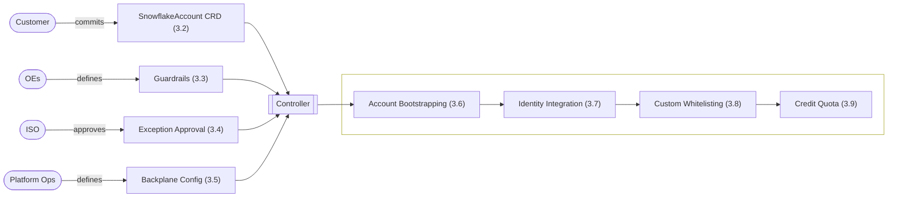

# Product Design

## Table of Contents

1. [Introduction](#1-introduction)
2. [Tenant Onboarding](#2-tenant-onboarding)
3. [SnowflakeAccount Resource](#3-snowflakeaccount-resource)
4. [SnowflakeDeletionRequest Resource](#4-snowflakedeletionrequest-resource)
5. [Error Handling & Observability](#5-global-error-handling--observability)
6. [Open TODOs](#6-open-todos)


## 1. Introduction

### 1.1 Purpose & Scope
The Snowflake Multi-Account Platform aims to deliver a secure, scalable, and fully self-service solution for automated provisioning and centralized management of Snowflake accounts at enterprise scale.

**Scope:**
* **Self-Service:** Enable teams to create and manage their own Snowflake accounts (tenants) without dependency on central operations tickets.
* **Enterprise Security:** Ensure compliance through automated guardrails and server-side policy enforcement.
* **Multi-Cloud/Region:** Support uniform operations across AWS and Azure regions.
* **Integration:** Provide seamless connectivity with existing enterprise self-service and Identity Access Management (IAM) systems.


### 1.2 Design Philosophy: AI-First Engineering
This platform is not built using traditional, manual software development methods. Instead, it adopts a **Spec-Driven Development (SDD)** approach, designed explicitly for an era of AI coding and operations. This document outlines the desired end-state and serves as the strict blueprint for implementation of the AI coding agent. 

* **The Spec is the Source Code:** This document is the authoritative source of truth. The implementation code for the controller is generated by AI agents (e.g., Claude Code) directly from these schemas and behavioral descriptions.
* **Regeneration over Refactoring:** To avoid technical debt, the system is designed so that code is regenerated from the latest specification rather than manually patched. This ensures strict alignment between the design (this doc) and the runtime artifacts.
* **AI Ops Readiness:** By strictly defining state and error behaviors, the platform prepares for future AI Ops capabilities, allowing autonomous agents to understand system goals, detect anomalies, and resolve operational issues without human intervention.


### 1.3. User Journey

The following describes how a customer team interacts with the Snowflake Multi-Account platform—from requesting access to managing its own Snowflake environments.

#### Onboarding to the Self-Service Platform

The journey begins when a customer team decides to set up its own Snowflake environment. After reviewing the landing page, the team follows the instructions to email the product owner with the required details.

Once the request is approved, the operations team runs an onboarding script that prepares all necessary components:

* A dedicated Git repository
* Access to ArgoCD

After setup, the team gains access to its fully isolated environment.

#### Creating the First Snowflake Account

With access in place, the team can create its Snowflake account by committing a simple YAML file to the repository. Once committed, the system automatically provisions the account, and progress can be tracked directly in ArgoCD.

#### Extending the Environment With Templates

Once the account is ready, teams often need additional resources such as databases, warehouses. They can choose to create these manually or use pre-built templates provided by the platform and community. These templates go beyond enforcing best practices—they simplify setup, ensure compliance, and eliminate the need for complex CI/CD pipelines with tools like Jenkins or Flyway. By using templates, teams can start immediately with Snowflake DBT projects and OpenFlow without leaving the Snowflake ecosystem.


## 2. Tenant Onboarding

The onboarding process begins when a team requests access to the self-service platform and provides three pieces of information: the tenant name (called profile at FCP), the GIAM group that should be granted access in Argo CD, and the team’s cost center. The platform product owner defines the credit quota based on expected consumption. Once this information is available, the operations team performs a standardized onboarding workflow:

* A Kubernetes namespace with the same name is created and labeled with the cost center and credit quota.
* A new GitHub repository is created under the shared organization using the tenant name.
* Argo CD is then configured to automatically sync the team’s repo into this namespace so that any SnowflakeAccount or template resources are reconciled immediately.

The following is a simple bash script to illustrate the required steps. (will be replaced by Terraform):

```bash
 #!/usr/bin/env bash  
 TENANT="$1" # profile name, also repo + namespace name  
 AD_GROUP="$2" # AD group for Argo CD access  
 COST_CENTER="$3" # provided by customer  
 CREDIT_QUOTA="$4" # set by platform PO  
 
 gh repo create "allianz/$TENANT" --template allianz/get-started
 kubectl create namespace "$TENANT"  
 kubectl label namespace "$TENANT" \  
    cost-center="$COST_CENTER" \  
    credit-quota="$CREDIT_QUOTA" \  --overwrite  

argocd app create "$TENANT" \  
    --repo "git@github.com:allianz/$TENANT.git" \  
    --path "." \  --dest-namespace "$TENANT" \  
    --dest-server https://kubernetes.default.svc \  
    --project "snowflake-accounts" \  
    --sync-policy automated 
 ```


## 3. SnowflakeAccount Resource
The SnowflakeAccount resource enables teams to define, provision, and manage a fully isolated Snowflake account.

### 3.1 Domain Concepts

The SnowflakeAccount CRD serves as the atomic unit of tenancy within the platform. It represents a fully isolated Snowflake Account Object combined with necessary enterprise bindings, specifically identity mapping (GIAM/SCIM) and network posture (Network Policies).

The platform’s scalability relies on a fundamental architectural shift: integrating regions rather than individual accounts. Previously, account creation required provisioning heavy infrastructure from scratch for every account. To address this, the architecture pre-provisions infrastructure once per cloud region as a shared "backplane".

Integration is performed once per region (or globally where possible) rather than repeatedly for each tenant:

* PrivateLink is configured once per Snowflake region.
* DNS is registered using regional wildcards.
* SSO is integrated globally.
* Hardened network and authentication policies are defined centrally.

Because the network integration is pre-configured and active, new accounts simply attach to this existing infrastructure via automated SQL commands. This mechanism transforms provisioning from a manual infrastructure project into an instant, logical operation.

Account creation is driven by four inputs, each owned by a different party, which the controller reconciles into a live account through a fixed sequence. The diagram below shows how these inputs relate, who owns each one, and how they feed the create flow; the bullets and sections that follow detail each in turn.



* **SnowflakeAccount CRD (3.2):** The customer commits a `SnowflakeAccount` CRD describing the account they want, kicking off the reconciliation flow.
* **Guardrails (3.3):** OEs (Operating Entities) define the rules that gate and preset the customer's CRD input before it is ever applied to Snowflake.
* **Exception Approval (3.4):** ISO approves one-off exceptions to what the guardrails would otherwise reject — e.g. whitelisting a public-internet IP.
* **Backplane Config (3.5):** Once Ops has provisioned a region's network via Terraform and closed out the follow-up setup tickets, they record the resulting IDs and IP ranges in the Backplane Config for the controller to use.
* **Account Bootstrapping (3.6):** The controller creates the Snowflake account and binds it to the regional backplane infrastructure from the Backplane Config.
* **Identity Integration (3.7):** The controller imports the CRD's referenced company groups into the new account, so their members can log in via SSO with their existing company roles carried over.
* **Custom Whitelisting (3.8):** The controller turns the CRD's whitelisting entries into network policies — a dedicated, deny-by-default one per technical user named, and account-wide additions where an entry names none.
* **Credit Quota (3.9):** The controller checks the share of credits the CRD claims against the namespace allowance set at onboarding (2), then pushes that share into Snowflake as a resource monitor and a budget so consumption stops when it is used up.


### 3.2 SnowflakeAccount CRD

```yaml
apiVersion: infra.snowflake.allianz.io/v1alpha1
kind: SnowflakeAccount
metadata:
  name: analytics-team-eu
  labels:
    environment: prod
spec:
  # --- General metadata ---
  description: "Analytics team Snowflake environment for EU operations"
  contacts:
    - alice.smith@company.com
    - team-analytics@company.com
  # --- Snowflake account configuration ---
  region: aws-eu-central-1
  timeZone: Europe/Berlin
  # --- Share of the namespace's monthly credit allowance (3.9) ---
  creditQuota: 500
  # --- GIAM roles to import and assign ---
  groups:
    accountAdmin: CDH_DATA_ENGINEERS
    sysAdmin: CDH_DEVELOPERS
    userManaged:
      - CDH_ANALYSTS
  # --- Allow custom whitelisting ---
  networkPolicy:
    whitelisting:
      - user: airflow
        connection: agn        # from the region's inventory in the Backplane Config
        allowedIPs:
          - 10.23.45.0/24
      - connection: dbt-cloud  # no user → account-wide
  # --- Allow human users to bypass SSO ---
  authPolicy:
    exceptions:
      - user: alice.smith
        rsaKeyAllowed: true
        reason: "Automation without SSO support"
```


### 3.3 Guardrails

Guardrails gate and preset the *user's input* before it is ever applied to Snowflake. They govern everything a tenant may write into a `SnowflakeAccount` CRD — including the `networkPolicy.whitelisting` connections consumed by the whitelisting logic that follows (3.8) — before the controller's account bootstrapping (3.6) ever runs.

**Scope:** Guardrails apply exclusively to `SnowflakeAccount` resources. Other resource types have their own separate validation mechanisms.

Each guardrail declares three things:

  * **`target`:** Which accounts the guardrail applies to. An omitted or `"*"` field matches anything, so a guardrail scoped to one environment names only that field.
  * **`constraints`:** Gates user input. If a user commits a CRD that violates these patterns (e.g., bad naming, unsafe IP ranges), the resource is rejected with a validation error.
  * **`preset`:** Populates fields in the CRD if the user omits them.

**Connection Constraints:** The `constraints.connections` map governs how a tenant may reference each named connection (`agn`, `public`, …) under `networkPolicy.whitelisting`, keyed by scope (`user` or `account`) then connection, via a single value per connection:

  * **`"/NN"`** — a CIDR is **required**, capped at width `/NN` (the widest block allowed). E.g. `"/16"` accepts `/16`–`/32` and rejects anything broader.
  * **`"full"`** — no CIDR may be given; the user references the connection alone and inherits its full Backplane Config range. Used for dev convenience and for VPCE-only connections that have no CIDR to narrow.
  * **`"off"`** — the connection may not be referenced at all.

A connection not listed in a scope falls through to that scope's `"*"` key. Containment (does an entry sit inside the connection's range?) is **not** re-checked here — the network-policy builder enforces it at create time (3.8). The connection constraints only gate whether a CIDR is required, forbidden, or size-capped.

**Matching Strategy (Top-Down):** Guardrails are evaluated top-down. Operators define a broad global baseline first, followed by narrower guardrails that override settings for specific regions or environments. Every guardrail whose `target` matches contributes, and later matches win over earlier ones. Merging is per field:

  * **Scalars and lists replace wholesale.** A later `allowedRegions` supersedes the earlier list rather than appending to it.
  * **`connections` merges per key.** A guardrail naming only `user.agn` overrides that one value and inherits everything else.
  * **Omitted fields are inherited, not cleared.** A guardrail that says nothing about `accountName` leaves the baseline's pattern intact.

Changes to guardrails are validated immediately and applied automatically during the next reconciliation cycle.

<!-- TODO: Define the guardrail field table (types, required/optional, and where each `target` fact is resolved from — `department` in particular has no source yet). -->

```yaml
# Example guardrails (governs user-committed SnowflakeAccount YAML).
# Evaluated top-down: broad baseline first, narrower guardrails override.
guardrails:
  # 1️⃣ Global Baseline (Applies to everyone unless overridden)
  - target:
      environment: "*"
      region: "*"
      department: "*"
      account: "*"

    # constraints: Gates user input.
    constraints:
      accountName: "^[a-z][a-z0-9-]{2,62}$" # Lowercase, no special chars, RFC1123
      groupNames: "^[A-Z0-9_]+$"            # Name pattern for group names
      maxCreditQuota: 1000                  # ceiling per account (3.9); the namespace
                                            #   allowance still caps the sum

      allowedRegions:
        - "*"
      connections:              # per-connection: "/NN" = CIDR required (max width),
        user:                   #   "full" = no CIDR (inherit full range), "off" = forbidden
          agn: "/16"
          public: "/32"         # public: single IPs only
          dbt-cloud: "full"     # VPCE-only: no CIDR to narrow
          "*": "off"            # unlisted connection → rejected
        account:
          dbt-cloud: "full"     # VPCE-only: nothing to widen
          "*": "off"            # no account-wide whitelisting by default

    # preset: Applied if user omits these fields in their CRD.
    preset:
      timeZone: "UTC"
      creditQuota: 100                      # modest default rather than zero-credit

  # 2️⃣ Dev Overrides — agn needs no CIDR (convenience)
  - target:
      environment: "dev"

    constraints:
      connections:
        user:
          agn: "full"           # just `connection: agn`, no allowedIPs
        account:
          agn: "/16"            # dev may open agn account-wide

  # 3️⃣ Allianz DE Overrides
  - target:
      department: "Allianz_DE"

    constraints:
      allowedRegions:
        - "aws-eu-central-1"    # Frankfurt
        - "aws-eu-west-3"       # Paris
      connections:
        user:
          agn: "/24"            # DE tightens agn further
```


### 3.4 Exception Approval

When a `SnowflakeAccount` CRD fails its guardrails (3.3), the controller does not reject it outright. Before returning a validation error, it checks a separate exceptions file for a matching approved exception. If one exists, the otherwise-failing input is allowed through; if not, the resource is rejected as usual.

This exists for cases where a customer has a legitimate, one-off need that the standing guardrail baseline would otherwise block — for example, whitelisting the `public` connection with a wider CIDR than the guardrails normally permit. Getting one added is a manual, email-driven process, not a self-service one: the customer emails ISO (Information Security Office) to request approval for their specific use case; ISO reviews it and, if approved, forwards the request to platform ops; ops then adds the corresponding entry to the exceptions file. Only after that entry exists does the customer's CRD pass validation.

**Ownership:** The exceptions file is owned and maintained by platform ops, not ISO — ISO grants the security approval, but ops is the one who edits the file that the controller reads. The approval itself happens outside the platform, over email; the file is just the durable record of what was approved.

```yaml
# Example Exceptions file (ops-owned). Approves specific, otherwise-invalid inputs
# on a case-by-case basis, once ISO has approved them by email; matched against a
# CRD only after its guardrails (3.3) reject it.
exceptions:
  - account: "analytics-team-eu"        # exact account name — no wildcards
    whitelisting:                         # the full entry being approved, verbatim
      user: airflow
      connection: public
      allowedIPs:
        - 203.0.113.50/32                 # wider than the guardrails normally allow
    reason: "ISO-4821: temporary vendor integration, approved by ISO via email 2026-06-01"
```


### 3.5 Backplane Config

Account creation is the act of turning a committed `SnowflakeAccount` CRD into a live, network-bound Snowflake account. It draws on the **Backplane Config** — a platform-owned artifact that captures the org-wide security baseline and the per-region backplane — and then runs the controller's account bootstrapping (3.6).

Bringing a region online is a one-time manual job for platform ops: run the Terraform project that provisions the region's backplane, close out the follow-up tickets that finalize it (DNS, Snowflake accepting the VPC endpoint), test it end-to-end, then add the region's entry from the Terraform outputs with `active: true`. From then on the controller can provision accounts into it, looking the region up by the CRD's `region` field.

The config has three parts:

  * **`parameters`:** Snowflake account parameters applied to every account during bootstrapping (3.6) — the org-wide security baseline plus each region's own settings.
  * **`inventory`:** The catalogue of ingress paths that physically exist in the region, named by the `connection` handle tenants reference (3.2, 3.3, 3.8). It grants nothing itself; its `maxCidrs` is the security ceiling every `allowedIPs` is validated against.
  * **`ingress`:** The baseline whitelisting every account in the region needs to be reachable at all — principally so its human users can log in via the browser. Accounts are deny-by-default once a network policy is attached, so this is the required minimum, applied with no tenant involvement. 

```yaml
backplane:

  # --- GLOBAL PARAMETERS: org-wide security baseline, applied to every account ---
  globalParameters:
    PREVENT_UNLOAD_TO_INLINE_URL: "true"        # block data exfiltration to arbitrary URLs
    REQUIRE_STORAGE_INTEGRATION_FOR_STAGE_CREATION: "true"

  # --- REGIONS: one entry per cloud region, filled in from the Terraform outputs ---
  regions:

    aws-eu-central-1:
      active: true

      # Region-specific account parameters, from the Terraform outputs.
      regionalParameters:
        ENABLE_INTERNAL_STAGES_PRIVATELINK: "true"
        S3_STAGE_VPCE_DNS_NAME: "*.vpce-sd98fs0d9f8g.s3.eu-central-1.vpce.amazonaws.com"

      # Every ingress path that exists in this region. Listing one here only makes its
      # handle referenceable and caps how wide it may ever be opened; it opens nothing
      # on its own. Access is granted by `ingress` below (account-wide) or by a tenant's
      # per-user `whitelisting` (3.8).
      inventory:
        - connection: agn                       # Allianz Global Network (corp VPN)
          type: "AWSVPCEID"
          vpceId: "vpce-00006900000000001"
          maxCidrs: ["172.16.0.0/12"]           # widest block this path may carry
        - connection: dbt-cloud
          type: "AWSVPCEID"
          vpceId: "vpce-00006900000000004"      # VPCE-only: no maxCidrs, no IPs to manage
        - connection: public
          type: "IPV4"
          maxCidrs: ["0.0.0.0/0"]               # any public IP may be narrowed from this

      # The paths actually opened for every account in this region — this is what lets
      # people reach the account at all, e.g. logging in from the corporate network.
      # Each entry picks one connection from the inventory above. Add `allowedIPs` to
      # open only part of its range; leave it out to open the whole maxCidrs range.
      ingress:
        - connection: agn                       # inherit full 172.16.0.0/12
        - connection: dbt-cloud                 # VPCE-only, nothing to narrow
        - connection: public
          allowedIPs: ["203.0.113.0/24"]        # narrowed: platform office egress only

    # A region can be staged ahead of time and switched on once its backplane is confirmed.
    aws-eu-west-3:
      active: false
      regionalParameters:
        ENABLE_INTERNAL_STAGES_PRIVATELINK: "true"
        S3_STAGE_VPCE_DNS_NAME: "*.vpce-9f8g7h6j5k.s3.eu-west-3.vpce.amazonaws.com"
      inventory:
        - connection: agn
          type: "AWSVPCEID"
          vpceId: "vpce-00006900000000008"
          maxCidrs: ["10.0.0.0/8"]
      ingress:
        - connection: agn                       # inherit full 10.0.0.0/8
```


### 3.6 Account Bootstrapping

When the controller observes a `SnowflakeAccount` that does not yet exist in Snowflake, it runs the following script, drawing on two inputs: the `SnowflakeAccount` CRD itself, and the Backplane Config entry for `spec.region` — the controller looks up that region's entry under `backplane.regions` by the CRD's `region` field before it can resolve any of the values below.

```sql
-- 1. Instantiation: create the account.
CREATE ACCOUNT '<name-from-crd>' ADMIN_NAME='platform' ADMIN_RSA_PUBLIC_KEY = '<generated-by-controller>' ADMIN_USER_TYPE='SERVICE' EDITION='ENTERPRISE' REGION='<region-from-crd>' COMMENT='<description-from-crd>';

-- 2. Backplane Integration: bind the new account to the regional infrastructure
-- held in the region's Backplane Config entry.

-- 2a. Apply the org-wide baseline, then the region's own parameters — one statement
-- per entry in globalParameters followed by one per entry in regionalParameters.
ALTER ACCOUNT SET <parameter-name> = '<parameter-value>';
-- ... repeated for every entry in globalParameters, then every entry in regionalParameters

-- 2b. Create one network rule per entry in the region's ingress, resolving each
-- to its inventory entry: use the entry's `allowedIPs` if given (validated to
-- fall inside that connection's maxCidrs), otherwise inherit the connection's full maxCidrs.
CREATE NETWORK RULE <connection-name-from-ingress> TYPE = <type-from-region-config> MODE = INGRESS
  VALUE_LIST = (<vpceId-and/or-resolved-allowedIPs>);
-- ... repeated for every entry in the region's ingress

-- 2c. Attach those rules to the account via the platform's fixed network policy.
-- Further account-level rules are added to this policy in Custom Whitelisting (3.8).
CREATE NETWORK POLICY PLATFORM_ACCOUNT_POLICY
  ALLOWED_NETWORK_RULE_LIST = (<all-connection-names-from-ingress>);
ALTER ACCOUNT SET NETWORK_POLICY = 'PLATFORM_ACCOUNT_POLICY';

```

**Note:** Snowflake is expected to release a new feature/syntax called Organization Policies, which will let this same network policy be enforced centrally on the account rather than via the `ALTER ACCOUNT` commands above. Once that syntax is available, this implementation will be swapped to use it — the enforced policy stays the same, but tenants will no longer be able to modify or unset it themselves. Not yet released as of this writing.


### 3.7 Identity Integration

Identity, like networking, is integrated globally rather than per account. An Azure AD SCIM sync continuously feeds enterprise users and GIAM groups into a single Organization User Group backplane in Snowflake, independent of any `SnowflakeAccount` CRD. This sync makes groups available org-wide, but a group must still be explicitly imported into an account before it can be used there.

That import is what the CRD's `groups` field drives. `accountAdmin`, `sysAdmin`, and every entry in `userManaged` (see the example in 3.2) name organization groups that must already exist in the backplane; the controller imports each one into the new account as part of account bootstrapping (3.6). Importing a group creates a matching role in the account, and its members are granted that role automatically.

```sql
-- 1. accountAdmin: import the group, then grant it ACCOUNTADMIN so its members
-- inherit the system role through the role hierarchy.
ALTER ACCOUNT ADD ORGANIZATION USER GROUP '<accountAdmin-group-name-from-crd>';
GRANT ROLE ACCOUNTADMIN TO ROLE "<accountAdmin-group-name-from-crd>";

-- 2. sysAdmin: same pattern, granting SYSADMIN instead.
ALTER ACCOUNT ADD ORGANIZATION USER GROUP '<sysAdmin-group-name-from-crd>';
GRANT ROLE SYSADMIN TO ROLE "<sysAdmin-group-name-from-crd>";

-- 3. userManaged: every remaining group is simply imported, no extra grant.
ALTER ACCOUNT ADD ORGANIZATION USER GROUP '<group-name-from-crd>';
-- ... repeated for each entry in userManaged
```

**TODO:** Either all users and groups are synced with SCIM or the controller must trigger to add all groups in the CRD to the Azure Entra ID Enterprise App.


### 3.8 Custom Whitelisting

Technical users (service accounts like `airflow`) are the highest-value credential in an account: their tokens are long-lived and machine-held, so a leaked token is the platform's primary blast-radius concern. The `networkPolicy.whitelisting` field exists to contain that blast radius. The guiding principle is **deny-by-default**: a technical user with no whitelisting entry gets an **empty** network policy and therefore cannot log in from anywhere. Access is granted only by an explicit, narrow entry naming the user and the connection they may reach.

The intent is to force customers to commit to a tight ingress path for each technical user rather than reusing the broad browser-access ranges meant for humans (`agn`, `public`). A narrow per-user policy binds the token to the environment it is intended for: if it is copied elsewhere — such as a human workstation — it stops working.

Each `allowedIPs` entry must fall entirely inside the `maxCidrs` the referenced connection defines in the region's `inventory` (3.5). The network-policy builder checks this containment at create time; an entry broader than or outside the connection's `maxCidrs` — or any CIDR on a VPCE-only connection that defines no `maxCidrs` — is rejected with an error and the account is not provisioned. This is the same containment rule that gates the region's account-wide `ingress` in 3.5, applied here to every entry.

Snowflake network policies are either/or at the user level: setting `NETWORK_POLICY` on a user fully overrides the account-level default rather than merging with it. So each `user` referenced in `whitelisting` gets its own dedicated network policy, built from every whitelisting entry that names them; a user with no entry gets a dedicated policy that allows nothing.

```sql
-- For each distinct user in networkPolicy.whitelisting, create one network rule per
-- connection that user's entries reference. Resolve each entry's allowedIPs against
-- the connection's maxCidrs (from the region's inventory), having
-- validated that each allowedIPs entry falls inside that connection's maxCidrs.
CREATE NETWORK RULE <user-and-connection-derived-name> TYPE = <type-from-region-config> MODE = INGRESS
  VALUE_LIST = (<vpceId-and/or-validated-allowedIPs>);
-- ... repeated for every connection referenced by this user's entries

-- Collect that user's rules into a single dedicated policy — one policy per user,
-- covering every connection they were granted, since a user can only have one active
-- NETWORK_POLICY at a time.
CREATE NETWORK POLICY <user-derived-policy-name>
  ALLOWED_NETWORK_RULE_LIST = (<all-rule-names-for-this-user>);
ALTER USER '<user-from-crd>' SET NETWORK_POLICY = '<user-derived-policy-name>';
-- ... repeated for every distinct user in networkPolicy.whitelisting

-- Entries naming no user are account-scoped: they add their rules to the account policy
-- created during bootstrapping (3.6) instead of getting a policy of their own. Same
-- containment validation applies.
CREATE NETWORK RULE CUSTOM_<connection-name> TYPE = <type-from-region-config> MODE = INGRESS
  VALUE_LIST = (<vpceId-and/or-validated-allowedIPs>);
-- ... repeated for every connection referenced by account-scoped entries

-- Attach them to the account policy. The CUSTOM_ prefix keeps these separate from the
-- region's ingress rules (3.6), which are named by the bare connection.
ALTER NETWORK POLICY PLATFORM_ACCOUNT_POLICY
  ADD ALLOWED_NETWORK_RULE_LIST = (<all-custom-rule-names>);
```

**Note:** As with the account-level policy in 3.6, once Snowflake's Organization Policies feature is available these per-user policies will be enforced centrally as org policies rather than through `ALTER USER ... SET NETWORK_POLICY`. The deny-by-default posture and the per-user narrowing stay the same; the enforcement mechanism moves server-side so tenants cannot loosen it. Not yet released as of this writing.


### 3.9 Credit Quota TODO

A tenant's monthly credit allowance is set by the platform product owner at onboarding (2) and recorded as the `credit-quota` label on the tenant's Kubernetes namespace. Because the label lives outside the tenant's Git repository, a tenant cannot raise its own budget by committing YAML — the same trust-anchor argument that makes the namespace the tenancy boundary in 3.10.1.

Each account claims a share of that allowance through a `creditQuota` field in its CRD. The field is governed by the guardrails (3.3) like any other input, and is mutable — redistributing the allowance across a tenant's accounts is a normal edit.

**Admission** works like a Kubernetes `ResourceQuota` and a pod's CPU request: on create and on update, the controller sums the `creditQuota` of the other accounts in the namespace and admits this one only if `used + claim` still fits under the allowance. Otherwise the resource is rejected with a user error naming the allowance, what is already used, and the overrun. Accounts already provisioned are never retroactively suspended because a later sibling asked for too much, so capacity is effectively first-come-first-served.

**Enforcement** pushes the admitted share into Snowflake as an account-level resource monitor sized to the claim, with triggers that suspend warehouses when it is exhausted, plus an account budget set to the same limit. This covers warehouse credits — the majority of spend — server-side and in real time.

Serverless features and AI are the gap: resource monitors do not cover them, and budgets can only notify, never suspend. Closing that gap means the controller withdrawing the underlying privileges (task execution, Cortex access, pipes) when a share is exhausted, which is both stateful and incomplete — some serverless billing is per-object and materialized-view maintenance cannot be suspended at all. An account over its share reports a `QuotaExhausted` reason with a Kubernetes warning event; it is not a provisioning failure, since the account is intact and the condition clears at the monthly boundary.

**TODO:** Decide how serverless and AI spend is capped before implementing the privilege-revocation path above. Three options are open: check whether Snowflake now enforces spending limits at organization level (which would replace most of this section), grant serverless and AI only to accounts that explicitly claim them so no kill switch is needed, or accept notify-only for the long tail and rely on the resource monitor for warehouse spend. This also depends on where consumption is read — `ACCOUNT_USAGE` lags by up to three hours, too slow to gate AI spend reactively.


### 3.10 Security Constraints

Security in this platform is not based on validation alone, but on strict structural constraints in how initial account credentials are managed. The design goal is that security must be ensured even in case of bugs or breaches — every guarantee below is enforced outside the controller's own logic, by a system that does not trust it. The implementation must adhere to the following definitions.

#### 3.10.1. Tenant Isolation via Secret Paths

Isolation is enforced physically by the storage path of the credentials in **AWS Secrets Manager (ASM)**.

* **The Trust Anchor:** The **Kubernetes Namespace** (`metadata.namespace`) is the sole source of truth for tenancy. It is derived directly from the runtime environment (not user input) and is used to cryptographically bind the account to the team's sandbox.
* **Path Construction:** The controller must construct the ASM Secret ID using the following strict pattern:
    `snowflake/tenant/<snowflake-org-name>/<kubernetes-ns>/<snowflake-account-name>/platform-credentials`
* **The Constraint:** When the controller attempts to access an existing account, it **must** derive the lookup path using the CRD's namespace. This ensures that any attempt to manage an account outside the team's namespace will fail at the AWS IAM level due to an incorrect secret path, thereby preventing cross-tenant access.

#### 3.10.2. OIDC Authentication (Optional)

Every account is always created with the secret-based `platform` user described above and in 3.6 — that mechanism is not replaced. OIDC is an **additional**, optional authentication path layered on top of the same account, established immediately after creation, that lets the controller reach a tenant's account without reading its RSA private key from AWS Secrets Manager (ASM) on every connection.

**Principal:** Unlike the account-birth credential, which belongs to a single `platform` service user, the OIDC principal is scoped to the **tenant's Kubernetes namespace** — the same trust anchor used for secret-path isolation above. The controller creates a dedicated Kubernetes `ServiceAccount` in the tenant's namespace alongside the `SnowflakeAccount` resource (e.g. `sa-<account-name>-oidc`). This ServiceAccount never runs a pod — it exists purely as an identity primitive. When the controller needs to connect to that account, it uses the Kubernetes `TokenRequest` API to mint a short-lived, narrowly-audienced JWT for that ServiceAccount, uses it once, and discards it. The token's `sub` claim — `system:serviceaccount:<namespace>:sa-<account-name>-oidc` — encodes both the tenant namespace and the account name, mirroring the granularity of the ASM secret path.

**Global setup (one-time, like the network/identity backplane in 3.1):** The Kubernetes cluster's OIDC issuer and JWKS endpoint are registered once, platform-wide, as a trusted external identity provider in the Backplane Config. This is an ops/bootstrap concern, not a per-account step.

**Per-account setup (added to account bootstrapping, 3.6):**

```sql
-- 4. OIDC Integration: trust the cluster's OIDC issuer for this account, and map
-- this account's namespace-and-account-scoped ServiceAccount subject to one of
-- the CRD's already-imported groups (3.7) — no new identity or role is created.
CREATE SECURITY INTEGRATION PLATFORM_OIDC
  TYPE = EXTERNAL_OAUTH OAUTH_TYPE = CUSTOM
  OAUTH_ISSUER = '<k8s-oidc-issuer-url-from-platform-config>'
  OAUTH_JWS_KEYS_URL = '<k8s-oidc-jwks-url-from-platform-config>'
  OAUTH_AUDIENCE_LIST = ('snowflake')
  EXTERNAL_OAUTH_TOKEN_USER_MAPPING_CLAIM = 'sub';

-- The mapped Snowflake user's LOGIN_NAME is derived deterministically from the
-- expected `sub` claim value, and is granted the existing imported group role
-- (e.g. sysAdmin, 3.7) — OIDC authenticates as an *existing* role, it does not
-- introduce a new one.
ALTER USER '<sysAdmin-group-name-from-crd>' SET LOGIN_NAME = '<sub-claim-derived-from-namespace-and-account>';
```

**Isolation:** Cross-tenant access is rejected by Snowflake itself, not merely by client-side path construction. Each tenant account's `PLATFORM_OIDC` integration only maps its own namespace-and-account-derived `sub` to a valid user; a token minted for namespace B's ServiceAccount, presented to namespace A's account, matches no mapped user there and is rejected during Snowflake's own signature-and-claims verification — before any SQL executes. This is a stronger guarantee than the ASM path check above, which relies on the calling code correctly constructing a path string: here the Kubernetes API server cryptographically signs the `sub` claim, and Snowflake independently verifies it.

**Fallback:** The secret-based `platform` credential in ASM remains fully functional and is not deprecated by enabling OIDC. `CREATE ACCOUNT` always requires the RSA key pair, so the secret path and its isolation guarantees stay exactly as documented. OIDC is consulted first for routine reconciliation once established; the controller falls back to the ASM-stored key if OIDC is unavailable.

**TODO:** Define the precise fallback trigger (automatic detection vs. explicit CRD flag), and the Kubernetes RBAC model that lets the controller mint `TokenRequest` tokens for ServiceAccounts across every tenant namespace (a cluster-scoped capability that itself deserves the same "why can this not be abused cross-tenant" scrutiny given to the ASM IAM role below).


#### 3.10.3. Immutable Identity Binding

The **`region`** and **`name`** of a `SnowflakeAccount` are **Immutable** after creation. This prevents identity spoofing where a user creates an account, lets the secret generate, and then attempts to switch the CRD to point to a different target resource while retaining the original credentials.


## 4. SnowflakeDeletionRequest Resource

### 4.1 Example

```yaml
apiVersion: infra.snowflake.allianz.io/v1alpha1
kind: SnowflakeDeletionRequest
metadata:
  name: decommission-analytics-prod
  namespace: analytics-team-eu
spec:
  targetRef:
    kind: SnowflakeAccount
    name: analytics-team-eu
  duration: 4h  # Maintenance window duration (Max: 8h)
  reason: "Ticket OPS-1234: Project sunsetting, data archived."
```


### 4.2 Domain Concepts

#### Positive Control (The "Two-Key" System)

To prevent catastrophic data loss via accidental Git operations, the platform enforces a **Positive Control** model. A resource cannot be destroyed simply by removing its definition file. Instead, deletion is treated as a privileged operation that requires a dedicated "Deletion Warrant."

  * **The Lock:** Every critical resource is protected by a Kubernetes Finalizer (`snowflake.finalizer`) that blocks deletion by default.
  * **The Key:** The `SnowflakeDeletionRequest` acts as the temporary key that authorizes the controller to unlock and destroy the specific target resource.

#### Time-Boxed Maintenance Windows

Deletion permissions are ephemeral. By defining a `duration` (max 8 hours), the platform enforces strict **Time-Boxing**. This minimizes security risks by ensuring that an "open" deletion window automatically closes if not used promptly, preventing long-standing "dangling permissions" that could be exploited later.

#### Durable Audit Trail

While the target resource disappears after deletion, the `SnowflakeDeletionRequest` (or its logs) remains. This creates a permanent audit trail linking the destruction of infrastructure to a specific reason (e.g., a ticket number) and a specific timeframe, satisfying compliance requirements for data destruction.

### 4.3 Controller Behavior

The controller logic focuses on the interaction between the Target Resource (e.g., `SnowflakeAccount`) and the `SnowflakeDeletionRequest`.

**Phase 1: Request Validation**
Upon creation of a `SnowflakeDeletionRequest`:

1.  **Validation:** The controller verifies the `duration` does not exceed 8 hours.
2.  **Window Calculation:** It calculates `status.validUntil` based on the creation timestamp.
3.  **Activation:** It sets `status.state = Active`.

**Phase 2: Interception (The Block)**
When a user deletes a `SnowflakeAccount` (sets `deletionTimestamp`):

1.  The controller intercepts the delete request via the Finalizer.
2.  It queries for an **Active** `SnowflakeDeletionRequest` in the same namespace targeting this specific resource.

**Phase 3: Resolution**

  * **If Valid Request Found:**
    1.  **Execute:** The controller runs the SQL destruction logic (`DROP ACCOUNT` / `DROP DATABASE`).
    2.  **Unlock:** The controller removes the Finalizer, allowing the Kubernetes object to be garbage collected.
    3.  **Close:** The `SnowflakeDeletionRequest` status is updated to `Consumed`.
  * **If No Request / Expired:**
    1.  **Block:** The controller **refuses** to drop the resource.
    2.  **Stall:** The resource remains in a `Terminating` state.
    3.  **Alert:** A Kubernetes Event (`Warning: DeletionBlocked`) is emitted, and `Ready=False` is set, causing ArgoCD to report a failure. This forces the user to either restore the file or create a valid Deletion Request.


## 5. Global Error Handling & Observability

Reliable and transparent error handling is essential for a self-service platform. To ensure a consistent user experience, the platform enforces a **standardized status schema** across all CRDs (`SnowflakeAccount`).

Users must be able to instantly determine whether a resource is healthy, still reconciling, or requires manual intervention. The controller exposes this information via Kubernetes-compliant `status.conditions`.

### 5.1 Condition Model

Every Custom Resource (CR) in this platform surfaces three standard condition types. These conditions provide a high-level summary of the resource's lifecycle state.

| Condition Type | Scope | Description |
| :--- | :--- | :--- |
| **`Ready`** | **Availability** | Indicates whether the resource is provisioned and usable. <br>**During Creation:** Set to **False** until the resource is successfully created. Creation errors are reported here. <br>**After Creation:** Set to **True** once the resource is fully operational. <br>**During Updates:** Remains **True** (updates are non-disruptive). |
| **`Synced`** | **State Consistency** | Indicates whether the live state matches the desired state. <br>**During Creation:** Set to **True** once the CRD is accepted and processing begins. <br>**After Creation:** Remains **True** when no changes are pending. <br>**During Updates:** Set to **False** while changes are being applied. Update errors are reported here. Returns to **True** once synchronized. |
| **`Compliance`** | **Governance** | **True:** The account is bound by the platform's Organization Policies and adheres to the baseline. <br>**Reason `PolicyBound`:** The server-side Organization Policies are in effect for this account. |

### 5.2 Status Examples

**Example A: A Healthy Resource**

```yaml
status:
  accountName: "sf_analytics_prod"
  accountUrl: "https://xyz.snowflakecomputing.com"
  conditions:
    - type: Ready
      status: "True"
      reason: "Available"
      message: "Resource is available for use."
    - type: Synced
      status: "True"
      reason: "ReconcileSuccess"
```


## 6. Open TODOs

Items flagged inline throughout this document, collected here for tracking. 

* **Credits:** How serverless and AI spend is capped, and where consumption is read (3.9). The namespace allowance and admission model itself is specified in 3.9.
* **Region replication:** Cross-region replication support for SnowflakeAccount resources.


