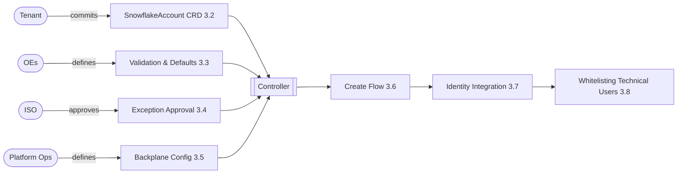

# Product Design

## Table of Contents

1. [Introduction](#1-introduction)
2. [Tenant Onboarding](#2-tenant-onboarding)
3. [SnowflakeAccount Resource](#3-snowflakeaccount-resource)

7. [Error Handling & Observability](#7-global-error-handling--observability)


## 1. Introduction

### 1.1 Purpose & Scope
The Snowflake Multi-Account Platform aims to deliver a secure, scalable, and fully self-service solution for automated provisioning and centralized management of Snowflake accounts at enterprise scale.

**Scope:**
* **Self-Service:** Enable teams to create and manage their own Snowflake accounts (tenants) without dependency on central operations tickets.
* **Enterprise Security:** Ensure compliance through automated guardrails and server-side policy enforcement.
* **Multi-Cloud/Region:** Support uniform operations across AWS and Azure regions.
* **Integration:** Provide seamless connectivity with existing enterprise self-service and Identity Access Management (IAM) systems.

### 1.2 Design Philosophy: AI-First Engineering
This platform is not built using traditional, manual software development methods. Instead, it adopts a **Spec-Driven Development (SDD)** approach, designed explicitly for an era of AI coding and operations. This document outlines the desired end-state and serves as the strict blueprint for implementation of the AI coding agent. 

* **The Spec is the Source Code:** This document is the authoritative source of truth. The implementation code for the controller is generated by AI agents (e.g., Claude Code) directly from these schemas and behavioral descriptions.
* **Regeneration over Refactoring:** To avoid technical debt, the system is designed so that code is regenerated from the latest specification rather than manually patched. This ensures strict alignment between the design (this doc) and the runtime artifacts.
* **AI Ops Readiness:** By strictly defining state and error behaviors, the platform prepares for future AI Ops capabilities, allowing autonomous agents to understand system goals, detect anomalies, and resolve operational issues without human intervention.

### 1.3. User Journey

The following describes how a customer team interacts with the Snowflake Multi-Account platform—from requesting access to managing its own Snowflake environments.

#### Onboarding to the Self-Service Platform

The journey begins when a customer team decides to set up its own Snowflake environment. After reviewing the landing page, the team follows the instructions to email the product owner with the required details.

Once the request is approved, the operations team runs an onboarding script that prepares all necessary components:

* A dedicated Git repository
* Access to ArgoCD

After setup, the team gains access to its fully isolated environment.

#### Creating the First Snowflake Account

With access in place, the team can create its Snowflake account by committing a simple YAML file to the repository. Once committed, the system automatically provisions the account, and progress can be tracked directly in ArgoCD.

#### Extending the Environment With Templates

Once the account is ready, teams often need additional resources such as databases, warehouses. They can choose to create these manually or use pre-built templates provided by the platform and community. These templates go beyond enforcing best practices—they simplify setup, ensure compliance, and eliminate the need for complex CI/CD pipelines with tools like Jenkins or Flyway. By using templates, teams can start immediately with Snowflake DBT projects and OpenFlow without leaving the Snowflake ecosystem.


## 2. Tenant Onboarding

The onboarding process begins when a team requests access to the self-service platform and provides three pieces of information: the tenant name (called profile at FCP), the GIAM group that should be granted access in Argo CD, and the team’s cost center. The platform product owner defines the credit quota based on expected consumption. Once this information is available, the operations team performs a standardized onboarding workflow:

* A Kubernetes namespace with the same name is created and labeled with the cost center and credit quota.
* A new GitHub repository is created under the shared organization using the tenant name.
* Argo CD is then configured to automatically sync the team’s repo into this namespace so that any SnowflakeAccount or template resources are reconciled immediately.

The following is a simple bash script to illustrate the required steps. (will be replaced by Terraform):

```bash
 #!/usr/bin/env bash  
 TENANT="$1" # profile name, also repo + namespace name  
 AD_GROUP="$2" # AD group for Argo CD access  
 COST_CENTER="$3" # provided by customer  
 CREDIT_QUOTA="$4" # set by platform PO  
 
 gh repo create "allianz/$TENANT" --template allianz/get-started
 kubectl create namespace "$TENANT"  
 kubectl label namespace "$TENANT" \  
    cost-center="$COST_CENTER" \  
    credit-quota="$CREDIT_QUOTA" \  --overwrite  

argocd app create "$TENANT" \  
    --repo "git@github.com:allianz/$TENANT.git" \  
    --path "." \  --dest-namespace "$TENANT" \  
    --dest-server https://kubernetes.default.svc \  
    --project "snowflake-accounts" \  
    --sync-policy automated 
 ```


## 3. SnowflakeAccount Resource
The SnowflakeAccount resource enables teams to define, provision, and manage a fully isolated Snowflake account.

### 3.1 Domain Concepts

The SnowflakeAccount CRD serves as the atomic unit of tenancy within the platform. It represents a fully isolated Snowflake Account Object combined with necessary enterprise bindings, specifically identity mapping (GIAM/SCIM) and network posture (Network Policies).

The platform’s scalability relies on a fundamental architectural shift: integrating regions rather than individual accounts. Previously, account creation required provisioning heavy infrastructure from scratch for every account. To address this, the architecture pre-provisions infrastructure once per cloud region as a shared "backplane".

Integration is performed once per region (or globally where possible) rather than repeatedly for each tenant:

* PrivateLink is configured once per Snowflake region.
* DNS is registered using regional wildcards.
* SSO is integrated globally.
* Hardened network and authentication policies are defined centrally.

Because the network integration is pre-configured and active, new accounts simply attach to this existing infrastructure via automated SQL commands. This mechanism transforms provisioning from a manual infrastructure project into an instant, logical operation.

The following diagram shows how the three documents that drive account creation relate to each other and who owns each one:




### 3.2 Example

```yaml
apiVersion: infra.snowflake.allianz.io/v1alpha1
kind: SnowflakeAccount
metadata:
  name: analytics-team-eu
  labels:
    environment: prod
spec:
  # --- General metadata ---
  description: "Analytics team Snowflake environment for EU operations"
  contacts:
    - alice.smith@company.com
    - team-analytics@company.com
  # --- Snowflake account configuration ---
  region: aws-eu-central-1
  timeZone: Europe/Berlin
  # --- GIAM roles to import and assign ---
  groups:
    accountAdmin: CDH_DATA_ENGINEERS
    sysAdmin: CDH_DEVELOPERS
    userManaged:
      - CDH_ANALYSTS
  # --- Allow technical users to access Snowflake ---
  networkPolicy:
    whitelisting:
      - user: airflow
        connection: agn        # named network from the Backplane Config; resolved to a VPCE per region
        allowedIPs:
          - 10.23.45.0/24
  # --- Allow human users to bypass SSO ---
  authPolicy:
    exceptions:
      - user: alice.smith
        rsaKeyAllowed: true
        reason: "Automation without SSO support"
```


### 3.3 Validation & Defaults

Validation & Defaults gates and defaults the *user's input* before it is ever applied to Snowflake. It governs everything a tenant may write into a `SnowflakeAccount` CRD — including the `networkPolicy.whitelisting` connections consumed by the whitelisting logic that follows (3.8) — before the controller's create flow (3.6) ever runs.

**Scope:** Validation & Defaults applies exclusively to `SnowflakeAccount` resources. Other resource types have their own separate validation mechanisms.

  * **Validation:** Gates user input. If a user tries to commit a CRD that violates these patterns (e.g., bad naming, unsafe IP ranges), the resource is rejected with a validation error.
  * **Defaults:** Populates fields in the CRD if the user omits them.

**Connection Validation:** Validation & Defaults governs how a tenant may reference each named connection (`agn`, `public`, …) under `networkPolicy.whitelisting`, via a single value per connection:

  * **`"/NN"`** — a CIDR is **required**, capped at width `/NN` (the widest block allowed). E.g. `"/16"` accepts `/16`–`/32` and rejects anything broader.
  * **`"full"`** — no CIDR may be given; the user references the connection alone and inherits its full Backplane Config range. Used for dev convenience and for VPCE-only connections that have no CIDR to narrow.
  * **`"off"`** — the connection may not be referenced at all.

A connection not listed falls through to `defaultConnection`. Containment (does an entry sit inside the connection's range?) is **not** re-checked here — the network-policy builder enforces it at create time (3.8). Validation & Defaults only gates whether a CIDR is required, forbidden, or size-capped.

**Matching Strategy (Top-Down):** Rules are evaluated top-down. Operators define a broad global baseline first, followed by specific rules that override settings for specific regions or environments. Changes to Validation & Defaults are validated immediately and applied automatically during the next reconciliation cycle.

<!-- TODO: Define the Validation & Defaults schema/field table and its match-selector semantics. -->

```yaml
# Example Validation & Defaults rules (governs user-committed SnowflakeAccount YAML)
validationRules:
  # 1️⃣ Global Baseline (Applies to everyone unless overridden)
  - match:
      environment: "*"
      region: "*"
      department: "*"
      account: "*"

    policy:
      # Validation: Gates user input.
      validation:
        accountName: "^[a-z][a-z0-9-]{2,62}$" # Lowercase, no special chars, RFC1123
        groupNames: "^[A-Z0-9_]+$"            # Name pattern for group names
        allowedRegions:
          - "*"
        connections:              # per-connection: "/NN" = CIDR required (max width),
          agn: "/16"              #   "full" = no CIDR (inherit full range), "off" = forbidden
          public: "/32"           # public: single IPs only
          dbt-cloud: "full"       # VPCE-only: no CIDR to narrow
        defaultConnection: "off"  # unlisted connection → rejected

      # Defaults: Applied if user omits these fields in their CRD.
      defaults:
        timeZone: "UTC"

  # 2️⃣ Dev Overrides — agn needs no CIDR (convenience)
  - match:
      environment: "dev"

    policy:
      validation:
        connections:
          agn: "full"             # just `connection: agn`, no allowedIPs

  # 3️⃣ Allianz DE Overrides
  - match:
      department: "Allianz_DE"

    policy:
      validation:
        allowedRegions:
          - "aws-eu-central-1"    # Frankfurt
          - "aws-eu-west-3"       # Paris
        connections:
          agn: "/24"              # DE tightens agn further
```

### 3.4 Exception Approval

When a `SnowflakeAccount` CRD fails Validation & Defaults (3.3), the controller does not reject it outright. Before returning a validation error, it checks a separate, ISO-owned exceptions file for a matching approved exception. If one exists, the otherwise-failing input is allowed through; if not, the resource is rejected as usual.

This exists for cases where a tenant has a legitimate, one-off need that the standing Validation & Defaults baseline would otherwise block — for example, whitelisting the `public` connection with a wider CIDR than `defaultConnection` normally permits. Rather than loosening the baseline for everyone, ISO reviews and approves the specific case, and the approval is recorded as its own entry.

**Ownership:** The exceptions file is owned and maintained by ISO (Information Security Office), not platform ops — approval is a security sign-off, distinct from the platform-defaults ownership in 3.3.

<!-- TODO: Define the exceptions file schema, its match/scope fields, and expiry semantics. -->

```yaml
# Example Exceptions file (ISO-owned). Approves specific, otherwise-invalid inputs
# on a case-by-case basis; matched against a CRD only after Validation & Defaults (3.3) rejects it.
exceptions:
  - match:
      account: "analytics-team-eu"
      field: "networkPolicy.whitelisting.public"
    approvedValue: "203.0.113.50/32"   # wider than defaultConnection normally allows
    reason: "ISO-4821: temporary vendor integration, reviewed 2026-06-01"
```

### 3.5 Backplane Config

Account creation is the act of turning a committed `SnowflakeAccount` CRD into a live, network-bound Snowflake account. It draws on the **Backplane Config** — a platform-owned artifact that captures the org-wide security baseline and the per-region backplane — and then runs the controller's create flow (3.6).

The Backplane Config holds settings applied directly against Snowflake that are invisible to the user and independent of the CRD. It is owned by platform operators, not tenants. It has two parts: a top-level `enforcedParameters` map — the org-wide security baseline applied to every account regardless of region — and a `regions` map holding one entry per cloud region the platform supports.

Bringing a region online is a manual, one-time procedure carried out by platform operators before the region can be consumed:

  1. Ops runs `yukimi-infra`, the Terraform project that provisions the region's backplane.
  2. Ops opens the follow-up tickets needed to finalize the region (e.g., a DNS change, Snowflake accepting the VPC endpoint connection).
  3. Ops tests the region to confirm the backplane works end-to-end.
  4. Once verified, ops adds the region's entry to the Backplane Config, using the Terraform outputs (S3 VPC endpoint DNS, browser-login ingress ranges) and setting `active: true`.
  5. The region is now available: the controller can provision `SnowflakeAccount` resources into it.

When a user creates a `SnowflakeAccount`, the controller takes the `region` field from the CRD and uses it to look up that region's entry in the Backplane Config. The values found there — the backplane network settings and the platform's baseline ingress rules — are combined with the CRD's own fields to construct the SQL that provisions and binds the account. This flow is described in detail in 3.6.

```yaml
# Backplane Config (platform-owned). Captures the org-wide security baseline enforced on
# every account, plus what's needed to bring a region online and bind an account to it.
# yukimi-infra adds a new entry under `regions` each time a region is provisioned.
backplaneConfig:

  # --- ENFORCED PARAMETERS: org-wide security baseline, applied to every account
  # in every region. Owned by platform ops; invisible to and unchangeable by tenants.
  # Enforced server-side via Snowflake Organization Policies (3.9), so accounts
  # cannot drift out of compliance in the first place.
  enforcedParameters:
    PREVENT_UNLOAD_TO_INLINE_URL: "true"  # block data exfiltration to arbitrary URLs
    REQUIRE_STORAGE_INTEGRATION_FOR_STAGE_CREATION: "true"

  # --- REGIONS: one entry per cloud region, filled in by yukimi-infra ---
  regions:

    aws-eu-central-1:
      active: true

      # Backplane values from Terraform, plus this region's named networks.
      network:
        s3_stage_vpce_dns_name: "*.vpce-sd98fs0d9f8g.s3.eu-central-1.vpce.amazonaws.com"

        # Named networks: each is an ingress path (VPCE or public internet) with a
        # tenant-facing handle. `baseCIDRs` is the platform's always-on whitelisting for
        # that path, applied to every account regardless of the CRD. Tenants reference the
        # name in their whitelisting and may add narrower CIDRs on top (subject to 3.3).
        networks:
          agn:                                    # Allianz Global Network (corp VPN)
            type: "AWSVPCEID"
            vpceId: "vpce-00006900000000001"
            baseCIDRs: ["172.16.0.0/12"]          # always allowed
          dbt-cloud:
            type: "AWSVPCEID"
            vpceId: "vpce-00006900000000004"      # no baseCIDRs: allow all traffic via this endpoint
          public:
            type: "IPV4"
            baseCIDRs: ["203.0.113.0/24"]         # platform office egress — always allowed

    # A region can be staged ahead of time and switched on once its backplane is confirmed.
    aws-eu-west-3:
      active: false
      network:
        s3_stage_vpce_dns_name: "*.vpce-9f8g7h6j5k.s3.eu-west-3.vpce.amazonaws.com"
        networks:
          agn:
            type: "AWSVPCEID"
            vpceId: "vpce-00006900000000008"
            baseCIDRs: ["10.0.0.0/8"]
```

### 3.6 Create Flow

When the controller observes a `SnowflakeAccount` that does not yet exist in Snowflake, it runs the following script, drawing on two inputs: the `SnowflakeAccount` CRD itself, and the Backplane Config entry for `spec.region` — the controller looks up that region's entry in `backplaneConfig.regions` by the CRD's `region` field before it can resolve any of the values below.

```sql
-- 1. Instantiation: create the account.
CREATE ACCOUNT '<name-from-crd>' ADMIN_NAME='platform' ADMIN_RSA_PUBLIC_KEY = '<generated-by-controller>' ADMIN_USER_TYPE='SERVICE' EDITION='ENTERPRISE' REGION='<region-from-crd>' COMMENT='<description-from-crd>';

-- 2. Backplane Integration: bind the new account to the regional infrastructure
-- held in the region's Backplane Config entry.
ALTER ACCOUNT SET ENABLE_INTERNAL_STAGES_PRIVATELINK = true;
ALTER ACCOUNT SET S3_STAGE_VPCE_DNS_NAME = '<network.s3_stage_vpce_dns_name-from-region-config>';

-- 2a. Create one network rule per named network in the region's network.networks,
-- combining its baseCIDRs with any tenant allowedIPs that reference this network.
CREATE NETWORK RULE <network-name-from-region-config> TYPE = <type-from-region-config> MODE = INGRESS
  VALUE_LIST = (<vpceId-and/or-baseCIDRs-plus-tenant-allowedIPs>);
-- ... repeated for every named network in the region's entry

-- 2b. Attach those rules to the account via the platform's fixed network policy
CREATE NETWORK POLICY PLATFORM_ACCOUNT_POLICY
  ALLOWED_NETWORK_RULE_LIST = (<all-network-names-from-region-config>);
ALTER ACCOUNT SET NETWORK_POLICY = 'PLATFORM_ACCOUNT_POLICY';

-- 3. Identity Integration: import the org user groups referenced in the CRD's
-- `groups` field (accountAdmin, sysAdmin, userManaged) into the new account.
-- These groups must already exist and be visible to this account — see 3.7.
ALTER ACCOUNT ADD ORGANIZATION USER GROUP '<group-name-from-crd>';
-- ... repeated for every group referenced in the CRD
```

**Note:** Snowflake is expected to release a new feature/syntax called Organization Policies, which will let this same network policy be enforced centrally on the account rather than via the `ALTER ACCOUNT` commands above. Once that syntax is available, this implementation will be swapped to use it — the enforced policy stays the same, but tenants will no longer be able to modify or unset it themselves. Not yet released as of this writing.

### 3.7 Identity Integration

Identity, like networking, is integrated globally rather than per account. An Azure AD SCIM sync continuously feeds enterprise users and GIAM groups into a single Organization User Group backplane in Snowflake, independent of any `SnowflakeAccount` CRD. This sync makes groups available org-wide, but a group must still be explicitly imported into an account before it can be used there.

That import is what the CRD's `groups` field drives. `accountAdmin`, `sysAdmin`, and every entry in `userManaged` (see the example in 3.2) name organization groups that must already exist in the backplane; the controller imports each one into the new account as part of the create flow (3.6). Importing a group creates a matching role in the account, and its members are granted that role automatically.

```sql
-- 1. accountAdmin: import the group, then grant it ACCOUNTADMIN so its members
-- inherit the system role through the role hierarchy.
ALTER ACCOUNT ADD ORGANIZATION USER GROUP '<accountAdmin-group-name-from-crd>';
GRANT ROLE ACCOUNTADMIN TO ROLE "<accountAdmin-group-name-from-crd>";

-- 2. sysAdmin: same pattern, granting SYSADMIN instead.
ALTER ACCOUNT ADD ORGANIZATION USER GROUP '<sysAdmin-group-name-from-crd>';
GRANT ROLE SYSADMIN TO ROLE "<sysAdmin-group-name-from-crd>";

-- 3. userManaged: every remaining group is simply imported, no extra grant.
ALTER ACCOUNT ADD ORGANIZATION USER GROUP '<group-name-from-crd>';
-- ... repeated for each entry in userManaged
```

**TODO:** Either all users and groups are synced with SCIM or the controller must trigger to add all groups in the CRD to the Azure Entra ID Enterprise App.

### 3.8 Whitelisting Technical Users

Technical users (service accounts like `airflow`) are the highest-value credential in an account: their tokens are long-lived and machine-held, so a leaked token is the platform's primary blast-radius concern. The `networkPolicy.whitelisting` field exists to contain that blast radius. The guiding principle is **deny-by-default**: a technical user with no whitelisting entry gets an **empty** network policy and therefore cannot log in from anywhere. Access is granted only by an explicit, narrow entry naming the user and the network they may reach.

The intent is to force customers to commit to a tight ingress path for each technical user rather than reusing the broad browser-access ranges meant for humans (`agn`, `public`). A narrow per-user policy binds the token to the environment it is intended for: if it is copied elsewhere — such as a human workstation — it stops working.

Each `allowedIPs` entry must fall inside the range the referenced connection defines in the Backplane Config (3.5). The network-policy builder checks this containment at create time; an entry outside the connection's range — or any CIDR on a VPCE-only connection that defines none — is rejected.

Snowflake network policies are either/or at the user level: setting `NETWORK_POLICY` on a user fully overrides the account-level default rather than merging with it. So each `user` referenced in `whitelisting` gets its own dedicated network policy, built from every whitelisting entry that names them; a user with no entry gets a dedicated policy that allows nothing.

```sql
-- For each distinct user in networkPolicy.whitelisting, create one network rule per
-- named network that user's entries reference, combining that network's baseCIDRs
-- (from the Backplane Config) with the entry's own allowedIPs.
CREATE NETWORK RULE <user-and-network-derived-name> TYPE = <type-from-region-config> MODE = INGRESS
  VALUE_LIST = (<vpceId-and/or-baseCIDRs-plus-entry-allowedIPs>);
-- ... repeated for every named network referenced by this user's entries

-- Collect that user's rules into a single dedicated policy — one policy per user,
-- covering every network they were granted, since a user can only have one active
-- NETWORK_POLICY at a time.
CREATE NETWORK POLICY <user-derived-policy-name>
  ALLOWED_NETWORK_RULE_LIST = (<all-rule-names-for-this-user>);
ALTER USER '<user-from-crd>' SET NETWORK_POLICY = '<user-derived-policy-name>';
-- ... repeated for every distinct user in networkPolicy.whitelisting
```

**Note:** As with the account-level policy in 3.6, once Snowflake's Organization Policies feature is available these per-user policies will be enforced centrally as org policies rather than through `ALTER USER ... SET NETWORK_POLICY`. The deny-by-default posture and the per-user narrowing stay the same; the enforcement mechanism moves server-side so tenants cannot loosen it. Not yet released as of this writing.

### 3.9 Configuring an Account

After an account exists, its ongoing shape is governed by the **Organization Policies** that enforce the Backplane Config security baseline server-side.

The platform's security baseline is enforced **server-side by Snowflake Organization Policies**, not by a controller-side drift loop. Policies are set once at the organization level; Snowflake applies them to every account and rejects any `ALTER` that would violate them — prevention rather than correction, so there is no drift window to detect or revert.

The controller's role is limited to establishing these policies (an ops/bootstrap concern) and surfacing compliance state on the CRD. It does not poll accounts or revert parameters itself. A setting not yet expressible as an Organization Policy is tracked as a known gap rather than backfilled by a drift loop.


### 3.10 Security Constraints

Security in this platform is not based on validation alone, but on strict structural constraints in how initial account credentials are managed. The implementation must adhere to the following definitions.

#### 1. Tenant Isolation via Secret Paths

Isolation is enforced physically by the storage path of the credentials in **AWS Secrets Manager (ASM)**.

* **The Trust Anchor:** The **Kubernetes Namespace** (`metadata.namespace`) is the sole source of truth for tenancy. It is derived directly from the runtime environment (not user input) and is used to cryptographically bind the account to the team's sandbox.
* **Path Construction:** The controller must construct the ASM Secret ID using the following strict pattern:
    `snowflake/tenant/<snowflake-org-name>/<kubernetes-ns>/<snowflake-account-name>/platform-credentials`
* **The Constraint:** When the controller attempts to access an existing account, it **must** derive the lookup path using the CRD's namespace. This ensures that any attempt to manage an account outside the team's namespace will fail at the AWS IAM level due to an incorrect secret path, thereby preventing cross-tenant access.

#### 2. OIDC Authentication (Optional)

Every account is always created with the secret-based `platform` user described above and in 3.6 — that mechanism is not replaced. OIDC is an **additional**, optional authentication path layered on top of the same account, established immediately after creation, that lets the controller reach a tenant's account without reading its RSA private key from AWS Secrets Manager (ASM) on every connection.

**Principal:** Unlike the account-birth credential, which belongs to a single `platform` service user, the OIDC principal is scoped to the **tenant's Kubernetes namespace** — the same trust anchor used for secret-path isolation above. The controller creates a dedicated Kubernetes `ServiceAccount` in the tenant's namespace alongside the `SnowflakeAccount` resource (e.g. `sa-<account-name>-oidc`). This ServiceAccount never runs a pod — it exists purely as an identity primitive. When the controller needs to connect to that account, it uses the Kubernetes `TokenRequest` API to mint a short-lived, narrowly-audienced JWT for that ServiceAccount, uses it once, and discards it. The token's `sub` claim — `system:serviceaccount:<namespace>:sa-<account-name>-oidc` — encodes both the tenant namespace and the account name, mirroring the granularity of the ASM secret path.

**Global setup (one-time, like the network/identity backplane in 3.1):** The Kubernetes cluster's OIDC issuer and JWKS endpoint are registered once, platform-wide, as a trusted external identity provider in the Backplane Config. This is an ops/bootstrap concern, not a per-account step.

**Per-account setup (added to the create flow, 3.6):**

```sql
-- 4. OIDC Integration: trust the cluster's OIDC issuer for this account, and map
-- this account's namespace-and-account-scoped ServiceAccount subject to one of
-- the CRD's already-imported groups (3.7) — no new identity or role is created.
CREATE SECURITY INTEGRATION PLATFORM_OIDC
  TYPE = EXTERNAL_OAUTH OAUTH_TYPE = CUSTOM
  OAUTH_ISSUER = '<k8s-oidc-issuer-url-from-platform-config>'
  OAUTH_JWS_KEYS_URL = '<k8s-oidc-jwks-url-from-platform-config>'
  OAUTH_AUDIENCE_LIST = ('snowflake')
  EXTERNAL_OAUTH_TOKEN_USER_MAPPING_CLAIM = 'sub';

-- The mapped Snowflake user's LOGIN_NAME is derived deterministically from the
-- expected `sub` claim value, and is granted the existing imported group role
-- (e.g. sysAdmin, 3.7) — OIDC authenticates as an *existing* role, it does not
-- introduce a new one.
ALTER USER '<sysAdmin-group-name-from-crd>' SET LOGIN_NAME = '<sub-claim-derived-from-namespace-and-account>';
```

**Isolation:** Cross-tenant access is rejected by Snowflake itself, not merely by client-side path construction. Each tenant account's `PLATFORM_OIDC` integration only maps its own namespace-and-account-derived `sub` to a valid user; a token minted for namespace B's ServiceAccount, presented to namespace A's account, matches no mapped user there and is rejected during Snowflake's own signature-and-claims verification — before any SQL executes. This is a stronger guarantee than the ASM path check above, which relies on the calling code correctly constructing a path string: here the Kubernetes API server cryptographically signs the `sub` claim, and Snowflake independently verifies it.

**Fallback:** The secret-based `platform` credential in ASM remains fully functional and is not deprecated by enabling OIDC. `CREATE ACCOUNT` always requires the RSA key pair (see "Platform User Lifecycle" below), so the secret path and its isolation guarantees stay exactly as documented. OIDC is consulted first for routine reconciliation once established; the controller falls back to the ASM-stored key if OIDC is unavailable.

**TODO:** Define the precise fallback trigger (automatic detection vs. explicit CRD flag), and the Kubernetes RBAC model that lets the controller mint `TokenRequest` tokens for ServiceAccounts across every tenant namespace (a cluster-scoped capability that itself deserves the same "why can this not be abused cross-tenant" scrutiny given to the ASM IAM role below).

#### 3. Platform User Lifecycle

The `platform` user is the high-privilege key for a specific account. Its lifecycle is tightly controlled, and its credentials must never leave the controller's memory space except for secure storage.

* **Generation:** Before executing the SQL to create the account, the controller generates the credentials (e.g., RSA Key Pair) in memory.
* **Atomic Provisioning:** These credentials are injected directly into the `CREATE ACCOUNT` SQL command (e.g., via the `ADMIN_RSA_PUBLIC_KEY` parameter). The `platform` user is thus **"born" simultaneously with the account**.
* **Leakage Prevention:** These credentials must **never** be written to logs, exposed in the CRD `status`, or otherwise shared with human users. The credentials are only managed by the controller and stored outside of Kubernetes.

#### 4. Credential Isolation from Kubernetes

The platform operates on the principle that the Kubernetes Namespace is an untrusted zone for high-privilege credentials.

* **Access Boundary:** Credentials exist *only* in AWS Secrets Manager. Access is controlled solely by the AWS IAM Role attached to the Controller's Service Account.
* **Result:** Even if a user gains full administrative control over their namespace, they cannot retrieve the Snowflake `ACCOUNTADMIN` credentials because they cannot assume the Controller's privileged IAM role.

#### 5. Immutable Identity Binding

The **`region`** and **`name`** of a `SnowflakeAccount` are **Immutable** after creation. This prevents identity spoofing where a user creates an account, lets the secret generate, and then attempts to switch the CRD to point to a different target resource while retaining the original credentials.


### 3.11 Compliance & Auditability

Compliance in this platform is not verified by human audit but enforced server-side by Snowflake Organization Policies. This section defines the enforcement strategy and the evidence required for regulatory reporting.

#### 1. Server-Side Prevention (Organization Policies)

See 3.9 for how the `enforcedParameters` baseline is enforced server-side via Organization Policies rather than a controller-side drift loop.

#### 2. Auditability & Evidence

To satisfy regulatory requirements, compliance state is transparent and queryable.

  * **Organization Policy Audit:** Because the baseline is enforced server-side, Snowflake's own logs record every attempt that a policy blocked, providing an immutable trail of prevented violations at the source.
  * **Status Visibility:** The `SnowflakeAccount` status exposes the current compliance state via standard conditions, allowing operators to instantly query the cluster to confirm which accounts are bound by the platform baseline.


## 6. SnowflakeDeletionRequest Resource

### 6.1 Example

```yaml
apiVersion: infra.snowflake.allianz.io/v1alpha1
kind: SnowflakeDeletionRequest
metadata:
  name: decommission-analytics-prod
  namespace: analytics-team-eu
spec:
  targetRef:
    kind: SnowflakeAccount
    name: analytics-team-eu
  duration: 4h  # Maintenance window duration (Max: 8h)
  reason: "Ticket OPS-1234: Project sunsetting, data archived."
```

### 6.2 Schema Specification

**Fields (`spec`)**

| Field Path | Type | Required | Validation / Constraints |
| :--- | :--- | :--- | :--- |
| `targetRef.kind` | string | **Yes** | Must be `SnowflakeAccount` or another finalizer-protected resource type. |
| `targetRef.name` | string | **Yes** | Must match an existing resource in the same namespace. |
| `duration` | duration | No | **Max: 8h.** Default: `1h`. Format: Go duration string (e.g., `30m`, `2h`). Defines how long the deletion window remains open. |
| `reason` | string | **Yes** | Min length: 10 chars. Mandatory audit justification. |

**Status Fields (`status`)**

| Field Path | Type | Description |
| :--- | :--- | :--- |
| `validUntil` | timestamp | The absolute time (UTC) when this window expires. Calculated as `creationTimestamp + duration`. |
| `state` | enum | `Active`: Window is open. <br>`Expired`: Duration passed without deletion occurring. <br>`Consumed`: Deletion successfully executed. |
| `message` | string | Human-readable details on the current state. |

### 6.3 Domain Concepts

#### Positive Control (The "Two-Key" System)

To prevent catastrophic data loss via accidental Git operations, the platform enforces a **Positive Control** model. A resource cannot be destroyed simply by removing its definition file. Instead, deletion is treated as a privileged operation that requires a dedicated "Deletion Warrant."

  * **The Lock:** Every critical resource is protected by a Kubernetes Finalizer (`snowflake.finalizer`) that blocks deletion by default.
  * **The Key:** The `SnowflakeDeletionRequest` acts as the temporary key that authorizes the controller to unlock and destroy the specific target resource.

#### Time-Boxed Maintenance Windows

Deletion permissions are ephemeral. By defining a `duration` (max 8 hours), the platform enforces strict **Time-Boxing**. This minimizes security risks by ensuring that an "open" deletion window automatically closes if not used promptly, preventing long-standing "dangling permissions" that could be exploited later.

#### Durable Audit Trail

While the target resource disappears after deletion, the `SnowflakeDeletionRequest` (or its logs) remains. This creates a permanent audit trail linking the destruction of infrastructure to a specific reason (e.g., a ticket number) and a specific timeframe, satisfying compliance requirements for data destruction.

### 6.4 Controller Behavior

The controller logic focuses on the interaction between the Target Resource (e.g., `SnowflakeAccount`) and the `SnowflakeDeletionRequest`.

**Phase 1: Request Validation**
Upon creation of a `SnowflakeDeletionRequest`:

1.  **Validation:** The controller verifies the `duration` does not exceed 8 hours.
2.  **Window Calculation:** It calculates `status.validUntil` based on the creation timestamp.
3.  **Activation:** It sets `status.state = Active`.

**Phase 2: Interception (The Block)**
When a user deletes a `SnowflakeAccount` (sets `deletionTimestamp`):

1.  The controller intercepts the delete request via the Finalizer.
2.  It queries for an **Active** `SnowflakeDeletionRequest` in the same namespace targeting this specific resource.

**Phase 3: Resolution**

  * **If Valid Request Found:**
    1.  **Execute:** The controller runs the SQL destruction logic (`DROP ACCOUNT` / `DROP DATABASE`).
    2.  **Unlock:** The controller removes the Finalizer, allowing the Kubernetes object to be garbage collected.
    3.  **Close:** The `SnowflakeDeletionRequest` status is updated to `Consumed`.
  * **If No Request / Expired:**
    1.  **Block:** The controller **refuses** to drop the resource.
    2.  **Stall:** The resource remains in a `Terminating` state.
    3.  **Alert:** A Kubernetes Event (`Warning: DeletionBlocked`) is emitted, and `Ready=False` is set, causing ArgoCD to report a failure. This forces the user to either restore the file or create a valid Deletion Request.


## 7. Global Error Handling & Observability

Reliable and transparent error handling is essential for a self-service platform. To ensure a consistent user experience, the platform enforces a **standardized status schema** across all CRDs (`SnowflakeAccount`).

Users must be able to instantly determine whether a resource is healthy, still reconciling, or requires manual intervention. The controller exposes this information via Kubernetes-compliant `status.conditions`.

### 7.1 Condition Model

Every Custom Resource (CR) in this platform surfaces three standard condition types. These conditions provide a high-level summary of the resource's lifecycle state.

| Condition Type | Scope | Description |
| :--- | :--- | :--- |
| **`Ready`** | **Availability** | Indicates whether the resource is provisioned and usable. <br>**During Creation:** Set to **False** until the resource is successfully created. Creation errors are reported here. <br>**After Creation:** Set to **True** once the resource is fully operational. <br>**During Updates:** Remains **True** (updates are non-disruptive). |
| **`Synced`** | **State Consistency** | Indicates whether the live state matches the desired state. <br>**During Creation:** Set to **True** once the CRD is accepted and processing begins. <br>**After Creation:** Remains **True** when no changes are pending. <br>**During Updates:** Set to **False** while changes are being applied. Update errors are reported here. Returns to **True** once synchronized. |
| **`Compliance`** | **Governance** | **True:** The account is bound by the platform's Organization Policies and adheres to the baseline. <br>**Reason `PolicyBound`:** The server-side Organization Policies are in effect for this account. |

### 7.2 Status Examples

**Example A: A Healthy Resource**

```yaml
status:
  accountName: "sf_analytics_prod"
  accountUrl: "https://xyz.snowflakecomputing.com"
  conditions:
    - type: Ready
      status: "True"
      reason: "Available"
      message: "Resource is available for use."
    - type: Synced
      status: "True"
      reason: "ReconcileSuccess"
```


